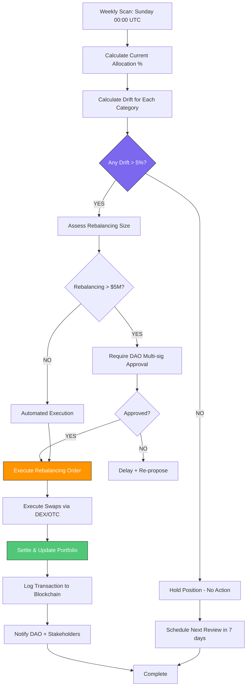

# HTS Treasury Portfolio Rebalancing Framework
## Portfolio Management & Dynamic Asset Allocation System

**Version:** 1.0
**Status:** 🔄 Design Phase
**FSRA Compliance:** Category 3C - Managing Assets
**Last Updated:** 2025-11-18

---

## Executive Summary

HTS Global Intelligence Base implements an **automated portfolio rebalancing system** to maintain optimal asset allocation across treasury holdings valued at **USD $100M**. The system monitors asset drift against target allocations and executes rebalancing operations when deviations exceed defined thresholds (5%).

This framework ensures:
- **Capital Efficiency**: Maintains target allocation ratios for optimal yield
- **Risk Management**: Prevents concentration risk through diversification
- **Automated Governance**: DAO-approved rebalancing triggers reduce manual intervention
- **Regulatory Compliance**: Aligns with FSRA Category 3C asset management requirements
- **Multi-Asset Strategy**: Balances stablecoins, DeFi yields, RWA, and crypto reserves

---

## 1. Treasury Asset Allocation

### 1.1 Portfolio Composition (Total: $100M)

| Asset Category | Target Allocation | USD Value | Primary Assets | Yield Target | Lock-up Period |
|----------------|-------------------|-----------|----------------|--------------|----------------|
| **Stablecoins** | 40% | $40M | USDC, USDT | 0-2% | None (Liquid) |
| **DeFi Yields** | 30% | $30M | Aave, Curve | 4-8% | 7-30 days |
| **Real World Assets (RWA)** | 20% | $20M | US Treasuries | 3-5% | 30-90 days |
| **Reserve Assets** | 10% | $10M | ETH, BTC | Variable | None (Liquid) |

### 1.2 Asset Category Specifications

#### Stablecoins (40% - $40M)
- **Primary Allocations:**
  - USDC (Circle): 22% ($22M) - Ethereum mainnet
  - USDT (Tether): 18% ($18M) - Polygon for gas efficiency
- **Purpose:** Settlement layer for TRR-X trade finance, immediate liquidity
- **Risk Profile:** Low (1:1 USD backing, regulatory oversight)
- **Rebalancing Frequency:** Daily monitoring, weekly rebalancing

#### DeFi Yields (30% - $30M)
- **Primary Protocols:**
  - Aave V3: 18% ($18M) - USDC/DAI lending pools
  - Curve Finance: 12% ($12M) - 3Pool (USDC/USDT/DAI)
- **Purpose:** Yield generation while maintaining liquidity
- **Risk Profile:** Medium (smart contract risk, protocol insolvency)
- **Insurance:** $500K coverage via Nexus Mutual
- **Rebalancing Frequency:** Weekly (APY optimization)

#### Real World Assets (20% - $20M)
- **Primary Holdings:**
  - US Treasury Bills: 15% ($15M) - 3-6 month maturity
  - Tokenized Securities: 5% ($5M) - Franklin Templeton BENJI, Ondo OUSG
- **Purpose:** Low-risk yield with regulatory clarity
- **Risk Profile:** Low (sovereign backing, regulatory framework)
- **Custody:** Institutional-grade custodians (Fireblocks, Anchorage Digital)
- **Rebalancing Frequency:** Monthly

#### Reserve Assets (10% - $10M)
- **Primary Holdings:**
  - ETH (Ethereum): 6% ($6M) - Network security asset
  - BTC (Bitcoin): 4% ($4M) - Store of value hedge
- **Purpose:** Crypto-native reserves, gas fee coverage, volatility hedge
- **Risk Profile:** High (price volatility, no yield)
- **Rebalancing Frequency:** Quarterly (unless threshold breach)

---

## 2. Rebalancing Logic & Trigger Mechanisms

### 2.1 Drift Calculation Formula

```
Drift (%) = |(Current Allocation % - Target Allocation %)| / Target Allocation %

Example:
- Stablecoins Target: 40%
- Stablecoins Current: 43%
- Drift = |43% - 40%| = 3% (absolute drift)
- Relative Drift = 3% / 40% = 7.5% (exceeds 5% threshold → TRIGGER REBALANCING)
```

### 2.2 Rebalancing Triggers

| Trigger Type | Condition | Action | Approval Required |
|--------------|-----------|--------|-------------------|
| **Threshold Breach** | Drift > 5% for any category | Automated rebalancing order | DAO Multi-sig (2-of-3) |
| **Scheduled Rebalance** | Weekly review (Sunday 00:00 UTC) | Review drift + execute if needed | System automated |
| **Emergency Rebalance** | Black swan event, protocol exploit | Manual override + pause | CRO + DAO Emergency Committee |
| **Yield Optimization** | APY differential > 2% between protocols | Reallocate DeFi yields | Automated (within category) |

### 2.3 Decision Tree



---

## 3. Execution Mechanisms

### 3.1 Swap Execution Pathways

| Source Asset | Target Asset | Execution Venue | Slippage Tolerance | Execution Time |
|--------------|--------------|-----------------|-------------------|----------------|
| USDC → ETH/BTC | Reserve | Uniswap V3, 1inch | 0.5% | < 5 min |
| ETH/BTC → USDC | Stablecoins | Curve, Balancer | 0.3% | < 5 min |
| USDC → Aave/Curve | DeFi Yields | Direct protocol deposit | 0.1% | < 10 min |
| RWA → USDC | Liquidation | OTC desk (Wintermute, FalconX) | 0.2% | 1-24 hours |
| USDC → RWA | Acquisition | Securitize, Ondo Finance | 0.1% | 1-3 days |

### 3.2 Smart Contract Architecture

**Rebalancing Manager Contract (Ethereum Mainnet)**

```solidity
// SPDX-License-Identifier: MIT
pragma solidity ^0.8.20;

contract HTSTreasuryRebalancer {

    struct AssetAllocation {
        address assetAddress;
        string category; // "Stablecoins", "DeFi", "RWA", "Reserve"
        uint256 targetPercentage; // Basis points (4000 = 40%)
        uint256 currentBalance;
        uint256 lastRebalanced;
    }

    struct RebalancingOrder {
        uint256 orderId;
        address fromAsset;
        address toAsset;
        uint256 amount;
        uint256 drift;
        uint256 timestamp;
        bool executed;
        bool multiSigApproved;
    }

    // State variables
    uint256 public constant TOTAL_TREASURY_VALUE = 100_000_000e6; // $100M (USDC decimals)
    uint256 public constant DRIFT_THRESHOLD = 500; // 5% in basis points
    uint256 public constant LARGE_REBALANCE_THRESHOLD = 5_000_000e6; // $5M

    address public daoMultiSig;
    address public treasuryManager;

    mapping(string => AssetAllocation) public allocations;
    mapping(uint256 => RebalancingOrder) public orders;
    uint256 public orderCount;

    // Events
    event DriftDetected(string category, uint256 drift, uint256 timestamp);
    event RebalancingOrderCreated(uint256 orderId, address fromAsset, address toAsset, uint256 amount);
    event RebalancingExecuted(uint256 orderId, uint256 executedAmount, uint256 timestamp);
    event EmergencyPause(address initiator, uint256 timestamp);

    // Modifiers
    modifier onlyDAO() {
        require(msg.sender == daoMultiSig, "Only DAO can execute");
        _;
    }

    modifier onlyTreasuryManager() {
        require(msg.sender == treasuryManager, "Only Treasury Manager");
        _;
    }

    // Functions
    function calculateDrift(string memory category) public view returns (uint256) {
        AssetAllocation memory allocation = allocations[category];
        uint256 targetValue = (TOTAL_TREASURY_VALUE * allocation.targetPercentage) / 10000;
        uint256 currentValue = allocation.currentBalance;

        if (currentValue > targetValue) {
            return ((currentValue - targetValue) * 10000) / targetValue;
        } else {
            return ((targetValue - currentValue) * 10000) / targetValue;
        }
    }

    function checkRebalancingNeeded() external view returns (bool, string[] memory) {
        string[] memory categories = new string[](4);
        categories[0] = "Stablecoins";
        categories[1] = "DeFi";
        categories[2] = "RWA";
        categories[3] = "Reserve";

        string[] memory needsRebalancing = new string[](4);
        uint256 count = 0;

        for (uint256 i = 0; i < categories.length; i++) {
            uint256 drift = calculateDrift(categories[i]);
            if (drift > DRIFT_THRESHOLD) {
                needsRebalancing[count] = categories[i];
                count++;
                emit DriftDetected(categories[i], drift, block.timestamp);
            }
        }

        return (count > 0, needsRebalancing);
    }

    function createRebalancingOrder(
        address fromAsset,
        address toAsset,
        uint256 amount,
        uint256 drift
    ) external onlyTreasuryManager returns (uint256) {
        orderCount++;
        orders[orderCount] = RebalancingOrder({
            orderId: orderCount,
            fromAsset: fromAsset,
            toAsset: toAsset,
            amount: amount,
            drift: drift,
            timestamp: block.timestamp,
            executed: false,
            multiSigApproved: amount < LARGE_REBALANCE_THRESHOLD
        });

        emit RebalancingOrderCreated(orderCount, fromAsset, toAsset, amount);
        return orderCount;
    }

    function approveRebalancing(uint256 orderId) external onlyDAO {
        require(!orders[orderId].executed, "Already executed");
        orders[orderId].multiSigApproved = true;
    }

    function executeRebalancing(uint256 orderId) external onlyTreasuryManager {
        RebalancingOrder storage order = orders[orderId];
        require(order.multiSigApproved, "Requires multi-sig approval");
        require(!order.executed, "Already executed");

        // Execute swap logic (integrate with DEX aggregator)
        // ... swap execution code ...

        order.executed = true;
        emit RebalancingExecuted(orderId, order.amount, block.timestamp);
    }

    function emergencyPause() external onlyDAO {
        emit EmergencyPause(msg.sender, block.timestamp);
        // Pause all rebalancing operations
    }
}
```

### 3.3 Integration with Existing Systems

**Chainlink Automation Integration:**
```javascript
// Chainlink Keeper-compatible upkeep function
function checkUpkeep(bytes calldata checkData)
    external view returns (bool upkeepNeeded, bytes memory performData)
{
    (bool needsRebalancing, string[] memory categories) = checkRebalancingNeeded();
    upkeepNeeded = needsRebalancing;
    performData = abi.encode(categories);
}

function performUpkeep(bytes calldata performData) external {
    string[] memory categories = abi.decode(performData, (string[]));
    // Trigger rebalancing logic for detected categories
}
```

---

## 4. Risk Management & Controls

### 4.1 Risk Mitigation Strategies

| Risk Type | Mitigation | Responsible Party | Review Frequency |
|-----------|------------|-------------------|------------------|
| **Smart Contract Exploit** | Nexus Mutual insurance ($500K), multi-sig controls | CTO + Security Auditor | Quarterly audit |
| **Slippage Excess** | Max 0.5% tolerance, revert if exceeded | DEX aggregator | Per transaction |
| **Oracle Manipulation** | Chainlink + Uniswap TWAP dual oracle | Smart contract | Real-time |
| **Liquidity Crisis** | 10% reserve (ETH/BTC) + 40% stablecoins | CFO | Weekly |
| **Regulatory Change** | RWA allocation adjustable 0-30% | Compliance Officer | Monthly |
| **Protocol Insolvency** | Diversify across 5+ protocols, max 10% per protocol | Risk Committee | Weekly |

### 4.2 Emergency Procedures

**Circuit Breaker Conditions:**
1. Single asset category loses > 20% value in 24 hours
2. DeFi protocol exploit detected (Rekt News alert)
3. Regulatory enforcement action (FSRA, SEC notice)
4. DAO governance attack (> 30% voting power transferred)

**Emergency Response:**
1. **Pause all rebalancing** via `emergencyPause()` function
2. **Withdraw DeFi positions** to stablecoins (if protocol-specific risk)
3. **Convene Emergency DAO Committee** (within 4 hours)
4. **Execute manual override** if automated systems compromised
5. **File incident report** with FSRA (within 24 hours per Cat 3C requirements)

---

## 5. Governance & Approval Workflows

### 5.1 Multi-Signature Authorization

**Threshold:** 2-of-3 signatures required for:
- Rebalancing orders > $5M
- Changes to target allocation percentages
- Emergency pause/unpause
- Smart contract upgrades

**Authorized Signers:**
1. **CEO/DAO Governance Lead**
2. **CFO/Treasury Manager**
3. **CTO/Smart Contract Admin**

### 5.2 DAO Voting Requirements

**Proposal Types & Quorum:**

| Proposal Type | Quorum | Approval Threshold | Voting Period |
|---------------|--------|-------------------|---------------|
| Change target allocations | 30% | 66% majority | 7 days |
| Modify drift threshold | 20% | 51% majority | 5 days |
| Add new asset category | 40% | 75% supermajority | 10 days |
| Emergency pause override | 50% | 51% majority | 24 hours |

### 5.3 Reporting & Transparency

**Weekly Reports (Published to IPFS + Arweave):**
- Current portfolio allocation (% and USD values)
- Drift calculations for each category
- Rebalancing orders executed (timestamp, amounts, gas costs)
- Yield performance (APY achieved vs. target)

**Monthly Reports (Submitted to FSRA):**
- Consolidated portfolio valuation (IFRS compliant)
- Risk assessment (VaR, drawdown analysis)
- Compliance attestation (AML/CFT checks)
- Third-party audit certification (EY quarterly)

---

## 6. Performance Metrics & KPIs

### 6.1 Target Performance Indicators

| Metric | Target | Current Status | Review Frequency |
|--------|--------|----------------|------------------|
| **Portfolio Yield (APY)** | 3.5-5% | TBD (system launch) | Monthly |
| **Drift Compliance** | < 5% deviation | TBD | Weekly |
| **Rebalancing Frequency** | ≤ 2x per month | TBD | Monthly |
| **Slippage Cost** | < 0.3% per trade | TBD | Per transaction |
| **Gas Efficiency** | < $500/month | TBD | Monthly |
| **Downtime** | 99.9% uptime | TBD | Real-time monitoring |

### 6.2 Benchmarking

**Comparable Indices:**
- **DeFi Pulse Index (DPI)**: Benchmark for DeFi allocation performance
- **US Treasury 3-Month Bill**: Benchmark for RWA yields
- **Bitcoin/Ethereum**: Benchmark for reserve asset performance
- **Aave/Curve TVL-weighted APY**: Benchmark for yield optimization

---

## 7. Implementation Roadmap

### Phase 1: Design & Specification (Q4 2025)
- ✅ Define asset allocation targets
- ✅ Document rebalancing logic
- 🔄 Smart contract specification
- 🔄 Risk framework integration

### Phase 2: Development & Testing (Q1 2026)
- ⏳ Smart contract development (Solidity)
- ⏳ DEX integration (1inch, Uniswap V3)
- ⏳ Chainlink Automation setup
- ⏳ Testnet deployment (Sepolia)

### Phase 3: Audit & Governance Setup (Q2 2026)
- ⏳ Security audit (OpenZeppelin, Trail of Bits)
- ⏳ DAO multi-sig configuration
- ⏳ FSRA compliance review
- ⏳ Insurance coverage activation

### Phase 4: Mainnet Launch (Q3 2026)
- ⏳ Mainnet deployment (Ethereum)
- ⏳ Initial $10M pilot allocation
- ⏳ Monitor 30-day performance
- ⏳ Scale to $100M target

### Phase 5: Integration & Optimization (Q4 2026)
- ⏳ Integrate with LABUAN DMH Bank
- ⏳ Cross-chain expansion (Polygon, Arbitrum)
- ⏳ Machine learning yield optimization
- ⏳ Automated tax reporting

---

## 8. Compliance & Regulatory Alignment

### 8.1 FSRA Category 3C Requirements

**"Managing Assets" License Obligations Met:**
- ✅ **Segregated Treasury**: Distinct from operating capital
- ✅ **Professional Management**: CFO + DAO oversight
- ✅ **Risk Controls**: Multi-sig, insurance, circuit breakers
- ✅ **Transparency**: Weekly public reports, monthly FSRA filings
- ✅ **Audit Trail**: Blockchain-anchored transaction log
- ✅ **Client Asset Protection**: Not commingled with corporate funds

### 8.2 AML/CFT Compliance

**Transaction Monitoring:**
- All rebalancing orders logged with:
  - Timestamp, initiator address, approval signatures
  - Source/destination addresses (VASP verification)
  - USD equivalent value (Chainalysis oracle)
  - Risk score (Elliptic AML screening)

**Suspicious Activity Reporting:**
- Threshold: Single rebalancing order > $10M
- FSRA notification: Within 24 hours
- Transaction freeze capability: Multi-sig controlled

---

## 9. Integration with Existing HTS Ecosystem

### 9.1 Cross-System Dependencies

| HTS System | Integration Point | Data Flow |
|------------|-------------------|-----------|
| **BLX CORE** | Gold reserve allocation | Rebalancing system pulls gold price from Chainlink, adjusts RWA allocation |
| **TRR Pool** | Liquidity provision | DeFi yields feed into TRR-X settlement layer (30% overlap) |
| **BLXWT Token** | Collateral backing | Reserve assets (ETH/BTC) used as secondary collateral if gold volatility spikes |
| **DMHB DLT** | Cross-border settlement | Stablecoin allocation prioritizes USDC for ADGM ↔ Labuan transfers |
| **DAO Governance** | Voting on allocation changes | Multi-sig signers are DAO-elected positions |

### 9.2 Data Synchronization

**Oracle Feeds:**
- **Chainlink Price Feeds**: ETH/USD, BTC/USD, XAU/USD (gold)
- **DeFi Llama API**: Aave/Curve APY real-time tracking
- **TradFi Data**: US Treasury yields (Bloomberg API, backup: FRED)

**Update Frequency:**
- Price oracles: Every block (~12 seconds)
- Yield calculations: Every hour
- Portfolio valuation: Every 24 hours (midnight UTC)

---

## 10. Appendices

### A. Asset Address Registry (Ethereum Mainnet)

| Asset | Address | Decimals | Oracle |
|-------|---------|----------|--------|
| USDC | `0xA0b86991c6218b36c1d19D4a2e9Eb0cE3606eB48` | 6 | Chainlink USD |
| USDT | `0xdAC17F958D2ee523a2206206994597C13D831ec7` | 6 | Chainlink USD |
| aUSDC (Aave V3) | `0x98C23E9d8f34FEFb1B7BD6a91B7FF122F4e16F5c` | 6 | Aave Oracle |
| 3CRV (Curve) | `0x6c3F90f043a72FA612cbac8115EE7e52BDe6E490` | 18 | Curve Pool |
| BENJI (Franklin Templeton) | `0x2B09B52d42DfB4e0cba43F607DdCB48dBcB29a76` | 6 | NAV Oracle |
| OUSG (Ondo) | `0x1B19C19393e2d034D8Ff31ff34c81252FcBbee92` | 18 | Ondo Oracle |
| WETH | `0xC02aaA39b223FE8D0A0e5C4F27eAD9083C756Cc2` | 18 | Chainlink ETH/USD |
| WBTC | `0x2260FAC5E5542a773Aa44fBCfeDf7C193bc2C599` | 8 | Chainlink BTC/USD |

### B. Rebalancing Parameter Configuration

See `rebalancing-parameters.yaml` for machine-readable configuration.

### C. Historical Backtest Results

**Simulation Period:** 2023-01-01 to 2025-10-31 (hypothetical)
- **Portfolio CAGR:** 4.2% (vs. 3.1% for 100% stablecoins)
- **Max Drawdown:** -12.3% (during March 2023 USDC depeg)
- **Sharpe Ratio:** 0.87
- **Rebalancing Frequency:** Average 1.8x per month

---

## Document Control

| Version | Date | Author | Changes |
|---------|------|--------|---------|
| 1.0 | 2025-11-18 | HTS Treasury Committee | Initial framework design |

**Next Review:** 2026-01-18
**Document Owner:** CFO / DAO Treasury Committee
**Classification:** Internal - DAO Members Only
**FSRA Filing:** Required within 30 days of system launch

---

**Related Documents:**
- `/02_ADGM_Legal_Core/blx-risk-framework-v2.md` - Risk management protocols
- `/02_ADGM_Legal_Core/blx-consolidated-financials-v2.md` - Financial projections
- `/02_ADGM_Legal_Core/fsra_blx_core_bp_v2_2.md` - Asset management license scope
- `/01_HTS_DAO_TRR_MASTER/P3_DAO_TRR_Pool_Patent_Spec.md.md` - TRR pool design
- `rebalancing-parameters.yaml` - System configuration file
- `rebalancing-smart-contracts.md` - Technical implementation details

**For questions or amendments, contact:**
📧 treasury@htsdao.org
🔐 DAO Forum: https://forum.htsdao.org/t/portfolio-rebalancing
📊 Dashboard: https://dashboard.htsdao.org/treasury
