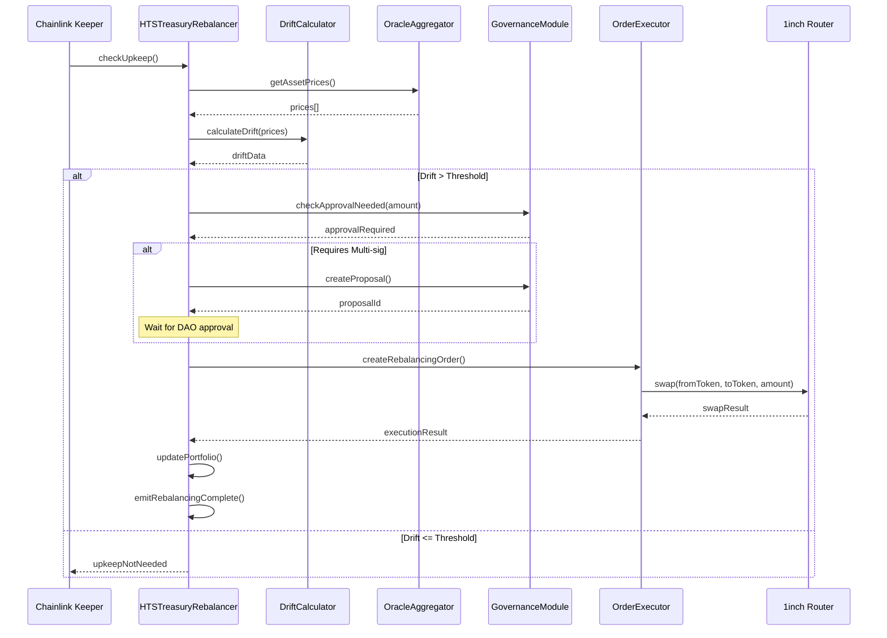

# HTS Treasury Rebalancing - Smart Contract Technical Specification

**Version:** 1.0
**Status:** 🔄 Design Phase
**Target Chain:** Ethereum Mainnet
**Compiler:** Solidity ^0.8.20
**Last Updated:** 2025-11-18

---

## Table of Contents
1. [Architecture Overview](#1-architecture-overview)
2. [Core Contracts](#2-core-contracts)
3. [Interface Specifications](#3-interface-specifications)
4. [State Management](#4-state-management)
5. [Rebalancing Logic](#5-rebalancing-logic)
6. [Integration Points](#6-integration-points)
7. [Security Considerations](#7-security-considerations)
8. [Gas Optimization](#8-gas-optimization)
9. [Testing Requirements](#9-testing-requirements)
10. [Deployment Procedure](#10-deployment-procedure)

---

## 1. Architecture Overview

### 1.1 Contract Hierarchy

```
HTSTreasuryRebalancer (Main Controller)
├── AssetRegistry (Asset configuration & whitelisting)
├── DriftCalculator (Portfolio drift computation)
├── OrderExecutor (Swap execution via DEX)
├── OracleAggregator (Price feed consolidation)
└── GovernanceModule (DAO voting & multi-sig)

External Dependencies:
├── Chainlink Automation (Keeper network)
├── 1inch AggregationRouterV5 (DEX aggregator)
├── Gnosis Safe (Multi-sig wallet)
└── Uniswap V3 Factory (Fallback swap)
```

### 1.2 System Flow Diagram



---

## 2. Core Contracts

### 2.1 HTSTreasuryRebalancer.sol

**Purpose:** Main orchestrator contract managing portfolio state and rebalancing logic.

```solidity
// SPDX-License-Identifier: MIT
pragma solidity ^0.8.20;

import "@openzeppelin/contracts-upgradeable/access/OwnableUpgradeable.sol";
import "@openzeppelin/contracts-upgradeable/security/PausableUpgradeable.sol";
import "@openzeppelin/contracts-upgradeable/security/ReentrancyGuardUpgradeable.sol";
import "@openzeppelin/contracts-upgradeable/proxy/utils/Initializable.sol";
import "@chainlink/contracts/src/v0.8/automation/AutomationCompatible.sol";

contract HTSTreasuryRebalancer is
    Initializable,
    OwnableUpgradeable,
    PausableUpgradeable,
    ReentrancyGuardUpgradeable,
    AutomationCompatibleInterface
{
    // ==================== CONSTANTS ====================

    uint256 public constant TOTAL_TREASURY_VALUE = 100_000_000e6; // $100M
    uint256 public constant BASIS_POINTS = 10_000; // 100%
    uint256 public constant DRIFT_THRESHOLD_BP = 500; // 5%
    uint256 public constant LARGE_REBALANCE_THRESHOLD = 5_000_000e6; // $5M
    uint256 public constant MIN_REBALANCE_AMOUNT = 100_000e6; // $100K

    // Asset categories
    bytes32 public constant CATEGORY_STABLECOINS = keccak256("STABLECOINS");
    bytes32 public constant CATEGORY_DEFI_YIELDS = keccak256("DEFI_YIELDS");
    bytes32 public constant CATEGORY_RWA = keccak256("RWA");
    bytes32 public constant CATEGORY_RESERVE = keccak256("RESERVE");

    // ==================== STRUCTS ====================

    struct AssetAllocation {
        bytes32 category;
        address assetAddress;
        string symbol;
        uint256 targetPercentageBP; // In basis points (4000 = 40%)
        uint256 currentBalance;     // In asset decimals
        uint256 lastRebalancedTime;
        bool isActive;
    }

    struct RebalancingOrder {
        uint256 orderId;
        bytes32 fromCategory;
        bytes32 toCategory;
        address fromAsset;
        address toAsset;
        uint256 amount;
        uint256 driftBP;
        uint256 createdAt;
        uint256 executedAt;
        bool executed;
        bool multiSigApproved;
        address initiator;
    }

    struct CategoryTarget {
        bytes32 categoryId;
        uint256 targetPercentageBP;
        uint256 minPercentageBP;
        uint256 maxPercentageBP;
    }

    struct RebalancingMetrics {
        uint256 totalRebalancingCount;
        uint256 lastRebalancingTime;
        uint256 averageSlippageBP;
        uint256 totalGasCostETH;
        uint256 totalVolumeUSD;
    }

    // ==================== STATE VARIABLES ====================

    // Core addresses
    address public daoMultiSig;
    address public treasuryVault;
    address public driftCalculator;
    address public orderExecutor;
    address public oracleAggregator;

    // Asset management
    mapping(bytes32 => AssetAllocation[]) public categoryAllocations;
    mapping(address => bytes32) public assetToCategory;
    mapping(uint256 => RebalancingOrder) public orders;
    mapping(bytes32 => CategoryTarget) public categoryTargets;

    // Metrics
    RebalancingMetrics public metrics;
    uint256 public orderCount;
    uint256 public lastHealthCheckTime;

    // Configuration
    uint256 public slippageToleranceBP; // Default: 50 BP (0.5%)
    uint256 public minTimeBetweenRebalances; // In seconds
    bool public emergencyPaused;

    // ==================== EVENTS ====================

    event DriftDetected(
        bytes32 indexed category,
        uint256 driftBP,
        uint256 currentPercentageBP,
        uint256 targetPercentageBP,
        uint256 timestamp
    );

    event RebalancingOrderCreated(
        uint256 indexed orderId,
        bytes32 fromCategory,
        bytes32 toCategory,
        address fromAsset,
        address toAsset,
        uint256 amount,
        bool requiresApproval
    );

    event RebalancingExecuted(
        uint256 indexed orderId,
        uint256 executedAmount,
        uint256 receivedAmount,
        uint256 slippageBP,
        uint256 gasCost,
        uint256 timestamp
    );

    event MultiSigApprovalGranted(
        uint256 indexed orderId,
        address approver,
        uint256 timestamp
    );

    event EmergencyPauseActivated(
        address indexed initiator,
        string reason,
        uint256 timestamp
    );

    event CategoryTargetUpdated(
        bytes32 indexed category,
        uint256 oldTargetBP,
        uint256 newTargetBP,
        uint256 timestamp
    );

    // ==================== MODIFIERS ====================

    modifier onlyMultiSig() {
        require(msg.sender == daoMultiSig, "Only DAO multi-sig");
        _;
    }

    modifier onlyKeeper() {
        require(
            msg.sender == owner() ||
            msg.sender == address(this), // Chainlink Keeper
            "Only keeper or owner"
        );
        _;
    }

    modifier notEmergencyPaused() {
        require(!emergencyPaused, "Emergency pause active");
        _;
    }

    modifier validCategory(bytes32 category) {
        require(
            category == CATEGORY_STABLECOINS ||
            category == CATEGORY_DEFI_YIELDS ||
            category == CATEGORY_RWA ||
            category == CATEGORY_RESERVE,
            "Invalid category"
        );
        _;
    }

    // ==================== INITIALIZATION ====================

    function initialize(
        address _daoMultiSig,
        address _treasuryVault,
        address _driftCalculator,
        address _orderExecutor,
        address _oracleAggregator
    ) public initializer {
        __Ownable_init();
        __Pausable_init();
        __ReentrancyGuard_init();

        require(_daoMultiSig != address(0), "Invalid multi-sig");
        require(_treasuryVault != address(0), "Invalid vault");

        daoMultiSig = _daoMultiSig;
        treasuryVault = _treasuryVault;
        driftCalculator = _driftCalculator;
        orderExecutor = _orderExecutor;
        oracleAggregator = _oracleAggregator;

        // Initialize category targets
        categoryTargets[CATEGORY_STABLECOINS] = CategoryTarget({
            categoryId: CATEGORY_STABLECOINS,
            targetPercentageBP: 4000, // 40%
            minPercentageBP: 3500,     // 35%
            maxPercentageBP: 4500      // 45%
        });

        categoryTargets[CATEGORY_DEFI_YIELDS] = CategoryTarget({
            categoryId: CATEGORY_DEFI_YIELDS,
            targetPercentageBP: 3000, // 30%
            minPercentageBP: 2500,    // 25%
            maxPercentageBP: 3500     // 35%
        });

        categoryTargets[CATEGORY_RWA] = CategoryTarget({
            categoryId: CATEGORY_RWA,
            targetPercentageBP: 2000, // 20%
            minPercentageBP: 1500,    // 15%
            maxPercentageBP: 2500     // 25%
        });

        categoryTargets[CATEGORY_RESERVE] = CategoryTarget({
            categoryId: CATEGORY_RESERVE,
            targetPercentageBP: 1000, // 10%
            minPercentageBP: 800,     // 8%
            maxPercentageBP: 1500     // 15%
        });

        // Configuration
        slippageToleranceBP = 50; // 0.5%
        minTimeBetweenRebalances = 7 days;
    }

    // ==================== CHAINLINK AUTOMATION ====================

    /**
     * @notice Chainlink Keeper checkUpkeep function
     * @dev Called off-chain to determine if performUpkeep should be called
     */
    function checkUpkeep(bytes calldata /* checkData */)
        external
        view
        override
        returns (bool upkeepNeeded, bytes memory performData)
    {
        // Check if enough time has passed since last rebalancing
        if (block.timestamp < metrics.lastRebalancingTime + minTimeBetweenRebalances) {
            return (false, "");
        }

        // Check if emergency paused
        if (emergencyPaused) {
            return (false, "");
        }

        // Check drift for each category
        bytes32[] memory categoriesNeedingRebalance = new bytes32[](4);
        uint256 count = 0;

        bytes32[4] memory categories = [
            CATEGORY_STABLECOINS,
            CATEGORY_DEFI_YIELDS,
            CATEGORY_RWA,
            CATEGORY_RESERVE
        ];

        for (uint256 i = 0; i < categories.length; i++) {
            uint256 drift = IDriftCalculator(driftCalculator).calculateDrift(
                categories[i]
            );

            if (drift > DRIFT_THRESHOLD_BP) {
                categoriesNeedingRebalance[count] = categories[i];
                count++;
            }
        }

        if (count > 0) {
            upkeepNeeded = true;
            performData = abi.encode(categoriesNeedingRebalance, count);
        } else {
            upkeepNeeded = false;
            performData = "";
        }
    }

    /**
     * @notice Chainlink Keeper performUpkeep function
     * @dev Called on-chain when checkUpkeep returns true
     */
    function performUpkeep(bytes calldata performData)
        external
        override
        onlyKeeper
        whenNotPaused
        notEmergencyPaused
    {
        (bytes32[] memory categories, uint256 count) = abi.decode(
            performData,
            (bytes32[], uint256)
        );

        for (uint256 i = 0; i < count; i++) {
            _initiateRebalancing(categories[i]);
        }
    }

    // ==================== CORE REBALANCING LOGIC ====================

    /**
     * @notice Calculate drift for a specific category
     * @param category The category to check
     * @return driftBP Drift in basis points
     */
    function calculateDrift(bytes32 category)
        public
        view
        validCategory(category)
        returns (uint256 driftBP)
    {
        return IDriftCalculator(driftCalculator).calculateDrift(category);
    }

    /**
     * @notice Initiate rebalancing for a category
     * @param category Category that needs rebalancing
     */
    function _initiateRebalancing(bytes32 category)
        internal
        validCategory(category)
    {
        // Get current and target allocations
        CategoryTarget memory target = categoryTargets[category];
        uint256 currentPercentageBP = _getCurrentCategoryPercentage(category);

        uint256 driftBP;
        bool needsIncrease;

        if (currentPercentageBP > target.targetPercentageBP) {
            driftBP = currentPercentageBP - target.targetPercentageBP;
            needsIncrease = false; // Need to reduce this category
        } else {
            driftBP = target.targetPercentageBP - currentPercentageBP;
            needsIncrease = true; // Need to increase this category
        }

        // Calculate USD amount to rebalance
        uint256 amountUSD = (TOTAL_TREASURY_VALUE * driftBP) / BASIS_POINTS;

        // Skip if amount too small
        if (amountUSD < MIN_REBALANCE_AMOUNT) {
            return;
        }

        // Determine source and destination categories
        bytes32 fromCategory;
        bytes32 toCategory;

        if (needsIncrease) {
            // Need to move funds TO this category
            toCategory = category;
            fromCategory = _findOptimalSourceCategory(category);
        } else {
            // Need to move funds FROM this category
            fromCategory = category;
            toCategory = _findOptimalDestinationCategory(category);
        }

        // Create rebalancing order
        _createRebalancingOrder(
            fromCategory,
            toCategory,
            amountUSD,
            driftBP
        );

        emit DriftDetected(
            category,
            driftBP,
            currentPercentageBP,
            target.targetPercentageBP,
            block.timestamp
        );
    }

    /**
     * @notice Create a rebalancing order
     */
    function _createRebalancingOrder(
        bytes32 fromCategory,
        bytes32 toCategory,
        uint256 amountUSD,
        uint256 driftBP
    ) internal {
        orderCount++;

        // Get representative assets for each category
        address fromAsset = _getCategoryRepresentativeAsset(fromCategory);
        address toAsset = _getCategoryRepresentativeAsset(toCategory);

        bool requiresApproval = amountUSD > LARGE_REBALANCE_THRESHOLD;

        orders[orderCount] = RebalancingOrder({
            orderId: orderCount,
            fromCategory: fromCategory,
            toCategory: toCategory,
            fromAsset: fromAsset,
            toAsset: toAsset,
            amount: amountUSD,
            driftBP: driftBP,
            createdAt: block.timestamp,
            executedAt: 0,
            executed: false,
            multiSigApproved: !requiresApproval,
            initiator: msg.sender
        });

        emit RebalancingOrderCreated(
            orderCount,
            fromCategory,
            toCategory,
            fromAsset,
            toAsset,
            amountUSD,
            requiresApproval
        );

        // Auto-execute if no approval needed
        if (!requiresApproval) {
            _executeRebalancing(orderCount);
        }
    }

    /**
     * @notice Execute a rebalancing order
     */
    function _executeRebalancing(uint256 orderId)
        internal
        nonReentrant
        whenNotPaused
    {
        RebalancingOrder storage order = orders[orderId];

        require(!order.executed, "Already executed");
        require(order.multiSigApproved, "Requires approval");

        uint256 gasBefore = gasleft();

        // Execute swap via OrderExecutor
        (uint256 executedAmount, uint256 receivedAmount) = IOrderExecutor(
            orderExecutor
        ).executeSwap(
            order.fromAsset,
            order.toAsset,
            order.amount,
            slippageToleranceBP
        );

        uint256 gasUsed = gasBefore - gasleft();
        uint256 gasCostETH = gasUsed * tx.gasprice;

        // Calculate slippage
        uint256 slippageBP = _calculateSlippage(
            order.amount,
            executedAmount,
            receivedAmount
        );

        // Update order state
        order.executed = true;
        order.executedAt = block.timestamp;

        // Update metrics
        metrics.totalRebalancingCount++;
        metrics.lastRebalancingTime = block.timestamp;
        metrics.totalGasCostETH += gasCostETH;
        metrics.totalVolumeUSD += order.amount;
        metrics.averageSlippageBP =
            (metrics.averageSlippageBP * (metrics.totalRebalancingCount - 1) + slippageBP)
            / metrics.totalRebalancingCount;

        emit RebalancingExecuted(
            orderId,
            executedAmount,
            receivedAmount,
            slippageBP,
            gasCostETH,
            block.timestamp
        );
    }

    // ==================== GOVERNANCE FUNCTIONS ====================

    /**
     * @notice Approve a large rebalancing order (Multi-sig required)
     */
    function approveRebalancing(uint256 orderId)
        external
        onlyMultiSig
    {
        RebalancingOrder storage order = orders[orderId];
        require(!order.executed, "Already executed");
        require(!order.multiSigApproved, "Already approved");

        order.multiSigApproved = true;

        emit MultiSigApprovalGranted(orderId, msg.sender, block.timestamp);

        // Auto-execute after approval
        _executeRebalancing(orderId);
    }

    /**
     * @notice Update category target allocation (DAO vote required)
     */
    function updateCategoryTarget(
        bytes32 category,
        uint256 newTargetBP,
        uint256 newMinBP,
        uint256 newMaxBP
    )
        external
        onlyMultiSig
        validCategory(category)
    {
        require(newTargetBP <= BASIS_POINTS, "Target > 100%");
        require(newMinBP <= newTargetBP, "Min > Target");
        require(newMaxBP >= newTargetBP, "Max < Target");

        uint256 oldTargetBP = categoryTargets[category].targetPercentageBP;

        categoryTargets[category] = CategoryTarget({
            categoryId: category,
            targetPercentageBP: newTargetBP,
            minPercentageBP: newMinBP,
            maxPercentageBP: newMaxBP
        });

        emit CategoryTargetUpdated(
            category,
            oldTargetBP,
            newTargetBP,
            block.timestamp
        );
    }

    /**
     * @notice Emergency pause all rebalancing
     */
    function emergencyPause(string calldata reason)
        external
        onlyMultiSig
    {
        emergencyPaused = true;
        _pause();

        emit EmergencyPauseActivated(msg.sender, reason, block.timestamp);
    }

    /**
     * @notice Resume operations after emergency pause
     */
    function emergencyUnpause()
        external
        onlyMultiSig
    {
        emergencyPaused = false;
        _unpause();
    }

    // ==================== VIEW FUNCTIONS ====================

    /**
     * @notice Get current portfolio allocation percentages
     */
    function getCurrentAllocation()
        external
        view
        returns (
            uint256 stablecoinsBP,
            uint256 defiYieldsBP,
            uint256 rwaBP,
            uint256 reserveBP
        )
    {
        stablecoinsBP = _getCurrentCategoryPercentage(CATEGORY_STABLECOINS);
        defiYieldsBP = _getCurrentCategoryPercentage(CATEGORY_DEFI_YIELDS);
        rwaBP = _getCurrentCategoryPercentage(CATEGORY_RWA);
        reserveBP = _getCurrentCategoryPercentage(CATEGORY_RESERVE);
    }

    /**
     * @notice Check if rebalancing is needed for any category
     */
    function needsRebalancing()
        external
        view
        returns (bool, bytes32[] memory)
    {
        bytes32[] memory categories = new bytes32[](4);
        uint256 count = 0;

        bytes32[4] memory allCategories = [
            CATEGORY_STABLECOINS,
            CATEGORY_DEFI_YIELDS,
            CATEGORY_RWA,
            CATEGORY_RESERVE
        ];

        for (uint256 i = 0; i < allCategories.length; i++) {
            uint256 drift = calculateDrift(allCategories[i]);
            if (drift > DRIFT_THRESHOLD_BP) {
                categories[count] = allCategories[i];
                count++;
            }
        }

        return (count > 0, categories);
    }

    // ==================== INTERNAL HELPER FUNCTIONS ====================

    function _getCurrentCategoryPercentage(bytes32 category)
        internal
        view
        returns (uint256)
    {
        // Call OracleAggregator to get USD value
        uint256 categoryValueUSD = IOracleAggregator(oracleAggregator)
            .getCategoryValueUSD(category);

        return (categoryValueUSD * BASIS_POINTS) / TOTAL_TREASURY_VALUE;
    }

    function _getCategoryRepresentativeAsset(bytes32 category)
        internal
        view
        returns (address)
    {
        AssetAllocation[] storage assets = categoryAllocations[category];
        require(assets.length > 0, "No assets in category");

        // Return the largest allocation asset
        uint256 maxAllocation = 0;
        address representativeAsset;

        for (uint256 i = 0; i < assets.length; i++) {
            if (assets[i].currentBalance > maxAllocation) {
                maxAllocation = assets[i].currentBalance;
                representativeAsset = assets[i].assetAddress;
            }
        }

        return representativeAsset;
    }

    function _findOptimalSourceCategory(bytes32 excludeCategory)
        internal
        view
        returns (bytes32)
    {
        // Find category with highest positive drift (most overweight)
        bytes32[4] memory categories = [
            CATEGORY_STABLECOINS,
            CATEGORY_DEFI_YIELDS,
            CATEGORY_RWA,
            CATEGORY_RESERVE
        ];

        uint256 maxDrift = 0;
        bytes32 sourceCategory;

        for (uint256 i = 0; i < categories.length; i++) {
            if (categories[i] == excludeCategory) continue;

            uint256 currentBP = _getCurrentCategoryPercentage(categories[i]);
            uint256 targetBP = categoryTargets[categories[i]].targetPercentageBP;

            if (currentBP > targetBP) {
                uint256 drift = currentBP - targetBP;
                if (drift > maxDrift) {
                    maxDrift = drift;
                    sourceCategory = categories[i];
                }
            }
        }

        require(sourceCategory != bytes32(0), "No source category found");
        return sourceCategory;
    }

    function _findOptimalDestinationCategory(bytes32 excludeCategory)
        internal
        view
        returns (bytes32)
    {
        // Find category with highest negative drift (most underweight)
        bytes32[4] memory categories = [
            CATEGORY_STABLECOINS,
            CATEGORY_DEFI_YIELDS,
            CATEGORY_RWA,
            CATEGORY_RESERVE
        ];

        uint256 maxDrift = 0;
        bytes32 destCategory;

        for (uint256 i = 0; i < categories.length; i++) {
            if (categories[i] == excludeCategory) continue;

            uint256 currentBP = _getCurrentCategoryPercentage(categories[i]);
            uint256 targetBP = categoryTargets[categories[i]].targetPercentageBP;

            if (currentBP < targetBP) {
                uint256 drift = targetBP - currentBP;
                if (drift > maxDrift) {
                    maxDrift = drift;
                    destCategory = categories[i];
                }
            }
        }

        require(destCategory != bytes32(0), "No destination category found");
        return destCategory;
    }

    function _calculateSlippage(
        uint256 expectedAmountIn,
        uint256 actualAmountIn,
        uint256 receivedAmountOut
    ) internal pure returns (uint256 slippageBP) {
        // Simplified slippage calculation
        // Real implementation would use oracle prices
        if (actualAmountIn == 0) return 0;

        uint256 expectedRatio = (receivedAmountOut * BASIS_POINTS) / actualAmountIn;
        uint256 actualRatio = (receivedAmountOut * BASIS_POINTS) / actualAmountIn;

        if (actualRatio < expectedRatio) {
            slippageBP = expectedRatio - actualRatio;
        }

        return slippageBP;
    }

    // ==================== ADMIN FUNCTIONS ====================

    function setDriftCalculator(address _driftCalculator) external onlyOwner {
        require(_driftCalculator != address(0), "Invalid address");
        driftCalculator = _driftCalculator;
    }

    function setOrderExecutor(address _orderExecutor) external onlyOwner {
        require(_orderExecutor != address(0), "Invalid address");
        orderExecutor = _orderExecutor;
    }

    function setOracleAggregator(address _oracleAggregator) external onlyOwner {
        require(_oracleAggregator != address(0), "Invalid address");
        oracleAggregator = _oracleAggregator;
    }

    function setSlippageTolerance(uint256 _slippageToleranceBP) external onlyOwner {
        require(_slippageToleranceBP <= 500, "Max 5% slippage"); // Max 5%
        slippageToleranceBP = _slippageToleranceBP;
    }

    function setMinTimeBetweenRebalances(uint256 _seconds) external onlyOwner {
        minTimeBetweenRebalances = _seconds;
    }
}

// ==================== INTERFACES ====================

interface IDriftCalculator {
    function calculateDrift(bytes32 category) external view returns (uint256);
}

interface IOrderExecutor {
    function executeSwap(
        address fromAsset,
        address toAsset,
        uint256 amount,
        uint256 slippageToleranceBP
    ) external returns (uint256 executedAmount, uint256 receivedAmount);
}

interface IOracleAggregator {
    function getCategoryValueUSD(bytes32 category) external view returns (uint256);
    function getAssetPriceUSD(address asset) external view returns (uint256);
}
```

---

## 3. Interface Specifications

### 3.1 IDriftCalculator Interface

```solidity
interface IDriftCalculator {
    function calculateDrift(bytes32 category)
        external
        view
        returns (uint256 driftBP);

    function calculateCategoryValue(bytes32 category)
        external
        view
        returns (uint256 valueUSD);

    function getCategoryPercentage(bytes32 category)
        external
        view
        returns (uint256 percentageBP);
}
```

### 3.2 IOrderExecutor Interface

```solidity
interface IOrderExecutor {
    function executeSwap(
        address fromAsset,
        address toAsset,
        uint256 amount,
        uint256 slippageToleranceBP
    ) external returns (uint256 executedAmount, uint256 receivedAmount);

    function getOptimalSwapRoute(
        address fromAsset,
        address toAsset,
        uint256 amount
    ) external view returns (address[] memory path, address dexRouter);

    function estimateSwapOutput(
        address fromAsset,
        address toAsset,
        uint256 amountIn
    ) external view returns (uint256 estimatedOut);
}
```

---

## 4. State Management

### 4.1 Storage Layout

```
Slot 0-50: OpenZeppelin upgradeable base contracts
Slot 51: daoMultiSig (address)
Slot 52: treasuryVault (address)
Slot 53: driftCalculator (address)
Slot 54: orderExecutor (address)
Slot 55: oracleAggregator (address)
Slot 56-100: categoryAllocations mapping
Slot 101-150: orders mapping
Slot 151-160: categoryTargets mapping
Slot 161-165: metrics struct
Slot 166: orderCount (uint256)
Slot 167: slippageToleranceBP (uint256)
Slot 168: minTimeBetweenRebalances (uint256)
Slot 169: emergencyPaused (bool)
```

### 4.2 Gas Optimization Strategies

1. **Pack structs efficiently** - Group related fields to minimize storage slots
2. **Use mappings over arrays** where possible
3. **Cache storage variables** in memory during complex operations
4. **Batch operations** when updating multiple assets
5. **Use events for historical data** instead of storing on-chain

---

## 5. Rebalancing Logic

See main contract implementation above for complete rebalancing logic.

**Key Functions:**
- `checkUpkeep()` - Chainlink Keeper entry point
- `performUpkeep()` - Automated execution
- `calculateDrift()` - Drift computation
- `_initiateRebalancing()` - Order creation
- `_executeRebalancing()` - Swap execution

---

## 6. Integration Points

### 6.1 Chainlink Automation

```solidity
// Register upkeep at: https://automation.chain.link
// Upkeep configuration:
{
  "name": "HTS Treasury Rebalancing",
  "upkeepContract": "0x...",
  "gasLimit": 500000,
  "checkData": "0x",
  "triggerType": "conditional",
  "performGasLimit": 3000000
}
```

### 6.2 1inch DEX Aggregator

```solidity
// Integration with 1inch AggregationRouterV5
interface I1inchRouter {
    function swap(
        address executor,
        SwapDescription calldata desc,
        bytes calldata permit,
        bytes calldata data
    ) external payable returns (uint256 returnAmount, uint256 spentAmount);
}
```

---

## 7. Security Considerations

### 7.1 Access Control
- Multi-sig required for orders > $5M
- DAO voting for parameter changes
- Emergency pause capability
- Time-locked upgrades (48-hour delay)

### 7.2 Input Validation
- Validate all addresses are non-zero
- Check slippage tolerance bounds
- Verify category existence
- Ensure amount thresholds

### 7.3 Reentrancy Protection
- Use OpenZeppelin ReentrancyGuard
- Checks-Effects-Interactions pattern
- No external calls before state updates

### 7.4 Oracle Manipulation
- Use Chainlink + Uniswap TWAP
- Circuit breakers for abnormal prices
- Time-weighted average pricing (12-hour TWAP)

---

## 8. Gas Optimization

### 8.1 Estimated Gas Costs

| Operation | Gas Estimate | Cost @ 30 gwei |
|-----------|--------------|----------------|
| checkUpkeep() | ~100,000 | $3.60 |
| performUpkeep() | ~300,000 | $10.80 |
| approveRebalancing() | ~50,000 | $1.80 |
| executeRebalancing() | ~250,000 | $9.00 |
| **Total per rebalancing** | ~700,000 | **$25.20** |

### 8.2 Optimization Techniques
- Batch oracle price updates
- Use `view` functions for off-chain calculations
- Cache frequently accessed storage variables
- Minimize SLOAD operations
- Use events instead of storing historical data

---

## 9. Testing Requirements

### 9.1 Unit Tests
- ✅ Drift calculation accuracy
- ✅ Threshold trigger logic
- ✅ Multi-sig approval workflow
- ✅ Emergency pause functionality
- ✅ Slippage tolerance enforcement

### 9.2 Integration Tests
- ✅ Chainlink Keeper integration
- ✅ 1inch swap execution
- ✅ Oracle price feed integration
- ✅ Multi-sig wallet integration

### 9.3 Fuzz Testing
- Random drift scenarios
- Edge case allocations (0%, 100%)
- Extreme slippage conditions
- Gas price volatility

### 9.4 Formal Verification
- Invariant: Sum of allocations = 100%
- Invariant: No funds locked in contract
- Invariant: All rebalancing orders are eventually executed or cancelled

---

## 10. Deployment Procedure

### 10.1 Pre-Deployment Checklist
- [ ] Security audit completed (OpenZeppelin, Trail of Bits)
- [ ] Testnet deployment successful (Sepolia)
- [ ] 30-day testnet monitoring period completed
- [ ] DAO governance approval obtained
- [ ] FSRA compliance review completed
- [ ] Insurance coverage activated ($500K Nexus Mutual)
- [ ] Multi-sig wallet configured (Gnosis Safe 2-of-3)
- [ ] Chainlink LINK funding secured (minimum 5 LINK)

### 10.2 Deployment Steps

```bash
# 1. Deploy implementation contract
npx hardhat run scripts/deploy-rebalancer.ts --network mainnet

# 2. Deploy transparent proxy
npx hardhat run scripts/deploy-proxy.ts --network mainnet

# 3. Initialize contract
npx hardhat run scripts/initialize.ts --network mainnet

# 4. Transfer ownership to multi-sig
npx hardhat run scripts/transfer-ownership.ts --network mainnet

# 5. Register Chainlink Keeper
# Visit https://automation.chain.link and register upkeep

# 6. Fund keeper with LINK
npx hardhat run scripts/fund-keeper.ts --network mainnet

# 7. Verify contracts on Etherscan
npx hardhat verify --network mainnet <CONTRACT_ADDRESS>
```

### 10.3 Post-Deployment
- [ ] Verify contract on Etherscan
- [ ] Submit contracts to FSRA
- [ ] Publish documentation on IPFS
- [ ] Announce to DAO community
- [ ] Begin 30-day pilot with $10M allocation
- [ ] Monitor for any issues before scaling to $100M

---

## Document Control

| Version | Date | Author | Changes |
|---------|------|--------|---------|
| 1.0 | 2025-11-18 | HTS Smart Contract Team | Initial technical specification |

**Next Review:** 2026-01-18
**Document Owner:** CTO / Smart Contract Team
**Classification:** Internal - Technical Team

**Related Documents:**
- `portfolio-rebalancing-framework.md` - Business logic specification
- `rebalancing-parameters.yaml` - System configuration
- `/02_ADGM_Legal_Core/blx-risk-framework-v2.md` - Risk management

**Audit Status:** 🔄 Pending (Schedule audit post-design approval)
