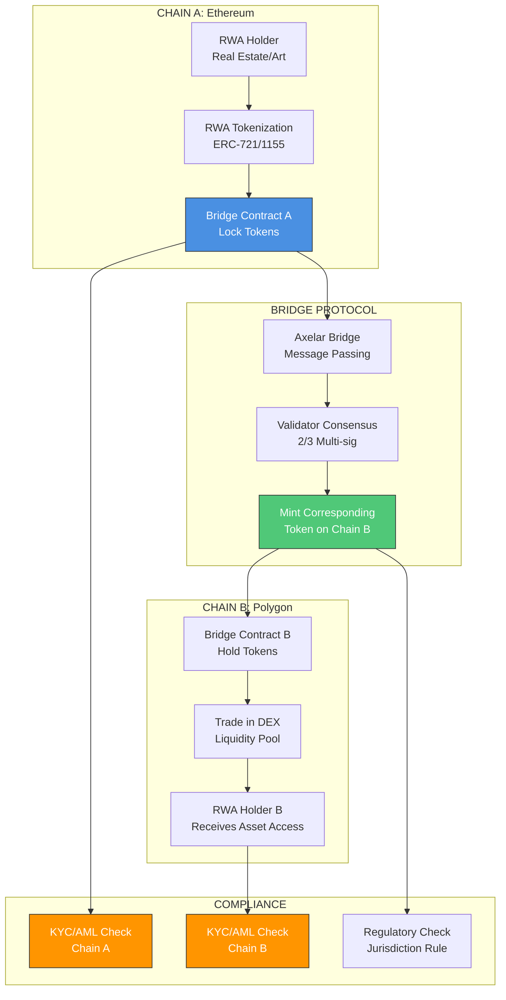

# Cross-Chain RWA Bridge Architecture

## Overview

The Cross-Chain RWA (Real World Asset) Bridge enables secure transfer of tokenized real-world assets between Ethereum (Chain A) and Polygon (Chain B) using Axelar's cross-chain messaging protocol. This system maintains regulatory compliance through integrated KYC/AML checks while ensuring asset security through multi-signature validator consensus.

## System Architecture

## Component Description

### Chain A: Ethereum (Source Chain)

#### 1. RWA Tokenization
- **Asset Types**: Real estate, art, commodities, securities
- **Token Standards**:
  - ERC-721 for unique assets (individual properties, artworks)
  - ERC-1155 for fractional ownership (shares in properties, art collections)
- **Metadata**: IPFS-stored documentation linking to legal ownership records

#### 2. Bridge Contract A
- **Function**: Lock original RWA tokens during cross-chain transfer
- **Security Features**:
  - Time-locked escrow mechanism
  - Emergency pause functionality
  - Multi-signature admin controls
- **Events**: Emits `TokensLocked` event for bridge monitoring

### Bridge Protocol Layer

#### 1. Axelar Bridge Integration
- **Message Passing**: Uses Axelar Gateway contracts for cross-chain communication
- **Gas Management**: Automated gas payment on destination chain
- **Message Format**: Standardized payload containing:
  - Token contract address
  - Token ID(s)
  - Recipient address
  - Asset metadata URI
  - Compliance approval hash

#### 2. Validator Consensus
- **Threshold**: 2/3 multi-signature requirement (Byzantine fault tolerant)
- **Validators**: Decentralized network of professional validators
- **Verification Process**:
  1. Token lock confirmation on Chain A
  2. Compliance check validation
  3. Cross-chain message authentication
  4. Approval for minting on Chain B

#### 3. Mint Authorization
- **Process**: Validators authorize minting of wrapped RWA tokens on Chain B
- **Token Mapping**: 1:1 correspondence between locked and minted tokens
- **Metadata Synchronization**: IPFS URIs preserved across chains

### Chain B: Polygon (Destination Chain)

#### 1. Bridge Contract B
- **Function**: Mint and manage wrapped RWA tokens
- **Token Standard**: ERC-721/1155 wrapped versions
- **Burning Mechanism**: Allows reverse bridge (return to Chain A)

#### 2. DEX Integration
- **Liquidity Pools**: Automated market makers for RWA token trading
- **Price Discovery**: Market-driven valuation of tokenized assets
- **Trading Pairs**: RWA tokens paired with stablecoins (USDC, USDT)

#### 3. Asset Access Rights
- **Token Holder Benefits**: Rights to underlying real-world asset
- **Legal Framework**: Smart contract-enforced ownership rights
- **Redemption**: Process for converting tokens back to physical assets

### Compliance Layer

#### 1. KYC/AML on Chain A
- **Pre-Bridge Verification**: Identity verification before token locking
- **Accredited Investor Check**: For securities-type RWAs
- **Sanctions Screening**: OFAC and global sanctions list checking
- **Implementation**: Oracle-based compliance verification

#### 2. KYC/AML on Chain B
- **Recipient Verification**: Ensure receiving address is compliant
- **Transfer Restrictions**: Whitelist-based trading permissions
- **Continuous Monitoring**: Ongoing compliance checks for token holders

#### 3. Regulatory Framework
- **Jurisdiction Rules**: Asset-specific regulatory requirements
- **Cross-Border Compliance**: International securities law adherence
- **Reporting**: Automated regulatory reporting mechanisms
- **Legal Integrations**:
  - ADGM (Abu Dhabi Global Market) compliance framework
  - Labuan DMH Bank integration for banking services
  - Multi-jurisdiction legal opinions stored on-chain

## Key Features

### Security
- **Multi-Signature Controls**: 2/3 validator consensus prevents unauthorized minting
- **Time-Locked Escrow**: Protection against front-running and flash loan attacks
- **Emergency Pause**: Circuit breaker for security incidents
- **Audit Trail**: Complete on-chain history of all bridge transactions

### Scalability
- **Polygon Network**: High throughput, low transaction costs
- **Batch Processing**: Multiple token transfers in single transaction
- **Gas Optimization**: Efficient smart contract design

### Interoperability
- **Axelar Network**: Connect to 50+ blockchain networks
- **Future Expansion**: Easy addition of new chains (BSC, Arbitrum, Optimism)
- **Standard Protocols**: ERC-721/1155 compatibility across chains

### Compliance
- **Programmable Compliance**: Smart contract-enforced regulations
- **Real-Time Verification**: Instant KYC/AML checks
- **Jurisdictional Flexibility**: Configurable rules per asset type
- **Privacy Protection**: Zero-knowledge proofs for sensitive data

## Use Cases

### 1. Real Estate Tokenization
- Tokenize property on Ethereum
- Transfer to Polygon for fractional trading
- Lower barriers to real estate investment
- Maintain legal ownership rights

### 2. Art & Collectibles
- NFT art pieces with physical backing
- Cross-chain gallery exhibitions
- Fractional ownership of masterpieces
- Global art market access

### 3. Securities & Bonds
- Compliant security token offerings
- Cross-border bond trading
- Automated dividend distribution
- Regulatory-compliant transfers

### 4. Commodities
- Gold, silver, and precious metals
- Agricultural products
- Energy credits and carbon offsets
- Warehouse receipt tokenization

## Integration with HTS Ecosystem

### TRR (Total Return Reserve) Integration
- RWA tokens can be used as collateral in TRR pools
- Cross-chain liquidity for reserve management
- Enhanced yield opportunities through multi-chain strategies

### BLXWT Reward System
- Bridge usage rewards in BLXWT tokens
- Liquidity provider incentives
- Governance participation for bridge parameters

### DMH Bank Integration
- Banking services for RWA token holders
- Fiat on/off ramps for asset purchases
- Custody services for high-value assets

### ADGM Legal Framework
- Regulatory compliance through ADGM structure
- Legal enforceability of smart contracts
- International legal recognition

## Technical Requirements

### Smart Contract Dependencies
- OpenZeppelin Contracts (v5.0+)
- Axelar Gateway SDK
- Chainlink Oracles (for compliance data)
- IPFS for metadata storage

### Infrastructure
- Ethereum mainnet deployment
- Polygon mainnet deployment
- Axelar relayer network
- IPFS pinning service
- Compliance oracle nodes

### Monitoring & Maintenance
- Real-time bridge transaction monitoring
- Validator performance tracking
- Compliance audit logging
- Emergency response procedures

## Risk Mitigation

### Smart Contract Risks
- **Mitigation**: Multi-firm security audits (CertiK, Trail of Bits)
- **Bug Bounty**: Ongoing program for vulnerability discovery
- **Formal Verification**: Mathematical proof of contract correctness

### Bridge Risks
- **Mitigation**: Gradual rollout with transaction limits
- **Insurance**: Coverage for bridge failures
- **Validator Incentives**: Slashing for malicious behavior

### Regulatory Risks
- **Mitigation**: Legal opinions in all operating jurisdictions
- **Compliance Updates**: Automated regulatory change monitoring
- **Jurisdictional Flexibility**: Asset-specific rule customization

### Market Risks
- **Mitigation**: Liquidity provider incentives
- **Oracle Integration**: Reliable price feeds for RWAs
- **Reserve Funds**: Protection against extreme volatility

## Future Enhancements

1. **Multi-Chain Expansion**: Add support for Arbitrum, Optimism, Base
2. **ZK-Rollup Integration**: Enhanced privacy for compliance data
3. **Automated Market Making**: Dedicated AMM for RWA tokens
4. **DAO Governance**: Community-driven bridge parameter management
5. **Institutional Custody**: Integration with qualified custodians
6. **DeFi Composability**: Lending, borrowing protocols for RWA collateral

---

**Document Version**: 1.0
**Last Updated**: 2025-11-18
**Related Documents**:
- `02_Smart_Contract_Specifications.md`
- `03_Compliance_Framework.md`
- `04_Implementation_Roadmap.md`
