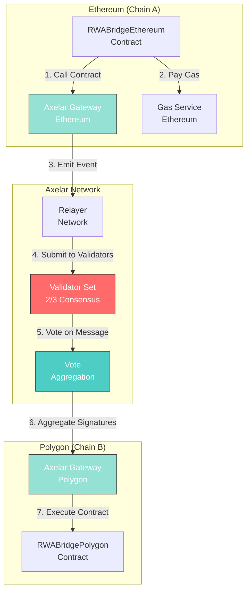
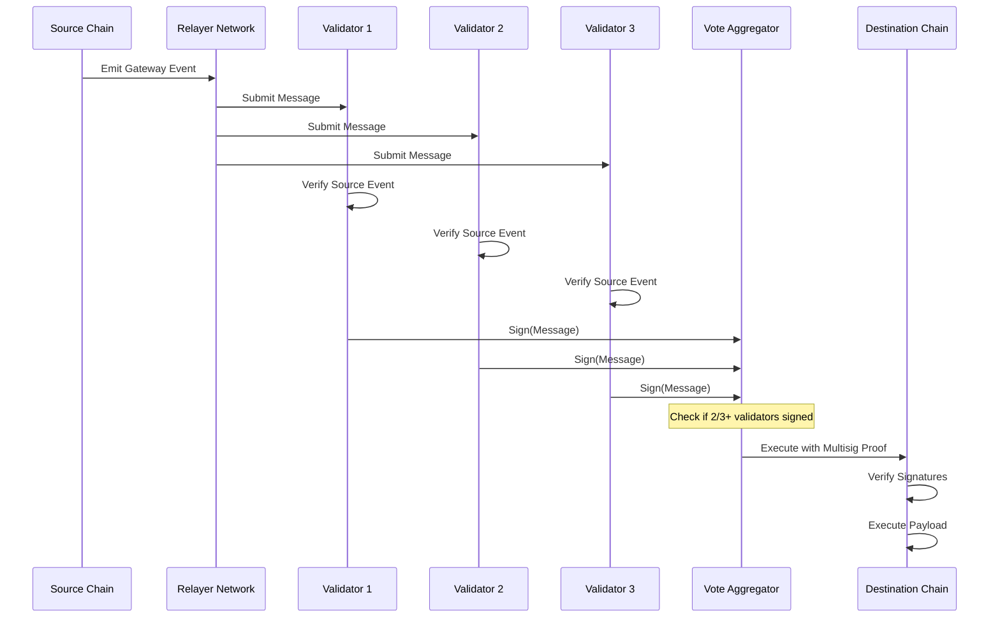

# Axelar Bridge Integration & Validator Consensus

## Overview

This document details the integration of Axelar Network for cross-chain message passing and the implementation of validator consensus mechanisms for the RWA Bridge.

---

## Axelar Network Architecture

### What is Axelar?

Axelar is a decentralized cross-chain communication protocol that enables secure message passing and asset transfers between different blockchains. It uses:

- **Gateway Contracts**: Smart contracts deployed on each connected chain
- **Relayer Network**: Off-chain infrastructure for message relay
- **Validator Set**: Decentralized validators securing cross-chain messages
- **Gas Service**: Automated gas payment for destination chain execution

### Why Axelar for RWA Bridge?

1. **Security**: Proof-of-Stake validator network with economic security
2. **Decentralization**: No single point of failure
3. **Scalability**: Supports 50+ blockchains
4. **Developer Experience**: Well-documented SDKs and tools
5. **Reliability**: Battle-tested with billions in TVL

---

## Integration Architecture

### Component Overview



---

## Smart Contract Integration

### 1. Import Axelar SDK

```solidity
// SPDX-License-Identifier: MIT
pragma solidity ^0.8.20;

import "@axelar-network/axelar-gmp-sdk-solidity/contracts/executable/AxelarExecutable.sol";
import "@axelar-network/axelar-gmp-sdk-solidity/contracts/interfaces/IAxelarGateway.sol";
import "@axelar-network/axelar-gmp-sdk-solidity/contracts/interfaces/IAxelarGasService.sol";
```

### 2. Implement AxelarExecutable

```solidity
contract RWABridgeEthereum is AxelarExecutable, ReentrancyGuard, Pausable, AccessControl {

    IAxelarGasService public immutable gasService;

    constructor(
        address _gateway,
        address _gasService
    ) AxelarExecutable(_gateway) {
        gasService = IAxelarGasService(_gasService);
        _grantRole(DEFAULT_ADMIN_ROLE, msg.sender);
    }

    // Override _execute to handle incoming messages
    function _execute(
        string calldata sourceChain,
        string calldata sourceAddress,
        bytes calldata payload
    ) internal override {
        // Handle cross-chain message
        _processIncomingMessage(sourceChain, sourceAddress, payload);
    }

    // Additional bridge logic...
}
```

### 3. Send Cross-Chain Messages

```solidity
function _sendCrossChainMessage(
    bytes32 requestId,
    address tokenContract,
    uint256 tokenId,
    address recipient,
    string calldata destinationChain,
    string memory destinationAddress,
    bytes32 metadataURI
) internal {
    // Encode bridge data
    bytes memory payload = abi.encode(
        requestId,
        tokenContract,
        tokenId,
        recipient,
        metadataURI,
        block.timestamp,
        msg.sender
    );

    // Calculate required gas for destination chain
    uint256 gasAmount = 500000; // Estimated gas for minting on Polygon

    // Pay for cross-chain gas
    gasService.payNativeGasForContractCall{value: msg.value}(
        address(this),           // Sender
        destinationChain,        // Destination chain name
        destinationAddress,      // Destination contract address
        payload,                 // Encoded message
        msg.sender              // Refund address
    );

    // Send message via Axelar Gateway
    gateway.callContract(destinationChain, destinationAddress, payload);

    emit CrossChainMessageSent(
        requestId,
        destinationChain,
        destinationAddress,
        payload
    );
}
```

### 4. Receive Cross-Chain Messages

```solidity
function _execute(
    string calldata sourceChain,
    string calldata sourceAddress,
    bytes calldata payload
) internal override {
    // Verify source
    require(
        keccak256(bytes(sourceAddress)) ==
        keccak256(bytes(trustedRemoteAddresses[sourceChain])),
        "Untrusted source"
    );

    // Decode payload
    (
        bytes32 requestId,
        address originalContract,
        uint256 originalTokenId,
        address recipient,
        bytes32 metadataURI,
        uint256 timestamp,
        address originalSender
    ) = abi.decode(
        payload,
        (bytes32, address, uint256, address, bytes32, uint256, address)
    );

    // Verify request not already processed
    require(!processedRequests[requestId], "Already processed");
    processedRequests[requestId] = true;

    // Process bridge request
    _mintWrappedToken(
        requestId,
        originalContract,
        originalTokenId,
        recipient,
        sourceChain,
        metadataURI
    );

    emit CrossChainMessageReceived(
        requestId,
        sourceChain,
        sourceAddress,
        recipient
    );
}
```

---

## Validator Consensus Mechanism

### Overview

Axelar uses a Byzantine Fault Tolerant (BFT) consensus mechanism requiring 2/3+ validator approval for cross-chain messages.

### Consensus Flow



### Validator Requirements

#### 1. Stake Requirements

```javascript
// Minimum stake to become validator
const MINIMUM_VALIDATOR_STAKE = 1_000_000; // AXL tokens

// Slashing conditions
const SLASHING_CONDITIONS = {
    downtime: 0.05,           // 5% slash for extended downtime
    double_sign: 1.0,         // 100% slash for double-signing
    invalid_vote: 0.10        // 10% slash for invalid votes
};
```

#### 2. Hardware Requirements

- **CPU**: 8+ cores
- **RAM**: 32 GB
- **Storage**: 1 TB SSD
- **Network**: 1 Gbps dedicated
- **Uptime**: 99.9%+ availability

#### 3. Security Requirements

- Hardware Security Module (HSM) for key management
- DDoS protection
- Multi-region redundancy
- 24/7 monitoring and alerting

### Validator Selection

Validators are selected based on:

1. **Stake Weight**: Higher stake = higher selection probability
2. **Performance History**: Uptime and accuracy tracking
3. **Geographic Distribution**: Ensure decentralization
4. **Reputation Score**: Community governance voting

### Vote Aggregation

```solidity
// Simplified validator consensus verification
function verifyValidatorSignatures(
    bytes32 messageHash,
    bytes[] calldata signatures,
    address[] calldata signers
) internal view returns (bool) {
    // Check minimum signature threshold
    require(
        signatures.length >= (validators.length * 2) / 3,
        "Insufficient signatures"
    );

    uint256 validSignatures = 0;
    uint256 totalStake = 0;
    uint256 signingStake = 0;

    // Calculate total validator stake
    for (uint256 i = 0; i < validators.length; i++) {
        totalStake += validators[i].stake;
    }

    // Verify each signature
    for (uint256 i = 0; i < signatures.length; i++) {
        address recovered = _recoverSigner(messageHash, signatures[i]);

        if (_isValidator(recovered)) {
            validSignatures++;
            signingStake += validatorStake[recovered];
        }
    }

    // Check stake-weighted threshold (2/3)
    return signingStake >= (totalStake * 2) / 3;
}
```

---

## Gas Management

### Gas Service Implementation

#### 1. Estimate Gas on Destination Chain

```solidity
function estimateGasFee(
    string calldata destinationChain,
    address destinationContract,
    bytes calldata payload
) public view returns (uint256) {
    // Query Axelar gas service for estimate
    return gasService.estimateGasFee(
        destinationChain,
        destinationContract,
        payload,
        500000, // Estimated gas limit
        "" // No custom params
    );
}
```

#### 2. Pay for Destination Gas

```solidity
function bridgeERC721WithGas(
    address tokenContract,
    uint256 tokenId,
    address recipient,
    string calldata destinationChain
) external payable returns (bytes32 requestId) {
    // Prepare payload
    bytes memory payload = _encodePayload(
        tokenContract,
        tokenId,
        recipient
    );

    // Estimate required gas
    uint256 gasFee = estimateGasFee(
        destinationChain,
        destinationBridgeAddress,
        payload
    );

    // Ensure sufficient payment
    require(msg.value >= gasFee, "Insufficient gas payment");

    // Pay for gas on destination
    gasService.payNativeGasForContractCall{value: gasFee}(
        address(this),
        destinationChain,
        destinationBridgeAddress,
        payload,
        msg.sender // Refund excess to sender
    );

    // Process bridge...
}
```

#### 3. Gas Refund Mechanism

```solidity
// Refund excess gas payment
function _refundExcessGas(address recipient, uint256 paid, uint256 used) internal {
    uint256 excess = paid - used;

    if (excess > 0) {
        (bool success, ) = recipient.call{value: excess}("");
        require(success, "Refund failed");

        emit GasRefunded(recipient, excess);
    }
}
```

---

## Chain Configuration

### Supported Chains

```solidity
contract ChainConfig {
    struct ChainInfo {
        string axelarChainName;
        address gatewayAddress;
        address gasServiceAddress;
        address bridgeAddress;
        uint256 confirmations;
        bool isActive;
    }

    mapping(uint256 => ChainInfo) public chains;

    constructor() {
        // Ethereum Mainnet
        chains[1] = ChainInfo({
            axelarChainName: "ethereum",
            gatewayAddress: 0x4F4495243837681061C4743b74B3eEdf548D56A5,
            gasServiceAddress: 0x2d5d7d31F671F86C782533cc367F14109a082712,
            bridgeAddress: address(0), // To be set after deployment
            confirmations: 12,
            isActive: true
        });

        // Polygon Mainnet
        chains[137] = ChainInfo({
            axelarChainName: "polygon",
            gatewayAddress: 0x6f015F16De9fC8791b234eF68D486d2bF203FBA8,
            gasServiceAddress: 0x2d5d7d31F671F86C782533cc367F14109a082712,
            bridgeAddress: address(0), // To be set after deployment
            confirmations: 128,
            isActive: true
        });

        // Add more chains...
    }
}
```

### Message Execution Configuration

```javascript
// Axelar execution parameters
const EXECUTION_CONFIG = {
    ethereum: {
        confirmations: 12,
        gasLimit: 500000,
        maxGasPrice: '100 gwei'
    },
    polygon: {
        confirmations: 128,
        gasLimit: 500000,
        maxGasPrice: '500 gwei'
    },
    avalanche: {
        confirmations: 1,
        gasLimit: 500000,
        maxGasPrice: '50 gwei'
    }
};
```

---

## Security Considerations

### 1. Message Replay Protection

```solidity
mapping(bytes32 => bool) public processedMessages;

function _execute(
    string calldata sourceChain,
    string calldata sourceAddress,
    bytes calldata payload
) internal override {
    bytes32 messageHash = keccak256(
        abi.encodePacked(sourceChain, sourceAddress, payload)
    );

    require(!processedMessages[messageHash], "Message already processed");
    processedMessages[messageHash] = true;

    // Process message...
}
```

### 2. Source Verification

```solidity
mapping(string => string) public trustedRemoteAddresses;

function setTrustedRemote(
    string calldata sourceChain,
    string calldata sourceAddress
) external onlyRole(ADMIN_ROLE) {
    trustedRemoteAddresses[sourceChain] = sourceAddress;
}

function _execute(
    string calldata sourceChain,
    string calldata sourceAddress,
    bytes calldata payload
) internal override {
    require(
        keccak256(bytes(sourceAddress)) ==
        keccak256(bytes(trustedRemoteAddresses[sourceChain])),
        "Untrusted source"
    );

    // Process message...
}
```

### 3. Rate Limiting

```solidity
struct RateLimit {
    uint256 maxTransactionsPerHour;
    uint256 maxValuePerTransaction;
    uint256 hourlyTransactionCount;
    uint256 lastResetTime;
}

mapping(address => RateLimit) public userLimits;

function _checkRateLimit(address user, uint256 value) internal {
    RateLimit storage limit = userLimits[user];

    // Reset hourly counter
    if (block.timestamp - limit.lastResetTime >= 1 hours) {
        limit.hourlyTransactionCount = 0;
        limit.lastResetTime = block.timestamp;
    }

    // Check limits
    require(
        limit.hourlyTransactionCount < limit.maxTransactionsPerHour,
        "Hourly transaction limit exceeded"
    );
    require(
        value <= limit.maxValuePerTransaction,
        "Transaction value too high"
    );

    limit.hourlyTransactionCount++;
}
```

---

## Monitoring & Observability

### Event Emission

```solidity
event MessageSent(
    bytes32 indexed messageId,
    string destinationChain,
    address indexed sender,
    uint256 timestamp,
    uint256 gasPaid
);

event MessageReceived(
    bytes32 indexed messageId,
    string sourceChain,
    address indexed recipient,
    uint256 timestamp,
    bool success
);

event ValidatorVoted(
    bytes32 indexed messageId,
    address indexed validator,
    bool vote,
    uint256 timestamp
);
```

### Off-Chain Monitoring

```javascript
// Monitor Axelar events
async function monitorBridgeMessages() {
    const ethereumBridge = await ethers.getContractAt(
        "RWABridgeEthereum",
        ETHEREUM_BRIDGE_ADDRESS
    );

    const polygonBridge = await ethers.getContractAt(
        "RWABridgePolygon",
        POLYGON_BRIDGE_ADDRESS
    );

    // Listen for sent messages
    ethereumBridge.on("MessageSent", (messageId, destinationChain, sender, timestamp, gasPaid) => {
        console.log(`[SENT] Message ${messageId} to ${destinationChain}`);
        trackMessage(messageId, "sent");
    });

    // Listen for received messages
    polygonBridge.on("MessageReceived", (messageId, sourceChain, recipient, timestamp, success) => {
        console.log(`[RECEIVED] Message ${messageId} from ${sourceChain}: ${success ? 'SUCCESS' : 'FAILED'}`);
        trackMessage(messageId, "received");
    });
}
```

---

## Testing Strategy

### Unit Tests

```javascript
describe("Axelar Integration", function() {
    it("Should send cross-chain message", async function() {
        const tx = await bridge.bridgeERC721(
            tokenAddress,
            tokenId,
            recipient,
            "polygon",
            complianceProof,
            { value: ethers.utils.parseEther("0.1") }
        );

        await expect(tx)
            .to.emit(bridge, "MessageSent")
            .withArgs(messageId, "polygon", sender, timestamp, gasPaid);
    });

    it("Should verify validator signatures", async function() {
        const messageHash = ethers.utils.keccak256(payload);
        const signatures = await getValidatorSignatures(messageHash);

        expect(
            await bridge.verifyValidatorSignatures(
                messageHash,
                signatures,
                validators
            )
        ).to.be.true;
    });
});
```

### Integration Tests

```javascript
describe("End-to-End Bridge", function() {
    it("Should bridge token from Ethereum to Polygon", async function() {
        // 1. Lock token on Ethereum
        await ethBridge.bridgeERC721(token, tokenId, recipient, "polygon");

        // 2. Wait for Axelar validators
        await waitForValidatorConsensus();

        // 3. Verify minting on Polygon
        const wrappedToken = await polyBridge.getWrappedToken(token, tokenId);
        expect(wrappedToken.recipient).to.equal(recipient);
    });
});
```

---

## Deployment Guide

### 1. Deploy Gateway Contracts

```bash
# Deploy on Ethereum
npx hardhat run scripts/deploy-ethereum.js --network ethereum

# Deploy on Polygon
npx hardhat run scripts/deploy-polygon.js --network polygon
```

### 2. Configure Cross-Chain Addresses

```javascript
// Set trusted remote on Ethereum
await ethBridge.setTrustedRemote("polygon", polygonBridgeAddress);

// Set trusted remote on Polygon
await polyBridge.setTrustedRemote("ethereum", ethereumBridgeAddress);
```

### 3. Fund Gas Service

```bash
# Fund Ethereum gas service for Polygon execution
npx hardhat run scripts/fund-gas-service.js --network ethereum
```

---

## Cost Analysis

### Transaction Costs

| Operation | Ethereum Gas | Polygon Gas | Axelar Fee | Total Cost (USD) |
|-----------|--------------|-------------|------------|------------------|
| Bridge ERC721 | ~150,000 | ~100,000 | $5 | ~$30-50 |
| Bridge ERC1155 | ~180,000 | ~120,000 | $5 | ~$35-55 |
| Reverse Bridge | ~100,000 | ~80,000 | $5 | ~$20-35 |
| Batch (10 tokens) | ~500,000 | ~300,000 | $8 | ~$100-150 |

*Prices based on ETH=$2000, MATIC=$0.80, gas prices at 30 gwei (ETH) and 100 gwei (Polygon)*

---

**Document Version**: 1.0
**Last Updated**: 2025-11-18
**Axelar SDK Version**: v3.0+
**Related Documents**:
- `01_Bridge_Architecture.md`
- `02_Smart_Contract_Specifications.md`
- `04_Compliance_Framework.md`
