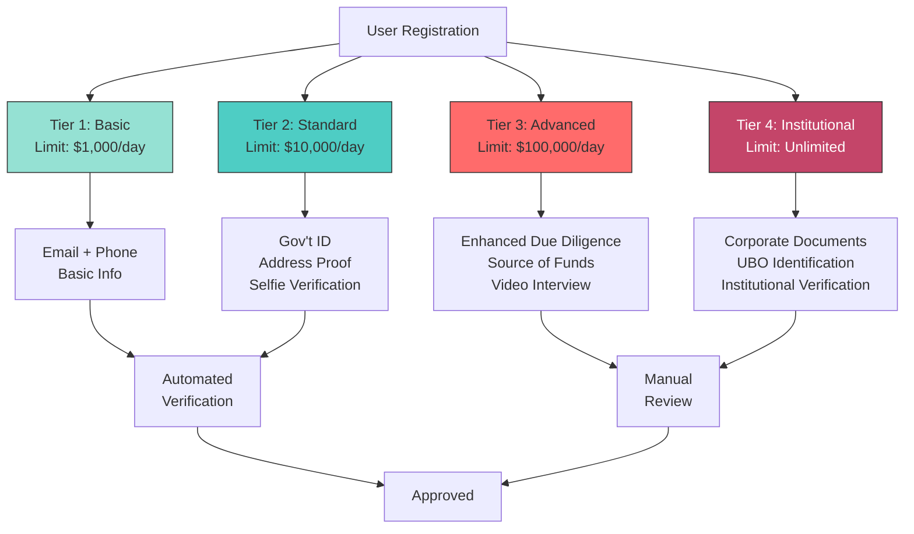
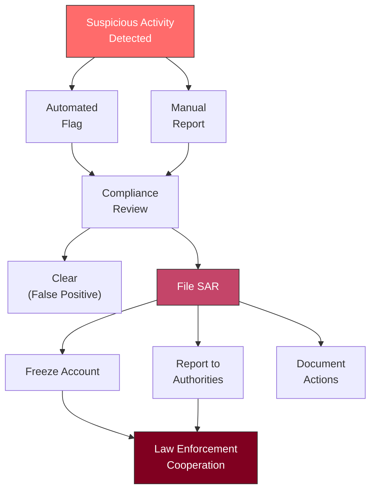
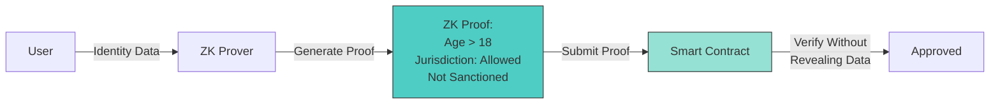

# Compliance & KYC/AML Framework

## Overview

The Cross-Chain RWA Bridge implements a comprehensive compliance framework to ensure regulatory adherence across multiple jurisdictions while maintaining user privacy and operational efficiency.

---

## Regulatory Landscape

### Applicable Regulations

#### 1. United States
- **Securities Act of 1933**: Registration and disclosure requirements
- **Securities Exchange Act of 1934**: Trading regulations
- **Bank Secrecy Act (BSA)**: AML reporting requirements
- **PATRIOT Act**: Enhanced due diligence
- **SEC Reg A+/D**: Exemptions for token offerings
- **FinCEN Guidance**: Virtual currency regulations

#### 2. European Union
- **MiFID II**: Markets in Financial Instruments Directive
- **5AMLD/6AMLD**: Anti-Money Laundering Directives
- **GDPR**: Data protection and privacy
- **eIDAS**: Electronic identification and trust services

#### 3. United Arab Emirates (ADGM)
- **FSRA Regulations**: Financial Services and Markets Regulations
- **FSMR**: Financial Services and Markets Regulations 2015
- **AML Rulebook**: ADGM's AML/CTF framework
- **Data Protection Regulations**: ADGM Data Protection Regulations 2021

#### 4. Malaysia (Labuan)
- **Labuan FSA**: Financial Services Authority regulations
- **LFSA Act 2010**: Labuan Financial Services and Securities Act
- **AML/CFT**: Anti-Money Laundering and Counter-Financing of Terrorism
- **SCM Guidelines**: Securities Commission Malaysia guidelines

#### 5. International Standards
- **FATF Recommendations**: Financial Action Task Force guidelines
- **Basel III**: International banking regulations
- **ISO 27001**: Information security management

---

## KYC (Know Your Customer) Framework

### Tier-Based KYC System



### Tier Requirements

#### Tier 1: Basic (Retail - Low Risk)
**Transaction Limits**: $1,000/day, $5,000/month

**Required Information**:
- Full legal name
- Email address (verified)
- Phone number (verified)
- Country of residence
- Date of birth

**Verification Method**: Email/SMS OTP

**Processing Time**: Instant

#### Tier 2: Standard (Retail - Medium Risk)
**Transaction Limits**: $10,000/day, $50,000/month

**Required Information**:
- All Tier 1 requirements
- Government-issued ID (passport, driver's license, national ID)
- Proof of address (utility bill, bank statement <3 months old)
- Selfie with ID for liveness detection
- Occupation and income range

**Verification Method**: Automated document verification + AI liveness detection

**Processing Time**: 1-24 hours

#### Tier 3: Advanced (High Net Worth - High Risk)
**Transaction Limits**: $100,000/day, $500,000/month

**Required Information**:
- All Tier 2 requirements
- Enhanced due diligence questionnaire
- Source of funds documentation
- Video KYC interview
- Tax identification number
- Bank reference letter
- Politically Exposed Person (PEP) screening

**Verification Method**: Manual review by compliance team

**Processing Time**: 2-5 business days

#### Tier 4: Institutional (Corporate/Accredited)
**Transaction Limits**: Unlimited (subject to individual assessment)

**Required Information**:
- All Tier 3 requirements (for beneficial owners)
- Corporate registration documents
- Articles of incorporation/association
- Shareholder structure and UBO identification
- Board resolution authorizing trading
- Audited financial statements (last 2 years)
- Regulatory licenses (if applicable)
- AML/CTF policies and procedures

**Verification Method**: Comprehensive institutional due diligence

**Processing Time**: 5-15 business days

---

## AML (Anti-Money Laundering) Procedures

### Risk-Based Approach

```solidity
// AML Risk Scoring System
enum RiskLevel {
    Low,        // 0-30 points
    Medium,     // 31-60 points
    High,       // 61-80 points
    Prohibited  // 81+ points
}

struct RiskAssessment {
    uint8 geographicRisk;        // 0-20
    uint8 transactionRisk;       // 0-20
    uint8 customerRisk;          // 0-20
    uint8 productRisk;           // 0-20
    uint8 channelRisk;           // 0-20
    uint256 totalScore;
    RiskLevel level;
    uint256 lastAssessment;
}
```

### Risk Factors

#### 1. Geographic Risk (0-20 points)

| Jurisdiction | Risk Score | Examples |
|--------------|------------|----------|
| Low Risk | 0-5 | USA, UK, EU, Singapore, Switzerland |
| Medium Risk | 6-10 | UAE, Malaysia, Hong Kong, South Korea |
| High Risk | 11-15 | Russia, China, Turkey, Brazil |
| Prohibited | 16-20 | FATF blacklist, sanctioned countries |

#### 2. Transaction Risk (0-20 points)

| Pattern | Risk Score | Description |
|---------|------------|-------------|
| Normal | 0-5 | Consistent transaction patterns |
| Irregular | 6-10 | Occasional large transactions |
| Suspicious | 11-15 | Rapid movement, structuring patterns |
| High Risk | 16-20 | Mixing services, dark web links |

#### 3. Customer Risk (0-20 points)

| Category | Risk Score | Description |
|----------|------------|-------------|
| Low Risk | 0-5 | Verified identity, clean history |
| Medium Risk | 6-10 | Limited history, minor flags |
| High Risk | 11-15 | PEP, adverse media, sanctions screening hits |
| Prohibited | 16-20 | Confirmed fraud, terrorism links |

#### 4. Product Risk (0-20 points)

| Asset Type | Risk Score | Rationale |
|------------|------------|-----------|
| Real Estate | 5 | Relatively low liquidity, traceable |
| Art & Collectibles | 10 | Subjective valuation, portability |
| Precious Metals | 12 | High liquidity, anonymity potential |
| Securities | 8 | Regulated, transparent |

#### 5. Channel Risk (0-20 points)

| Channel | Risk Score | Description |
|---------|------------|-------------|
| Direct | 0-5 | Face-to-face, video verification |
| Online (KYC) | 6-10 | Remote with strong verification |
| Third-Party | 11-15 | Reliance on external KYC |
| Anonymous | 16-20 | No identity verification (prohibited) |

### Transaction Monitoring

```javascript
// Real-time transaction monitoring rules
const MONITORING_RULES = {
    // Velocity checks
    rapidTransfers: {
        threshold: 5,
        timeWindow: '1 hour',
        action: 'FLAG'
    },

    // Amount thresholds
    largeTransaction: {
        threshold: 10000, // USD
        action: 'REVIEW'
    },

    // Structuring detection
    structuring: {
        pattern: 'Multiple txs just below $10k within 24h',
        action: 'ESCALATE'
    },

    // Geographic anomalies
    geographicMismatch: {
        pattern: 'Transaction from high-risk jurisdiction',
        action: 'ENHANCED_DUE_DILIGENCE'
    },

    // Sanctions screening
    sanctionsHit: {
        check: 'OFAC, EU, UN sanctions lists',
        action: 'BLOCK_IMMEDIATELY'
    }
};
```

### Suspicious Activity Reporting (SAR)



#### SAR Triggers

1. **Transaction Patterns**:
   - Structuring to avoid reporting thresholds
   - Rapid movement of funds (layering)
   - Round-trip transactions
   - Transactions with no clear economic purpose

2. **Customer Behavior**:
   - Reluctance to provide information
   - Unusual concern with compliance procedures
   - Frequent changes in account information
   - Use of multiple accounts for no apparent reason

3. **Geographic Red Flags**:
   - Transactions involving high-risk jurisdictions
   - Inconsistency between customer profile and transaction pattern
   - Involvement of shell companies in offshore jurisdictions

4. **Asset-Specific**:
   - Over/under-valuation of RWA tokens
   - Frequent trading of illiquid assets
   - Transactions involving sanctioned assets

---

## Sanctions Screening

### Screening Lists

```javascript
const SANCTIONS_LISTS = {
    OFAC: {
        name: 'Office of Foreign Assets Control (US)',
        lists: [
            'SDN (Specially Designated Nationals)',
            'Sectoral Sanctions',
            'Foreign Sanctions Evaders',
            'Non-SDN entities'
        ],
        updateFrequency: 'Real-time'
    },

    UN: {
        name: 'United Nations Security Council',
        lists: [
            'UN Consolidated List',
            'ISIL (Da\'esh) and Al-Qaida',
            'Taliban',
            'Terrorism'
        ],
        updateFrequency: 'Daily'
    },

    EU: {
        name: 'European Union',
        lists: [
            'EU Consolidated List',
            'Asset Freeze Targets',
            'Terrorism List'
        ],
        updateFrequency: 'Daily'
    },

    HMT: {
        name: 'UK HM Treasury',
        lists: [
            'UK Sanctions List',
            'Financial Sanctions Targets'
        ],
        updateFrequency: 'Daily'
    }
};
```

### Screening Process

```solidity
contract SanctionsScreening {

    // Sanctions screening oracle
    ISanctionsOracle public sanctionsOracle;

    // Screening cache (24-hour validity)
    mapping(address => ScreeningResult) public screeningCache;

    struct ScreeningResult {
        bool isClean;
        uint256 timestamp;
        string matchDetails;
        uint8 confidenceScore;
    }

    function screenAddress(address user)
        external
        returns (bool isClean)
    {
        // Check cache
        ScreeningResult memory cached = screeningCache[user];
        if (block.timestamp - cached.timestamp < 24 hours) {
            return cached.isClean;
        }

        // Perform fresh screening
        (
            bool clean,
            string memory matchDetails,
            uint8 confidence
        ) = sanctionsOracle.checkAddress(user);

        // Update cache
        screeningCache[user] = ScreeningResult({
            isClean: clean,
            timestamp: block.timestamp,
            matchDetails: matchDetails,
            confidenceScore: confidence
        });

        // Log screening
        emit AddressScreened(user, clean, confidence);

        return clean;
    }

    function requireCleanAddress(address user) internal view {
        ScreeningResult memory result = screeningCache[user];

        require(
            result.isClean &&
            block.timestamp - result.timestamp < 24 hours,
            "Address failed sanctions screening"
        );
    }
}
```

### Screening Implementation in Bridge

```solidity
function bridgeERC721(
    address tokenContract,
    uint256 tokenId,
    address recipient,
    string calldata destinationChain,
    bytes calldata complianceProof
) external payable returns (bytes32 requestId) {
    // 1. Sanctions screening for sender
    require(
        sanctionsScreening.screenAddress(msg.sender),
        "Sender failed sanctions screening"
    );

    // 2. Sanctions screening for recipient
    require(
        sanctionsScreening.screenAddress(recipient),
        "Recipient failed sanctions screening"
    );

    // 3. Additional compliance checks
    require(
        _checkCompliance(msg.sender, complianceProof),
        "Compliance verification failed"
    );

    // 4. Proceed with bridge...
}
```

---

## Privacy-Preserving Compliance

### Zero-Knowledge Proofs for KYC



### Implementation with zk-SNARKs

```solidity
// Simplified ZK-KYC verification
contract ZKKYCVerifier {

    // Verification key (generated during setup)
    struct VerificationKey {
        uint256[2] alpha;
        uint256[2][2] beta;
        uint256[2][2] gamma;
        uint256[2][2] delta;
        uint256[2][] gammaABC;
    }

    VerificationKey public vk;

    struct Proof {
        uint256[2] a;
        uint256[2][2] b;
        uint256[2] c;
    }

    // Public inputs (hashed commitments)
    struct PublicInputs {
        uint256 ageThreshold;      // e.g., hash(age >= 18)
        uint256 jurisdictionHash;   // e.g., hash("ALLOWED")
        uint256 sanctionsHash;      // e.g., hash("CLEAN")
        uint256 nullifier;          // Prevent double-use
    }

    mapping(uint256 => bool) public usedNullifiers;

    function verify(
        Proof calldata proof,
        PublicInputs calldata inputs
    ) external returns (bool) {
        // Verify nullifier not used
        require(!usedNullifiers[inputs.nullifier], "Proof already used");

        // Verify zk-SNARK proof
        bool valid = _verifyProof(
            proof,
            [
                inputs.ageThreshold,
                inputs.jurisdictionHash,
                inputs.sanctionsHash,
                inputs.nullifier
            ]
        );

        if (valid) {
            usedNullifiers[inputs.nullifier] = true;
            emit ProofVerified(inputs.nullifier, block.timestamp);
        }

        return valid;
    }

    function _verifyProof(
        Proof memory proof,
        uint256[4] memory input
    ) internal view returns (bool) {
        // Groth16 verification algorithm
        // (Simplified - actual implementation requires elliptic curve operations)
        // ...
        return true; // Placeholder
    }
}
```

---

## Compliance Automation

### Smart Contract Integration

```solidity
contract ComplianceAutomation {

    // Compliance modules
    IKYCProvider public kycProvider;
    IAMLScreening public amlScreening;
    ISanctionsScreening public sanctionsScreening;
    IRegulatorReporting public regulatorReporting;

    struct ComplianceCheck {
        bool kycPassed;
        bool amlPassed;
        bool sanctionsPassed;
        uint256 riskScore;
        uint256 timestamp;
    }

    mapping(address => ComplianceCheck) public complianceStatus;

    // Automated compliance verification
    function performComplianceCheck(address user)
        external
        returns (bool passed, uint256 riskScore)
    {
        ComplianceCheck memory check;

        // 1. KYC Verification
        check.kycPassed = kycProvider.isVerified(user);

        // 2. AML Screening
        (check.amlPassed, check.riskScore) = amlScreening.assessRisk(user);

        // 3. Sanctions Screening
        check.sanctionsPassed = sanctionsScreening.screenAddress(user);

        check.timestamp = block.timestamp;

        // Store results
        complianceStatus[user] = check;

        // Overall pass/fail
        passed = check.kycPassed &&
                 check.amlPassed &&
                 check.sanctionsPassed &&
                 check.riskScore < 60; // Medium-High threshold

        // Auto-report to regulators if required
        if (check.riskScore > 80 || !check.sanctionsPassed) {
            regulatorReporting.fileSAR(user, check);
        }

        emit ComplianceCheckCompleted(user, passed, check.riskScore);

        return (passed, check.riskScore);
    }
}
```

### Regulatory Reporting

```javascript
// Automated regulatory reporting
class RegulatoryReporter {
    constructor(jurisdictions) {
        this.jurisdictions = jurisdictions;
        this.reportingThresholds = {
            USD: 10000,  // FinCEN threshold
            EUR: 10000,  // EU threshold
            AED: 55000   // UAE threshold
        };
    }

    async generateCTR(transaction) {
        // Currency Transaction Report (CTR)
        if (transaction.amount > this.reportingThresholds[transaction.currency]) {
            const report = {
                reportType: 'CTR',
                transactionId: transaction.id,
                amount: transaction.amount,
                currency: transaction.currency,
                sender: await this.getCustomerDetails(transaction.sender),
                recipient: await this.getCustomerDetails(transaction.recipient),
                timestamp: transaction.timestamp,
                assetType: transaction.assetType
            };

            await this.submitToRegulator(report, transaction.jurisdiction);
        }
    }

    async generateSAR(suspiciousActivity) {
        // Suspicious Activity Report (SAR)
        const report = {
            reportType: 'SAR',
            activityId: suspiciousActivity.id,
            customer: await this.getCustomerDetails(suspiciousActivity.customer),
            suspiciousPatterns: suspiciousActivity.patterns,
            riskScore: suspiciousActivity.riskScore,
            investigationNotes: suspiciousActivity.notes,
            filingDate: new Date().toISOString()
        };

        // Do NOT notify customer (legal requirement)
        await this.submitToRegulator(report, suspiciousActivity.jurisdiction, {
            confidential: true,
            noCustomerNotification: true
        });
    }

    async generateFBAR(annualHoldings) {
        // Foreign Bank Account Report (FBAR)
        // Required for US persons with >$10k in foreign accounts
        const report = {
            reportType: 'FBAR',
            year: new Date().getFullYear(),
            maxValue: annualHoldings.maxValue,
            accounts: annualHoldings.accounts.map(acc => ({
                accountNumber: acc.id,
                institution: 'Cross-Chain RWA Bridge',
                jurisdiction: acc.jurisdiction,
                maxBalance: acc.maxBalance
            }))
        };

        await this.submitToRegulator(report, 'FinCEN');
    }
}
```

---

## Jurisdictional Compliance

### ADGM (Abu Dhabi Global Market) Integration

```solidity
contract ADGMCompliance {

    // ADGM-specific requirements
    struct ADGMRequirements {
        bool fsraApproved;           // FSRA approval for security tokens
        bool dataProtectionCompliant; // ADGM DPR compliance
        bool localCustodian;         // Use of ADGM-approved custodian
        string licenseNumber;        // FSRA license number
    }

    mapping(address => ADGMRequirements) public adgmStatus;

    function verifyADGMCompliance(address tokenContract)
        external
        view
        returns (bool)
    {
        ADGMRequirements memory req = adgmStatus[tokenContract];

        return req.fsraApproved &&
               req.dataProtectionCompliant &&
               req.localCustodian &&
               bytes(req.licenseNumber).length > 0;
    }

    // ADGM-specific transfer restrictions
    function checkADGMTransfer(
        address from,
        address to,
        uint256 tokenId
    ) external view returns (bool allowed, string memory reason) {
        // Check investor accreditation
        if (!isAccreditedInvestor(to)) {
            return (false, "Recipient not accredited investor");
        }

        // Check lock-up period
        if (isWithinLockupPeriod(tokenId)) {
            return (false, "Token within lock-up period");
        }

        // Check transfer limits
        if (exceedsTransferLimit(from, to, tokenId)) {
            return (false, "Exceeds transfer limit");
        }

        return (true, "");
    }
}
```

### Labuan (Malaysia) Compliance

```solidity
contract LabuanCompliance {

    // Labuan FSA requirements
    struct LabuanRequirements {
        bool lfsaRegistered;         // LFSA registration
        bool islamicFinanceCompliant; // Shariah compliance (optional)
        bool taxReportingCompliant;   // Tax reporting to LHDN
        string licenseType;          // "Securities", "Fund Management", etc.
    }

    mapping(address => LabuanRequirements) public labuanStatus;

    // Labuan-specific compliance for Islamic finance
    function verifyShariah Compliance(address tokenContract)
        external
        view
        returns (bool)
    {
        // Check Shariah board approval
        // Ensure asset is halal
        // Verify profit-sharing structure (not interest-based)
        return labuanStatus[tokenContract].islamicFinanceCompliant;
    }
}
```

---

## Data Protection & Privacy

### GDPR Compliance

```javascript
class GDPRCompliance {
    // Right to be forgotten
    async processDataDeletionRequest(userId) {
        // 1. Verify user identity
        await this.verifyIdentity(userId);

        // 2. Check legal obligations (cannot delete if SAR filed)
        if (await this.hasActiveSAR(userId)) {
            throw new Error("Cannot delete data - active SAR");
        }

        // 3. Anonymize on-chain data (cannot delete from blockchain)
        await this.anonymizeBlockchainRecords(userId);

        // 4. Delete off-chain data
        await this.deleteOffChainData(userId);

        // 5. Provide confirmation
        return {
            status: 'completed',
            timestamp: new Date().toISOString(),
            dataRetained: 'On-chain transaction hashes (anonymized)'
        };
    }

    // Data portability
    async exportUserData(userId) {
        return {
            personalInfo: await this.getPersonalInfo(userId),
            kycDocuments: await this.getKYCDocuments(userId),
            transactionHistory: await this.getTransactions(userId),
            complianceRecords: await this.getComplianceRecords(userId),
            format: 'JSON',
            generatedAt: new Date().toISOString()
        };
    }
}
```

---

## Audit Trail & Record Keeping

### Compliance Logging

```solidity
contract ComplianceLogger {

    event KYCVerified(
        address indexed user,
        uint256 tier,
        uint256 timestamp,
        bytes32 documentHash
    );

    event AMLScreeningPerformed(
        address indexed user,
        uint256 riskScore,
        RiskLevel level,
        uint256 timestamp
    );

    event SanctionsScreeningPerformed(
        address indexed user,
        bool passed,
        string[] listsChecked,
        uint256 timestamp
    );

    event SARFiled(
        bytes32 indexed sarId,
        address indexed user,
        string reason,
        uint256 timestamp
    );

    event ComplianceActionTaken(
        address indexed user,
        string action,
        string reason,
        uint256 timestamp
    );

    // Immutable audit trail
    struct AuditRecord {
        bytes32 recordId;
        string eventType;
        address user;
        bytes32 dataHash;
        uint256 timestamp;
        address performer;
    }

    AuditRecord[] public auditTrail;

    function logComplianceEvent(
        string memory eventType,
        address user,
        bytes32 dataHash
    ) external onlyRole(COMPLIANCE_ROLE) {
        auditTrail.push(AuditRecord({
            recordId: keccak256(abi.encodePacked(
                eventType,
                user,
                block.timestamp
            )),
            eventType: eventType,
            user: user,
            dataHash: dataHash,
            timestamp: block.timestamp,
            performer: msg.sender
        }));
    }

    // Retrieve audit history (paginated)
    function getAuditHistory(
        address user,
        uint256 offset,
        uint256 limit
    ) external view returns (AuditRecord[] memory) {
        // Implementation...
    }
}
```

### Record Retention Periods

| Record Type | Retention Period | Jurisdiction |
|-------------|------------------|--------------|
| KYC Documents | 5 years after relationship ends | FinCEN, EU |
| Transaction Records | 5 years | FinCEN |
| SAR Records | 5 years from filing | FinCEN |
| AML Risk Assessments | 5 years | FATF |
| Compliance Policies | 6 years | ADGM |
| Audit Logs | 7 years | SOX (if applicable) |

---

## Integration with HTS Ecosystem

### ADGM Legal Framework Compliance

The Cross-Chain RWA Bridge integrates with HTS's existing ADGM legal framework:

- **FSRA Licensing**: Bridge operations covered under existing FSRA license
- **Legal Opinions**: Cross-border transfer legality verified
- **Regulatory Reporting**: Automated reporting to FSRA
- **Investor Protection**: Compliance with ADGM investor protection rules

### DMH Bank Integration

Labuan DMH Bank provides:

- **Fiat Gateway**: KYC-compliant fiat on/off-ramps
- **Custody Services**: Qualified custodian for institutional clients
- **Banking Services**: Account services for token holders
- **AML Screening**: Bank-grade AML screening infrastructure

---

## Compliance Cost Estimates

| Service | Annual Cost | Provider Examples |
|---------|-------------|-------------------|
| KYC/AML Platform | $50,000 - $200,000 | Chainalysis, Elliptic, CipherTrace |
| Sanctions Screening | $20,000 - $80,000 | Dow Jones, LexisNexis, Refinitiv |
| Legal Counsel | $100,000 - $500,000 | International law firms |
| Compliance Staff | $200,000 - $1,000,000 | In-house team (2-5 people) |
| Regulatory Licenses | $50,000 - $500,000 | Varies by jurisdiction |
| Audit & Certification | $50,000 - $200,000 | Big 4 accounting firms |
| **Total Annual** | **$470,000 - $2,480,000** | |

---

## Compliance Roadmap

### Phase 1: Foundation (Months 1-3)
- [ ] Implement basic KYC tiers
- [ ] Integrate sanctions screening
- [ ] Establish AML policies
- [ ] Deploy compliance contracts

### Phase 2: Automation (Months 4-6)
- [ ] Implement automated risk scoring
- [ ] Deploy transaction monitoring
- [ ] Integrate regulatory reporting
- [ ] Establish SAR procedures

### Phase 3: Enhancement (Months 7-9)
- [ ] Implement ZK-KYC privacy features
- [ ] Multi-jurisdiction compliance
- [ ] Advanced AML analytics
- [ ] GDPR compliance tools

### Phase 4: Optimization (Months 10-12)
- [ ] AI-powered risk assessment
- [ ] Real-time sanctions updates
- [ ] Compliance dashboard
- [ ] Third-party audits

---

**Document Version**: 1.0
**Last Updated**: 2025-11-18
**Compliance Officer**: [To be assigned]
**Legal Review**: [Required before production]
**Related Documents**:
- `01_Bridge_Architecture.md`
- `02_Smart_Contract_Specifications.md`
- HTS ADGM Legal Core Documentation
- DMH Bank AML/CTF Policy
