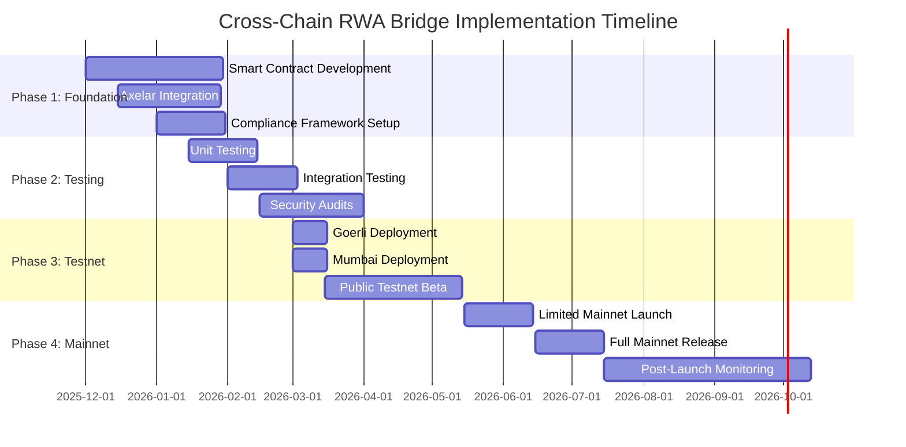

# Implementation Roadmap & Security Considerations

## Overview

This document outlines the phased implementation plan for the Cross-Chain RWA Bridge, including technical milestones, security audits, testing strategies, and risk mitigation approaches.

---

## Implementation Timeline



---

## Phase 1: Foundation (Months 1-2)

### Objectives
- Develop core smart contracts
- Integrate Axelar cross-chain infrastructure
- Establish compliance framework
- Set up development environment

### Deliverables

#### 1. Smart Contract Development

**Ethereum Contracts** (Weeks 1-4)
- [ ] RWABridgeEthereum.sol
  - Token locking mechanism
  - Cross-chain message sending
  - Compliance integration
  - Emergency controls
- [ ] RWAToken.sol (reference implementation)
- [ ] ComplianceOracle.sol
- [ ] Access control & role management

**Polygon Contracts** (Weeks 3-6)
- [ ] RWABridgePolygon.sol
  - Message receiving from Axelar
  - Wrapped token minting
  - Reverse bridge functionality
- [ ] WrappedRWA.sol (factory pattern)
- [ ] Liquidity pool integration

**Shared Infrastructure** (Weeks 5-8)
- [ ] Chainlink oracle integration
- [ ] IPFS metadata management
- [ ] Gas optimization patterns
- [ ] Event monitoring system

#### 2. Axelar Integration (Weeks 3-6)

- [ ] Gateway contract integration
- [ ] Gas service implementation
- [ ] Cross-chain message formatting
- [ ] Validator consensus verification
- [ ] Relayer network setup

#### 3. Development Environment (Weeks 1-2)

```bash
# Project structure
cross-chain-rwa-bridge/
├── contracts/
│   ├── ethereum/
│   │   ├── RWABridgeEthereum.sol
│   │   ├── RWAToken.sol
│   │   └── ComplianceOracle.sol
│   ├── polygon/
│   │   ├── RWABridgePolygon.sol
│   │   └── WrappedRWA.sol
│   ├── shared/
│   │   ├── interfaces/
│   │   └── libraries/
│   └── mocks/
├── scripts/
│   ├── deploy-ethereum.js
│   ├── deploy-polygon.js
│   └── configure-bridge.js
├── test/
│   ├── unit/
│   ├── integration/
│   └── e2e/
├── docs/
├── hardhat.config.js
└── package.json
```

#### 4. Dependencies Installation

```json
{
  "dependencies": {
    "@openzeppelin/contracts": "^5.0.0",
    "@axelar-network/axelar-gmp-sdk-solidity": "^3.0.0",
    "@chainlink/contracts": "^0.8.0",
    "ethers": "^6.0.0",
    "hardhat": "^2.19.0"
  },
  "devDependencies": {
    "@nomicfoundation/hardhat-toolbox": "^4.0.0",
    "@nomiclabs/hardhat-etherscan": "^3.1.0",
    "hardhat-gas-reporter": "^1.0.9",
    "solidity-coverage": "^0.8.5",
    "chai": "^4.3.10",
    "mocha": "^10.2.0"
  }
}
```

### Key Milestones
- ✅ Week 2: Development environment complete
- ✅ Week 4: Ethereum contracts complete
- ✅ Week 6: Polygon contracts complete
- ✅ Week 8: Axelar integration complete

---

## Phase 2: Testing & Auditing (Months 3-4)

### Objectives
- Comprehensive testing coverage
- Security vulnerability identification
- Performance optimization
- Third-party security audits

### Testing Strategy

#### 1. Unit Testing (Week 9-12)

**Coverage Requirements**: 100% line coverage, 95%+ branch coverage

```javascript
// Example test structure
describe("RWABridgeEthereum", function() {
    describe("Token Locking", function() {
        it("Should lock ERC721 token correctly", async function() {
            await rwaToken.mint(user.address, tokenId, metadataURI);
            await rwaToken.approve(bridge.address, tokenId);

            await expect(
                bridge.bridgeERC721(
                    rwaToken.address,
                    tokenId,
                    recipient,
                    "polygon",
                    complianceProof,
                    { value: gasFee }
                )
            ).to.emit(bridge, "TokensLocked")
             .withArgs(requestId, rwaToken.address, tokenId, user.address, recipient, 1, 0);

            expect(await rwaToken.ownerOf(tokenId)).to.equal(bridge.address);
        });

        it("Should revert if compliance check fails", async function() {
            await expect(
                bridge.bridgeERC721(
                    rwaToken.address,
                    tokenId,
                    recipient,
                    "polygon",
                    invalidProof,
                    { value: gasFee }
                )
            ).to.be.revertedWith("Compliance verification failed");
        });

        it("Should revert if sanctioned address", async function() {
            await sanctionsOracle.addToSanctionsList(user.address);

            await expect(
                bridge.bridgeERC721(/*...*/)
            ).to.be.revertedWith("Address failed sanctions screening");
        });
    });

    describe("Access Control", function() {
        it("Should allow only ADMIN_ROLE to pause", async function() {
            await expect(
                bridge.connect(nonAdmin).pause()
            ).to.be.revertedWith("AccessControl: account is missing role");
        });
    });

    describe("Gas Optimization", function() {
        it("Should use less than 200k gas for bridging", async function() {
            const tx = await bridge.bridgeERC721(/*...*/);
            const receipt = await tx.wait();
            expect(receipt.gasUsed).to.be.lessThan(200000);
        });
    });
});
```

**Test Categories**:
- Token locking/unlocking
- Cross-chain message encoding/decoding
- Compliance verification
- Access control
- Emergency functions
- Gas optimization
- Edge cases and error conditions

#### 2. Integration Testing (Week 13-16)

**Cross-Chain Flow Tests**:

```javascript
describe("End-to-End Bridge Flow", function() {
    it("Should bridge from Ethereum to Polygon", async function() {
        // 1. Setup
        const [owner, user] = await ethers.getSigners();
        const ethBridge = await setupEthereumBridge();
        const polyBridge = await setupPolygonBridge();
        const axelarRelay = await mockAxelarRelayer();

        // 2. Mint RWA token on Ethereum
        const rwaToken = await deployRWAToken();
        await rwaToken.mint(user.address, tokenId, metadataURI);

        // 3. Initiate bridge
        await rwaToken.approve(ethBridge.address, tokenId);
        const tx = await ethBridge.bridgeERC721(
            rwaToken.address,
            tokenId,
            user.address,
            "polygon",
            complianceProof,
            { value: ethers.utils.parseEther("0.1") }
        );

        const receipt = await tx.wait();
        const requestId = receipt.events[0].args.requestId;

        // 4. Simulate Axelar relay
        const payload = await ethBridge.getMessagePayload(requestId);
        await axelarRelay.relayMessage(
            "ethereum",
            ethBridge.address,
            "polygon",
            polyBridge.address,
            payload
        );

        // 5. Verify minting on Polygon
        const wrappedToken = await polyBridge.getWrappedToken(
            rwaToken.address,
            tokenId
        );
        expect(wrappedToken.recipient).to.equal(user.address);

        // 6. Verify wrapped token properties
        const wrappedContract = await ethers.getContractAt(
            "WrappedRWA",
            wrappedToken.wrappedContract
        );
        expect(await wrappedContract.ownerOf(wrappedToken.wrappedTokenId))
            .to.equal(user.address);
    });

    it("Should support reverse bridge (Polygon to Ethereum)", async function() {
        // Test reverse flow...
    });
});
```

**Integration Test Scenarios**:
- Full bridge flow (Ethereum → Polygon)
- Reverse bridge flow (Polygon → Ethereum)
- Multi-token batch bridging
- Failed transaction handling
- Axelar validator consensus simulation
- Gas payment and refund
- Compliance oracle integration

#### 3. Fuzz Testing (Week 15-16)

```javascript
const { FuzzTestRunner } = require('hardhat-fuzz-testing');

describe("Fuzz Tests", function() {
    it("Should handle random valid inputs", async function() {
        const fuzzer = new FuzzTestRunner({
            iterations: 10000,
            failFast: false
        });

        await fuzzer.fuzz(async (randomInputs) => {
            const {
                tokenId,
                recipient,
                gasPayment
            } = randomInputs;

            // Ensure inputs are within valid ranges
            assume(tokenId > 0 && tokenId < 2**256);
            assume(recipient != ethers.constants.AddressZero);
            assume(gasPayment >= minGasFee && gasPayment <= ethers.utils.parseEther("10"));

            await bridge.bridgeERC721(
                rwaToken.address,
                tokenId,
                recipient,
                "polygon",
                validProof,
                { value: gasPayment }
            );
        });
    });

    it("Should reject invalid inputs gracefully", async function() {
        // Fuzz testing with intentionally invalid inputs
    });
});
```

#### 4. Security Audits (Week 17-22)

**Audit Firms** (3 independent audits recommended):

1. **Trail of Bits**
   - Smart contract security
   - Formal verification
   - Cost: $150,000 - $200,000
   - Duration: 4-6 weeks

2. **CertiK**
   - Comprehensive security audit
   - Penetration testing
   - Cost: $100,000 - $150,000
   - Duration: 3-4 weeks

3. **OpenZeppelin**
   - Code review and security audit
   - Best practices verification
   - Cost: $80,000 - $120,000
   - Duration: 2-3 weeks

**Audit Scope**:
- Smart contract vulnerabilities
- Access control issues
- Reentrancy attacks
- Front-running risks
- Gas optimization
- Compliance integration
- Axelar integration security

**Critical Issues to Check**:
- [ ] Reentrancy protection
- [ ] Integer overflow/underflow
- [ ] Access control bypasses
- [ ] Front-running vulnerabilities
- [ ] Denial of service vectors
- [ ] Timestamp manipulation
- [ ] Oracle manipulation
- [ ] Cross-chain message replay
- [ ] Validator consensus bypass

### Key Milestones
- ✅ Week 12: Unit tests complete (100% coverage)
- ✅ Week 16: Integration tests complete
- ✅ Week 18: First audit complete
- ✅ Week 20: Second audit complete
- ✅ Week 22: All audits complete, issues resolved

---

## Phase 3: Testnet Deployment (Months 5-6)

### Objectives
- Deploy to Ethereum Goerli and Polygon Mumbai
- Public beta testing
- Performance optimization
- Bug fixes and refinements

### Testnet Configuration

#### 1. Goerli (Ethereum Testnet)

```javascript
// hardhat.config.js
module.exports = {
    networks: {
        goerli: {
            url: process.env.GOERLI_RPC_URL,
            accounts: [process.env.DEPLOYER_PRIVATE_KEY],
            chainId: 5,
            gasPrice: 20000000000, // 20 gwei
            verify: {
                etherscan: {
                    apiKey: process.env.ETHERSCAN_API_KEY
                }
            }
        }
    }
};
```

**Deployment Script**:
```javascript
async function deployGoerli() {
    const [deployer] = await ethers.getSigners();

    console.log("Deploying to Goerli with account:", deployer.address);

    // 1. Deploy Compliance Oracle
    const ComplianceOracle = await ethers.getContractFactory("ComplianceOracle");
    const complianceOracle = await ComplianceOracle.deploy();
    await complianceOracle.deployed();

    // 2. Deploy RWA Bridge
    const RWABridge = await ethers.getContractFactory("RWABridgeEthereum");
    const bridge = await RWABridge.deploy(
        AXELAR_GATEWAY_GOERLI,
        AXELAR_GAS_SERVICE_GOERLI,
        complianceOracle.address
    );
    await bridge.deployed();

    // 3. Configure trusted remotes
    await bridge.setTrustedRemote("mumbai", POLYGON_BRIDGE_ADDRESS);

    // 4. Verify on Etherscan
    await hre.run("verify:verify", {
        address: bridge.address,
        constructorArguments: [
            AXELAR_GATEWAY_GOERLI,
            AXELAR_GAS_SERVICE_GOERLI,
            complianceOracle.address
        ]
    });

    console.log("RWABridgeEthereum deployed to:", bridge.address);
}
```

#### 2. Mumbai (Polygon Testnet)

```javascript
async function deployMumbai() {
    const [deployer] = await ethers.getSigners();

    console.log("Deploying to Mumbai with account:", deployer.address);

    // 1. Deploy Polygon Bridge
    const PolygonBridge = await ethers.getContractFactory("RWABridgePolygon");
    const bridge = await PolygonBridge.deploy(
        AXELAR_GATEWAY_MUMBAI,
        AXELAR_GAS_SERVICE_MUMBAI
    );
    await bridge.deployed();

    // 2. Configure trusted remotes
    await bridge.setTrustedRemote("goerli", ETHEREUM_BRIDGE_ADDRESS);

    // 3. Deploy wrapped token factory
    const WrappedRWAFactory = await ethers.getContractFactory("WrappedRWAFactory");
    const factory = await WrappedRWAFactory.deploy(bridge.address);
    await factory.deployed();

    console.log("RWABridgePolygon deployed to:", bridge.address);
    console.log("WrappedRWAFactory deployed to:", factory.address);
}
```

#### 3. Beta Testing Program (Weeks 23-30)

**Participant Categories**:
1. **Internal Team** (50 users)
   - HTS DAO members
   - Development team
   - Compliance officers

2. **Partner Organizations** (100 users)
   - ADGM-licensed entities
   - Labuan DMH Bank
   - Strategic partners

3. **Public Beta** (500 users)
   - Whitelist application process
   - KYC verification required
   - Limited transaction amounts

**Beta Test Objectives**:
- [ ] User experience feedback
- [ ] Gas optimization verification
- [ ] Compliance workflow testing
- [ ] Performance under load
- [ ] Edge case discovery
- [ ] UI/UX refinement

**Beta Metrics to Track**:
```javascript
const BETA_METRICS = {
    transactions: {
        total: 0,
        successful: 0,
        failed: 0,
        averageGasCost: 0,
        averageExecutionTime: 0
    },
    users: {
        total: 0,
        active: 0,
        kycCompleted: 0,
        averageTransactionsPerUser: 0
    },
    errors: {
        byType: {},
        byFrequency: {},
        resolved: 0,
        pending: 0
    },
    performance: {
        averageBlockConfirmations: 0,
        longestBridgeTime: 0,
        shortestBridgeTime: 0
    }
};
```

### Key Milestones
- ✅ Week 23: Testnet deployment complete
- ✅ Week 24: Internal testing complete
- ✅ Week 26: Partner testing complete
- ✅ Week 30: Public beta complete, ready for mainnet

---

## Phase 4: Mainnet Launch (Months 7-8)

### Pre-Launch Checklist

#### Security
- [ ] All audit findings resolved
- [ ] Bug bounty program launched
- [ ] Emergency procedures documented
- [ ] Multi-sig wallet setup for admin functions
- [ ] Insurance coverage secured

#### Compliance
- [ ] Legal opinions obtained (all jurisdictions)
- [ ] FSRA approval (ADGM)
- [ ] LFSA registration (Labuan)
- [ ] Terms of service finalized
- [ ] Privacy policy published
- [ ] Regulatory reporting systems active

#### Infrastructure
- [ ] Monitoring systems deployed
- [ ] Alerting configured
- [ ] 24/7 on-call rotation established
- [ ] Incident response plan tested
- [ ] Backup and recovery procedures verified

#### Documentation
- [ ] User guides published
- [ ] Developer documentation complete
- [ ] API documentation live
- [ ] FAQ and support resources ready
- [ ] Video tutorials created

### Launch Strategy

#### 1. Limited Launch (Weeks 31-34)

**Transaction Limits**:
- Maximum per transaction: $10,000
- Maximum daily volume: $100,000
- Maximum monthly volume: $1,000,000

**User Limits**:
- Whitelist only (100 verified users)
- Institutional partners prioritized
- Gradual onboarding (10 users/day)

**Monitoring**:
- Real-time transaction monitoring
- Daily compliance reviews
- Weekly performance reports

#### 2. Full Launch (Weeks 35-38)

**Gradual Limit Increases**:
```javascript
const LAUNCH_PHASES = {
    week1: {
        maxTransactionSize: 10000,
        dailyVolume: 100000,
        monthlyVolume: 1000000
    },
    week2: {
        maxTransactionSize: 50000,
        dailyVolume: 500000,
        monthlyVolume: 5000000
    },
    week3: {
        maxTransactionSize: 100000,
        dailyVolume: 1000000,
        monthlyVolume: 10000000
    },
    week4: {
        maxTransactionSize: 500000,
        dailyVolume: 5000000,
        monthlyVolume: 50000000
    }
};
```

**Marketing & Communication**:
- Press release coordination
- Social media campaign
- Partnership announcements
- Educational webinars
- Community AMA sessions

### Post-Launch (Weeks 39-52)

**Continuous Monitoring**:
- Daily security scans
- Weekly performance reviews
- Monthly compliance audits
- Quarterly external audits

**Iterative Improvements**:
- User feedback implementation
- Gas optimization updates
- Feature enhancements
- Additional chain integrations

---

## Security Considerations

### Threat Model

#### 1. Smart Contract Vulnerabilities

**Threat**: Exploitation of contract bugs leading to fund loss

**Mitigation**:
- Multiple independent audits
- Formal verification of critical functions
- Bug bounty program
- Gradual rollout with transaction limits
- Emergency pause functionality

**Detection**:
```solidity
// Monitoring for anomalous activity
event AnomalousActivity(
    bytes32 indexed alertId,
    string alertType,
    address indexed actor,
    uint256 value,
    uint256 timestamp
);

function _checkAnomalousActivity() internal {
    // Check for rapid transactions
    if (userTransactionCount[msg.sender] > 10 in 1 hour) {
        emit AnomalousActivity(
            keccak256(abi.encodePacked("RAPID_TX", msg.sender, block.timestamp)),
            "RAPID_TRANSACTIONS",
            msg.sender,
            0,
            block.timestamp
        );
    }

    // Check for unusual amounts
    if (transactionAmount > averageAmount * 10) {
        emit AnomalousActivity(
            keccak256(abi.encodePacked("LARGE_TX", msg.sender, block.timestamp)),
            "UNUSUALLY_LARGE_TRANSACTION",
            msg.sender,
            transactionAmount,
            block.timestamp
        );
    }
}
```

#### 2. Cross-Chain Attack Vectors

**Threat**: Manipulation of cross-chain messages or validator consensus

**Mitigation**:
- Axelar's 2/3 validator consensus
- Message replay protection
- Source verification
- Time-locked execution
- Rate limiting

**Implementation**:
```solidity
mapping(bytes32 => bool) public processedMessages;
mapping(address => uint256) public lastTransactionTime;

uint256 public constant MIN_TIME_BETWEEN_TX = 60 seconds;

function _execute(
    string calldata sourceChain,
    string calldata sourceAddress,
    bytes calldata payload
) internal override {
    bytes32 messageHash = keccak256(payload);

    // Replay protection
    require(!processedMessages[messageHash], "Message already processed");
    processedMessages[messageHash] = true;

    // Rate limiting
    require(
        block.timestamp - lastTransactionTime[msg.sender] >= MIN_TIME_BETWEEN_TX,
        "Rate limit exceeded"
    );
    lastTransactionTime[msg.sender] = block.timestamp;

    // Source verification
    require(
        keccak256(bytes(sourceAddress)) ==
        keccak256(bytes(trustedRemoteAddresses[sourceChain])),
        "Untrusted source"
    );

    // Process message...
}
```

#### 3. Oracle Manipulation

**Threat**: Manipulation of compliance or price oracles

**Mitigation**:
- Multiple oracle sources
- Median price feeds
- Deviation thresholds
- Manual override capability

**Implementation**:
```solidity
function getComplianceStatus(address user)
    public
    view
    returns (bool isCompliant)
{
    // Query multiple oracle sources
    bool oracle1 = complianceOracle1.isCompliant(user);
    bool oracle2 = complianceOracle2.isCompliant(user);
    bool oracle3 = complianceOracle3.isCompliant(user);

    // Require majority consensus
    uint8 votes = 0;
    if (oracle1) votes++;
    if (oracle2) votes++;
    if (oracle3) votes++;

    return votes >= 2; // 2 out of 3
}
```

#### 4. Front-Running

**Threat**: MEV bots front-running bridge transactions

**Mitigation**:
- Commit-reveal scheme
- Flashbots integration
- Time-locked transactions
- Slippage protection

**Implementation**:
```solidity
// Two-step bridge process
mapping(bytes32 => BridgeCommitment) public commitments;

struct BridgeCommitment {
    bytes32 commitHash;
    uint256 commitTime;
    bool revealed;
}

// Step 1: Commit
function commitBridge(bytes32 commitHash) external {
    commitments[msg.sender] = BridgeCommitment({
        commitHash: commitHash,
        commitTime: block.timestamp,
        revealed: false
    });
}

// Step 2: Reveal (after minimum delay)
function revealAndBridge(
    address tokenContract,
    uint256 tokenId,
    address recipient,
    bytes32 salt
) external {
    BridgeCommitment storage commitment = commitments[msg.sender];

    // Verify commitment
    bytes32 expectedHash = keccak256(abi.encodePacked(
        tokenContract,
        tokenId,
        recipient,
        salt,
        msg.sender
    ));
    require(commitment.commitHash == expectedHash, "Invalid reveal");

    // Verify timing
    require(
        block.timestamp >= commitment.commitTime + 1 minutes,
        "Reveal too early"
    );
    require(
        block.timestamp <= commitment.commitTime + 1 hours,
        "Commitment expired"
    );

    require(!commitment.revealed, "Already revealed");
    commitment.revealed = true;

    // Execute bridge
    _executeBridge(tokenContract, tokenId, recipient);
}
```

#### 5. Compliance Bypass

**Threat**: Users circumventing KYC/AML requirements

**Mitigation**:
- On-chain compliance checks
- Real-time sanctions screening
- Continuous monitoring
- Address whitelisting

#### 6. Governance Attacks

**Threat**: Malicious actors gaining admin control

**Mitigation**:
- Multi-signature requirements (3-of-5)
- Time-locked governance actions
- Emergency guardian role
- Community governance (future)

**Multi-Sig Configuration**:
```solidity
// Gnosis Safe multi-sig for admin operations
address public constant ADMIN_MULTISIG = 0x...;

// Signers
address[] public signers = [
    0x..., // HTS DAO representative
    0x..., // Technical lead
    0x..., // Compliance officer
    0x..., // External advisor 1
    0x...  // External advisor 2
];

uint256 public constant REQUIRED_SIGNATURES = 3;
uint256 public constant TIMELOCK_DURATION = 48 hours;
```

---

## Incident Response Plan

### Severity Levels

#### Level 1: Critical
- Smart contract exploit
- Fund loss
- Validator consensus failure
- Immediate response required

**Response**:
1. Pause all bridge operations
2. Activate emergency multi-sig
3. Notify all stakeholders
4. Engage security firm
5. Prepare public communication

#### Level 2: High
- Compliance violation
- Regulatory inquiry
- Significant bug discovery
- Response required within 4 hours

**Response**:
1. Assess impact
2. Document incident
3. Implement fix/workaround
4. Notify affected users
5. File reports with regulators

#### Level 3: Medium
- Performance degradation
- Minor bug discovery
- User complaints
- Response required within 24 hours

**Response**:
1. Investigate issue
2. Prioritize fix
3. Schedule deployment
4. Update documentation

#### Level 4: Low
- Feature requests
- Documentation updates
- Minor optimizations
- Address in next sprint

### Emergency Procedures

```solidity
// Emergency pause (can be called by any admin)
function emergencyPause() external onlyRole(EMERGENCY_ROLE) {
    _pause();
    emit EmergencyPause(msg.sender, block.timestamp);
}

// Emergency withdraw (requires multi-sig + timelock)
function emergencyWithdrawAll(
    address[] calldata tokens,
    address recipient
) external onlyRole(ADMIN_ROLE) whenPaused {
    require(
        block.timestamp > lastEmergencyAction + TIMELOCK_DURATION,
        "Timelock not expired"
    );

    for (uint256 i = 0; i < tokens.length; i++) {
        uint256 balance = IERC721(tokens[i]).balanceOf(address(this));
        // Transfer all tokens to safe wallet
        // (Implementation details...)
    }

    lastEmergencyAction = block.timestamp;
    emit EmergencyWithdrawal(tokens, recipient, block.timestamp);
}
```

---

## Performance Targets

### Transaction Metrics

| Metric | Target | Monitoring |
|--------|--------|------------|
| Bridge Time (Eth→Poly) | < 15 minutes | Real-time dashboard |
| Bridge Time (Poly→Eth) | < 20 minutes | Real-time dashboard |
| Gas Cost (ERC721) | < 200,000 gas | Per-transaction logging |
| Gas Cost (ERC1155) | < 250,000 gas | Per-transaction logging |
| Success Rate | > 99.5% | Daily reports |
| Uptime | > 99.9% | 24/7 monitoring |

### Scalability Targets

| Period | Transaction Volume | User Count | TVL (Total Value Locked) |
|--------|-------------------|------------|--------------------------|
| Month 1 | 100 transactions | 50 users | $500K |
| Month 3 | 1,000 transactions | 500 users | $5M |
| Month 6 | 10,000 transactions | 5,000 users | $50M |
| Month 12 | 100,000 transactions | 50,000 users | $500M |

---

## Budget & Resources

### Development Costs

| Item | Cost (USD) | Timeline |
|------|-----------|----------|
| Smart Contract Development | $200,000 | 2 months |
| Audits (3 firms) | $350,000 | 2 months |
| Testing Infrastructure | $50,000 | 1 month |
| Bug Bounty Program | $100,000 | Ongoing |
| **Total Development** | **$700,000** | **3-4 months** |

### Operational Costs (Annual)

| Item | Cost (USD) |
|------|-----------|
| Compliance & Legal | $300,000 |
| Infrastructure (AWS, monitoring) | $60,000 |
| Axelar Network Fees | $50,000 |
| Customer Support | $150,000 |
| Ongoing Development | $400,000 |
| **Total Annual** | **$960,000** |

### Team Requirements

| Role | Count | Responsibilities |
|------|-------|------------------|
| Smart Contract Developers | 2 | Core development, audits |
| Full-Stack Developers | 2 | Frontend, backend, APIs |
| DevOps Engineer | 1 | Infrastructure, monitoring |
| Compliance Officer | 1 | KYC/AML, regulatory |
| Product Manager | 1 | Roadmap, stakeholder management |
| QA Engineer | 1 | Testing, quality assurance |
| **Total Team** | **8** | |

---

## Success Criteria

### Technical Success
- [ ] All security audits passed with no critical issues
- [ ] 100% test coverage achieved
- [ ] <99.5% transaction success rate
- [ ] <15 minute average bridge time
- [ ] Zero security incidents

### Business Success
- [ ] 1,000+ active users in first 6 months
- [ ] $10M+ TVL in first 6 months
- [ ] 10,000+ transactions processed
- [ ] Partnerships with 5+ major RWA platforms
- [ ] Regulatory approval in 3+ jurisdictions

### Compliance Success
- [ ] FSRA approval obtained
- [ ] LFSA registration complete
- [ ] Zero regulatory violations
- [ ] 100% KYC compliance
- [ ] Successful regulatory audits

---

**Document Version**: 1.0
**Last Updated**: 2025-11-18
**Project Manager**: [To be assigned]
**Next Review**: 2026-01-01
