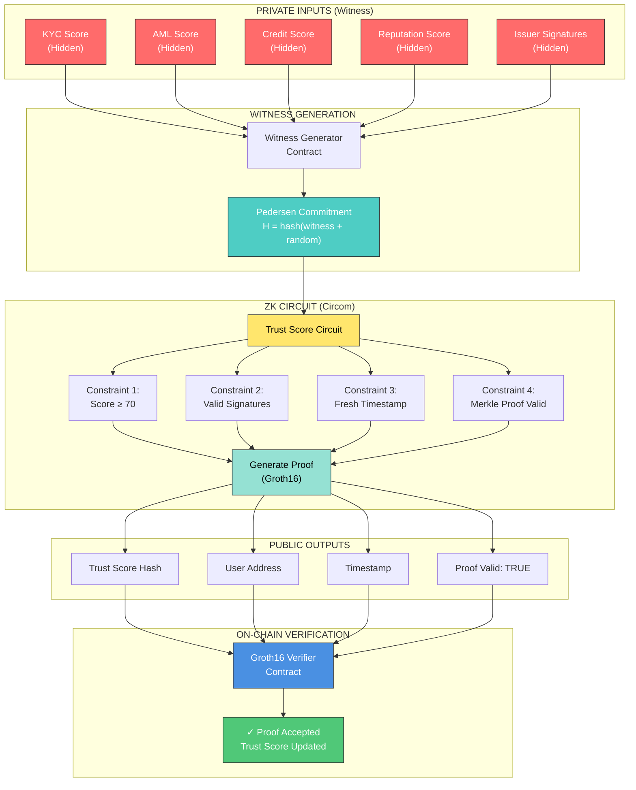
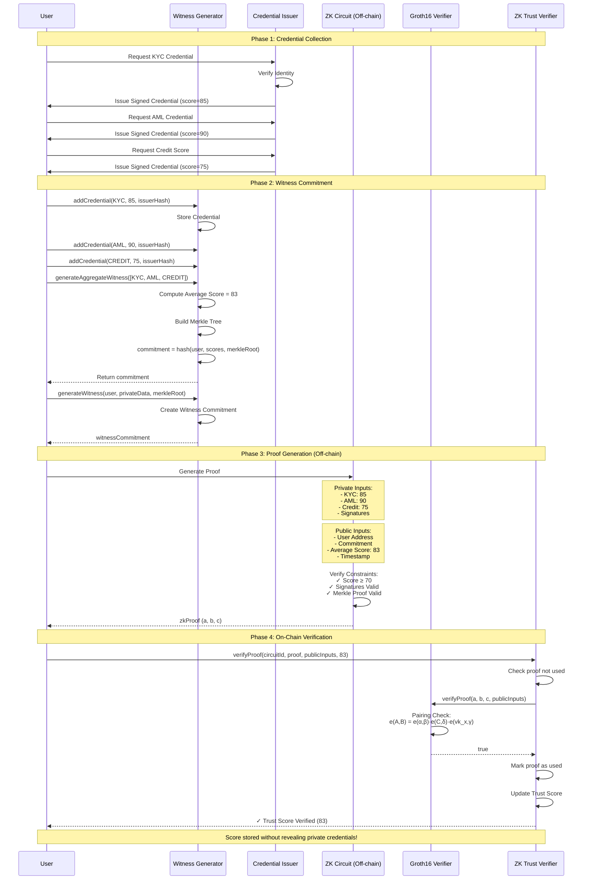
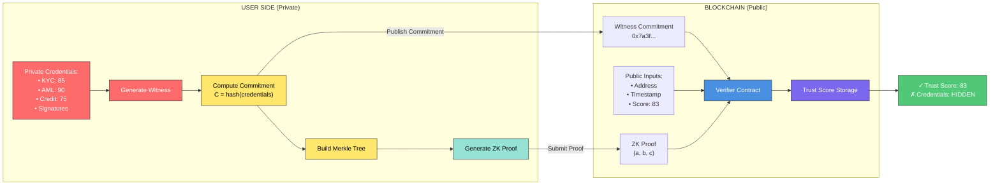
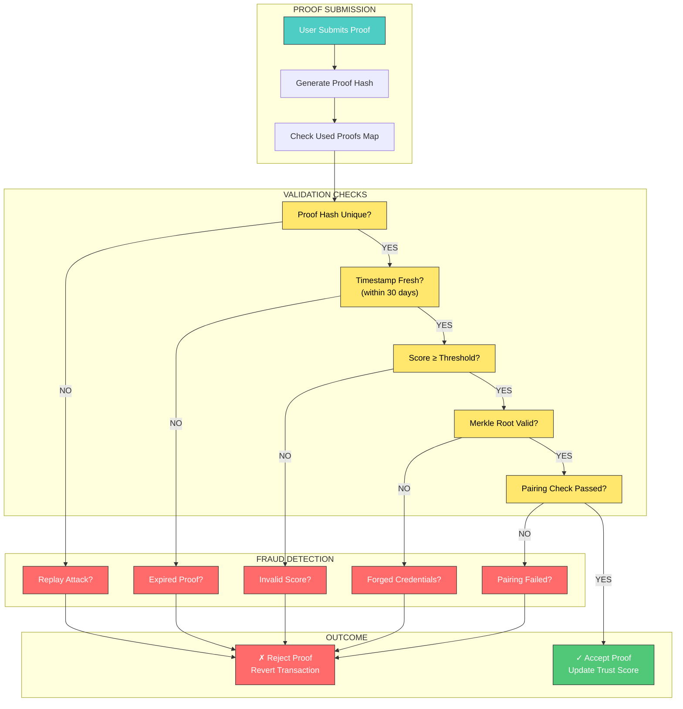
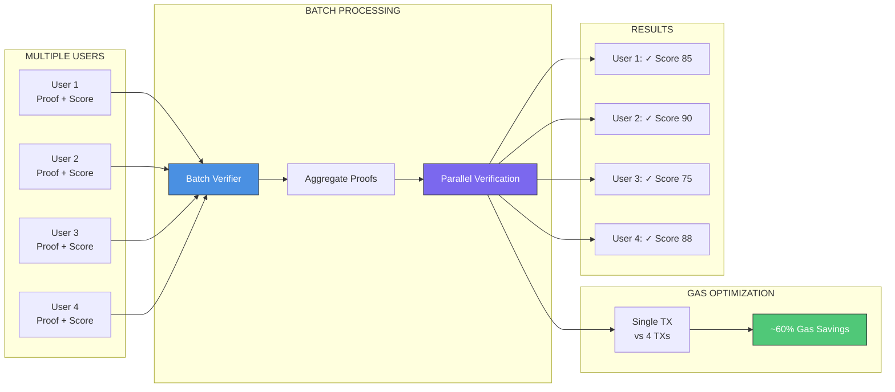
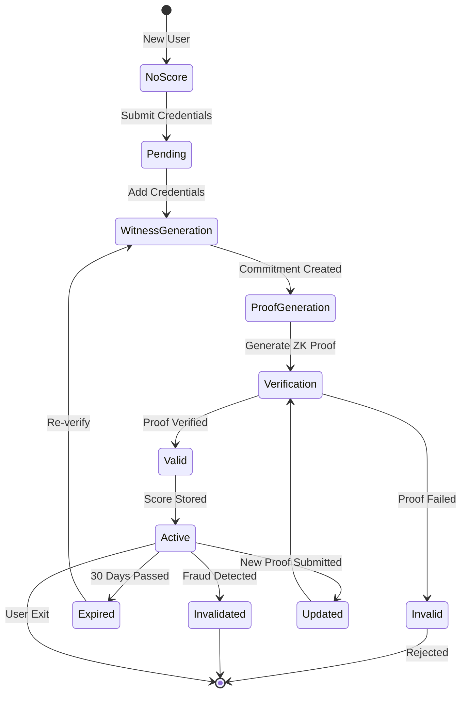
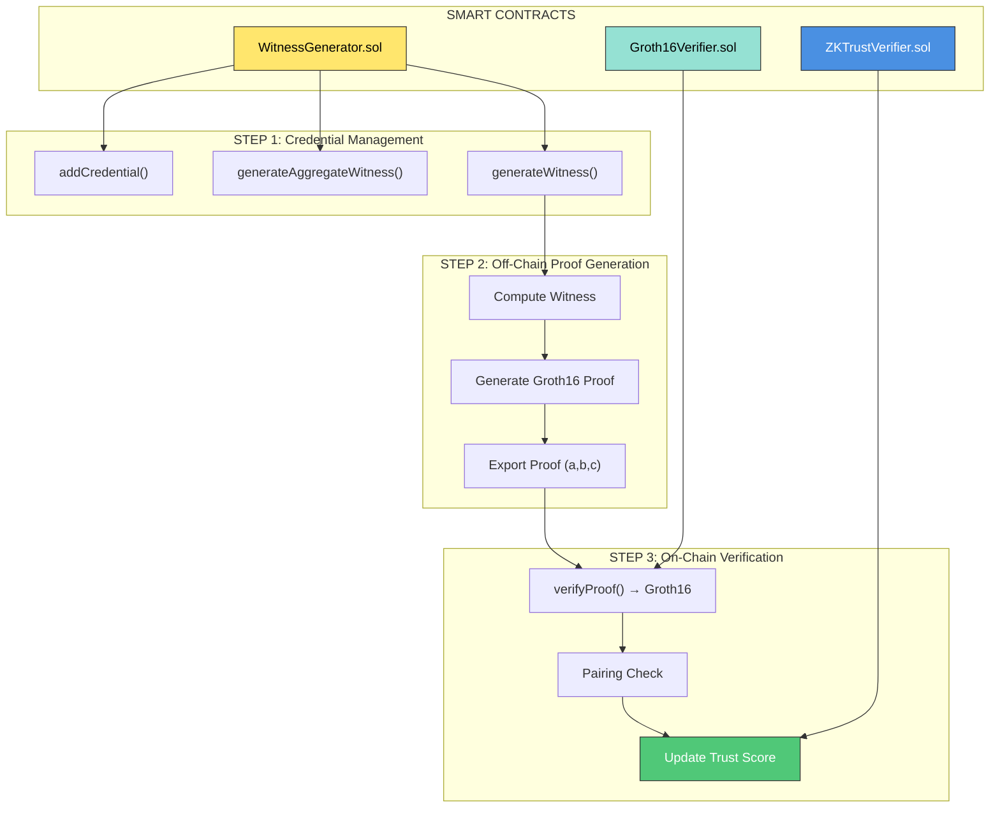

# GROUP 2A: Zero-Knowledge Trust Verification Engine - Architecture Diagrams

## 1. ZK Circuit Architecture

## 2. Witness Generation & Validation Process

## 3. Privacy-Preserving Verification Flow

## 4. Anti-Fraud Mechanism

## 5. Batch Verification Optimization

## 6. Trust Score Lifecycle

## 7. Contract Interaction Flow

