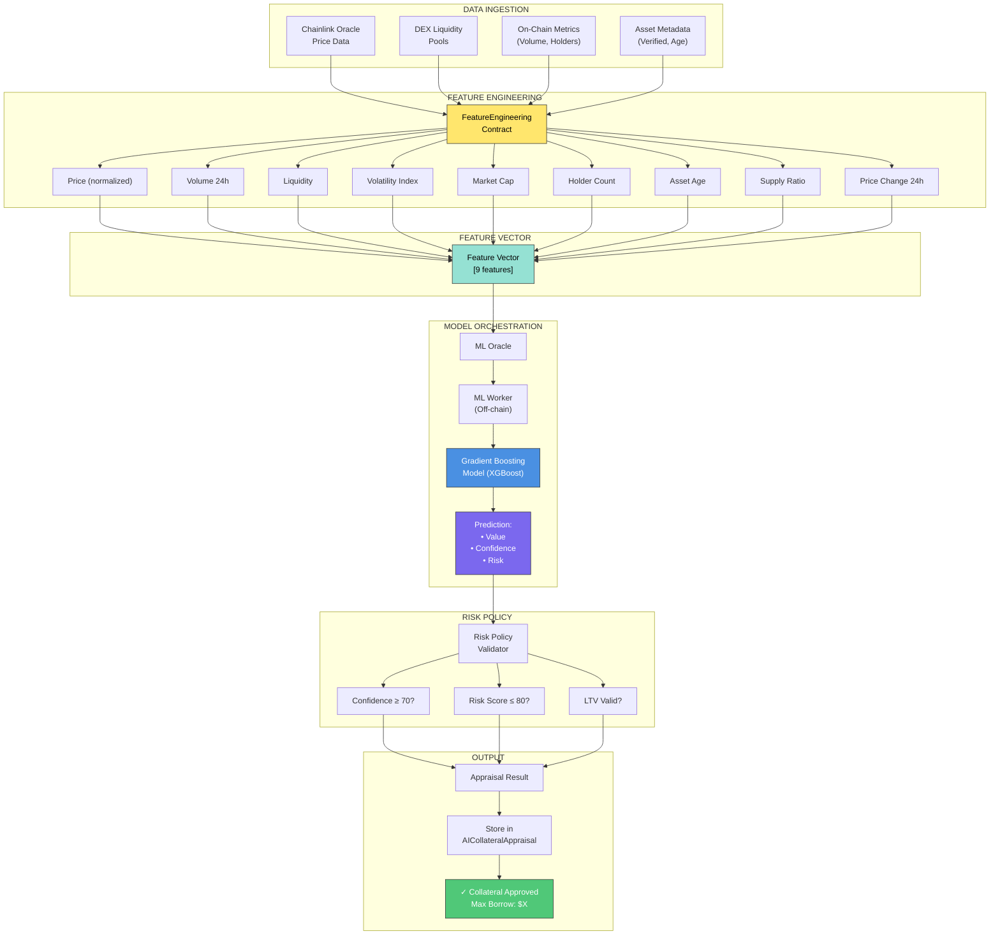
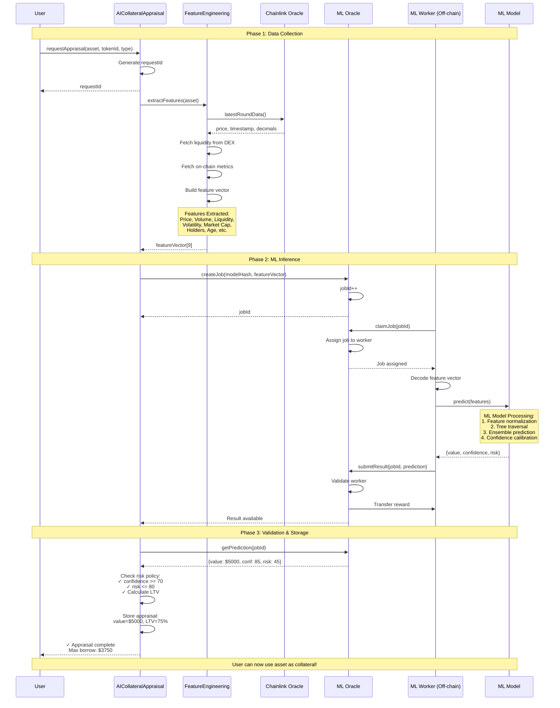
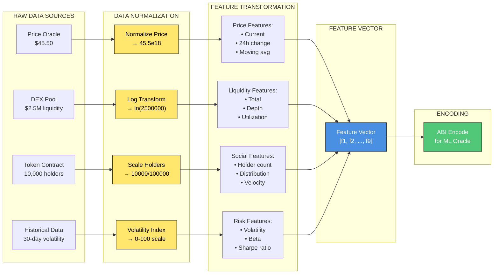
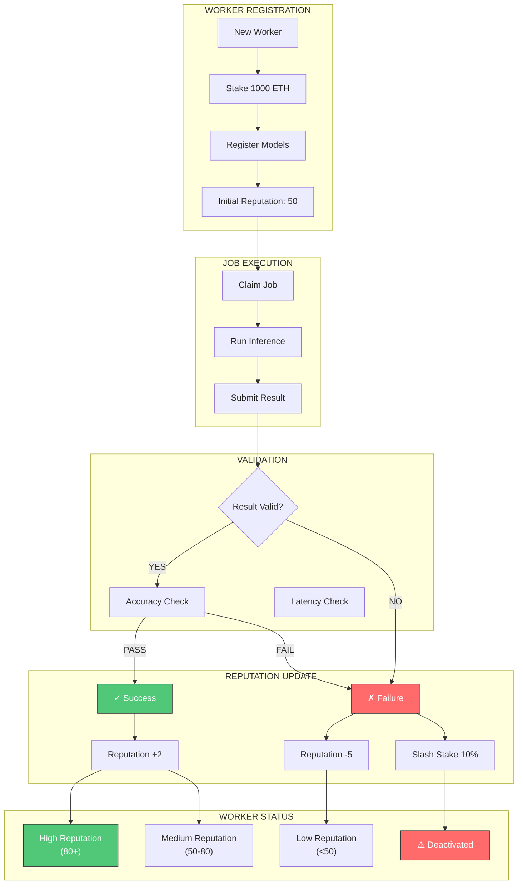
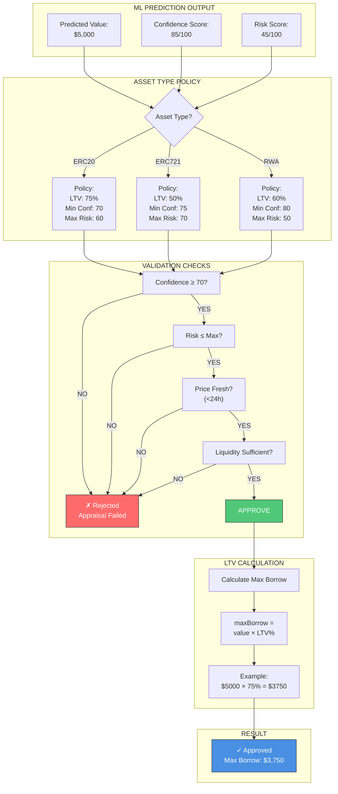
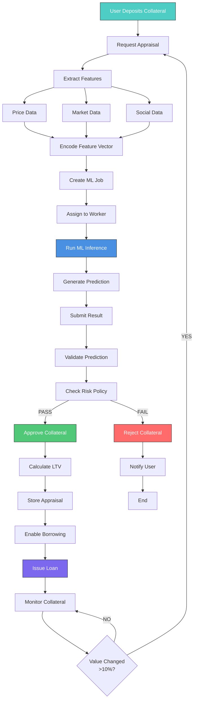
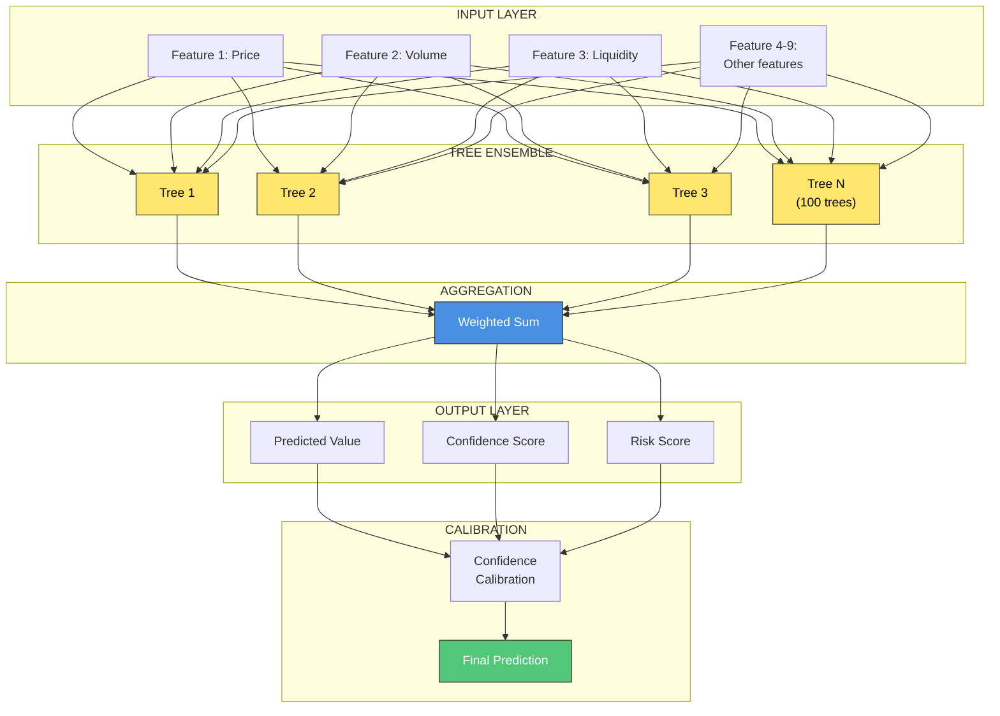
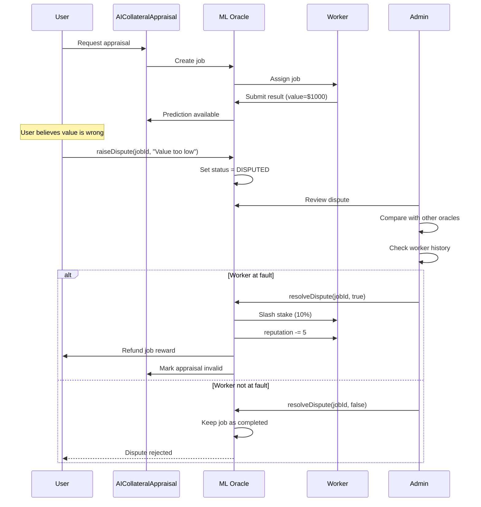
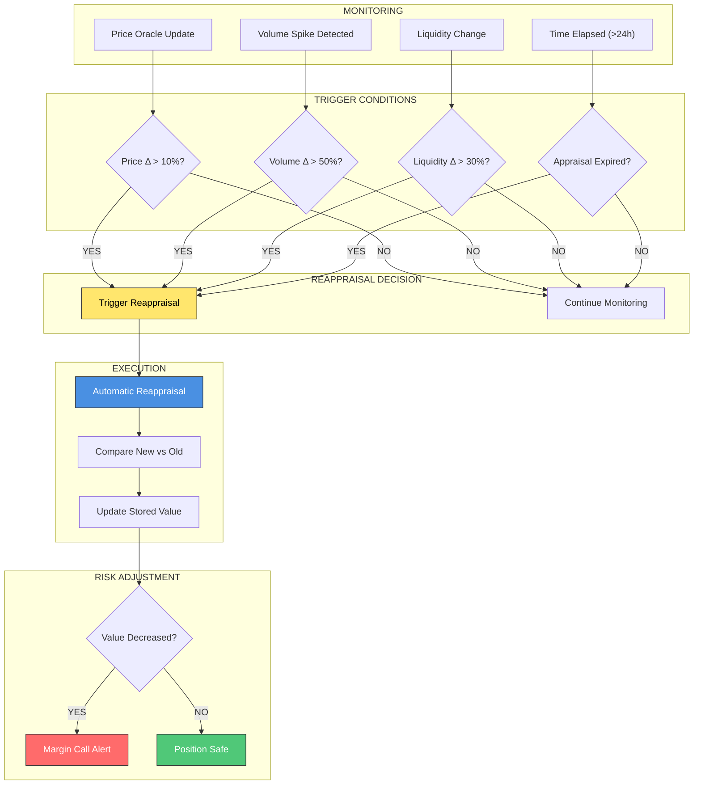
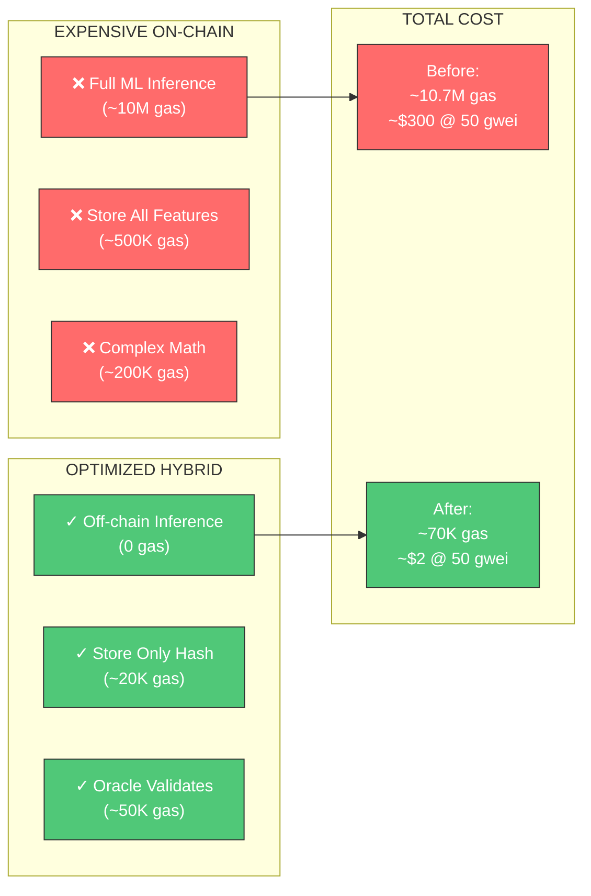

# GROUP 2B: AI-Based Collateral Auto-Appraisal System - Architecture Diagrams

## 1. ML Pipeline Architecture

## 2. Data Ingestion → Feature Engineering → Model Orchestration Flow

## 3. Feature Engineering Pipeline

## 4. ML Worker Reputation System

## 5. Risk Policy Validation

## 6. Complete System Flow

## 7. ML Model Architecture (XGBoost)

## 8. Dispute Resolution Flow

## 9. Auto-Reappraisal Trigger

## 10. Gas Optimization Strategy

