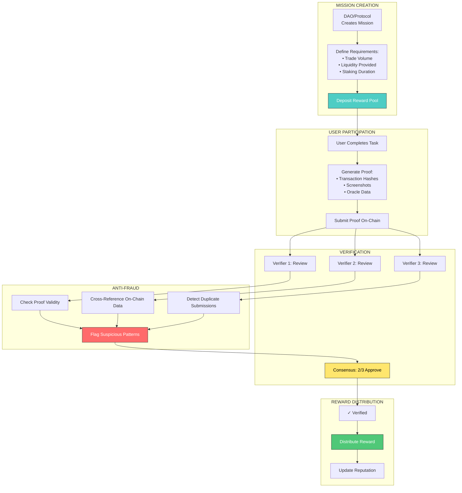
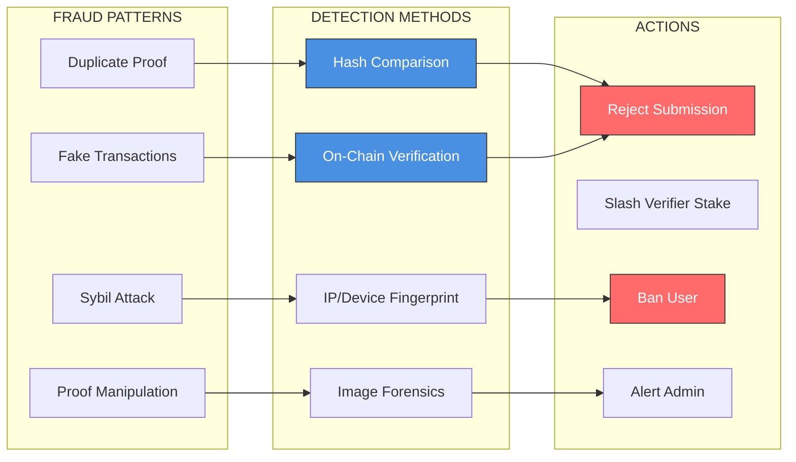

# GROUP 2C: Mission-Based Incentive Oracle - Architecture Diagrams

## 1. Mission Verification Flow

```mermaid
graph TB
    subgraph "MISSION CREATION"
        C1["DAO/Protocol<br/>Creates Mission"]
        C2["Define Requirements:<br/>• Trade Volume<br/>• Liquidity Provided<br/>• Staking Duration"]
        C3["Deposit Reward Pool"]
    end

    subgraph "USER PARTICIPATION"
        U1["User Completes Task"]
        U2["Generate Proof:<br/>• Transaction Hashes<br/>• Screenshots<br/>• Oracle Data"]
        U3["Submit Proof On-Chain"]
    end

    subgraph "VERIFICATION"
        V1["Verifier 1: Review"]
        V2["Verifier 2: Review"]
        V3["Verifier 3: Review"]
        V4["Consensus: 2/3 Approve"]
    end

    subgraph "ANTI-FRAUD"
        F1["Check Proof Validity"]
        F2["Cross-Reference On-Chain Data"]
        F3["Detect Duplicate Submissions"]
        F4["Flag Suspicious Patterns"]
    end

    subgraph "REWARD DISTRIBUTION"
        R1["✓ Verified"]
        R2["Distribute Reward"]
        R3["Update Reputation"]
    end

    C1 --> C2 --> C3
    C3 --> U1
    U1 --> U2 --> U3
    U3 --> V1 & V2 & V3
    V1 --> F1
    V2 --> F2
    V3 --> F3
    F1 & F2 & F3 --> F4
    F4 --> V4
    V4 --> R1 --> R2 --> R3

    style C3 fill:#4ECDC4,stroke:#333,color:#fff
    style V4 fill:#FFE66D,stroke:#333,color:#000
    style F4 fill:#FF6B6B,stroke:#333,color:#fff
    style R2 fill:#50C878,stroke:#333,color:#fff
```

## 2. Anti-Fraud Detection

```mermaid
graph LR
    subgraph "FRAUD PATTERNS"
        P1["Duplicate Proof"]
        P2["Fake Transactions"]
        P3["Sybil Attack"]
        P4["Proof Manipulation"]
    end

    subgraph "DETECTION METHODS"
        D1["Hash Comparison"]
        D2["On-Chain Verification"]
        D3["IP/Device Fingerprint"]
        D4["Image Forensics"]
    end

    subgraph "ACTIONS"
        A1["Reject Submission"]
        A2["Slash Verifier Stake"]
        A3["Ban User"]
        A4["Alert Admin"]
    end

    P1 --> D1 --> A1
    P2 --> D2 --> A1
    P3 --> D3 --> A3
    P4 --> D4 --> A4

    style D1 fill:#4A90E2,stroke:#333,color:#fff
    style D2 fill:#4A90E2,stroke:#333,color:#fff
    style A1 fill:#FF6B6B,stroke:#333,color:#fff
    style A3 fill:#FF6B6B,stroke:#333,color:#fff
```
