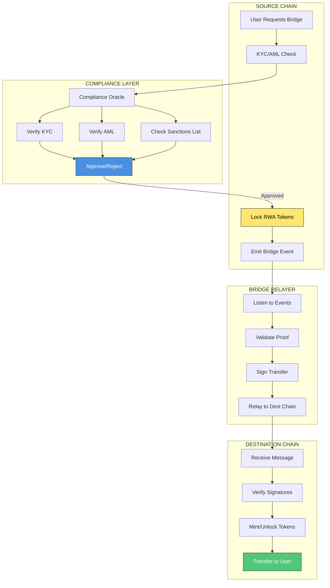
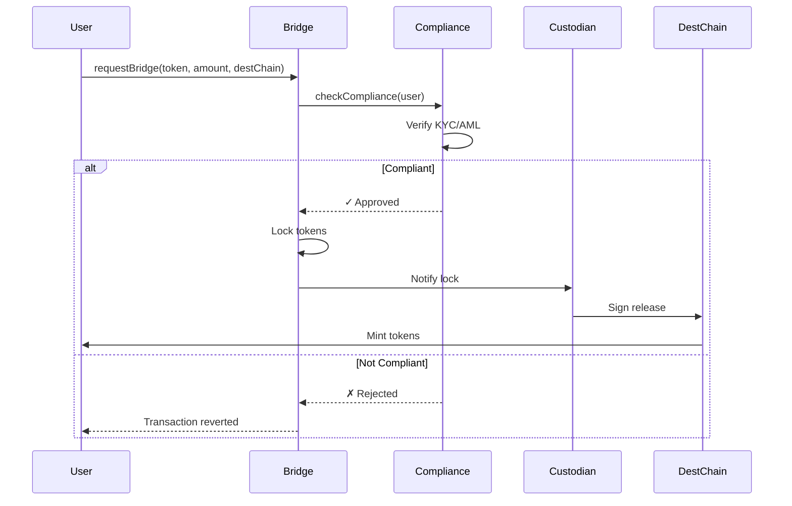

# GROUP 3: RWA Tokenization & Bridging - Architecture Diagrams

## 1. Cross-Chain RWA Bridge with Compliance

```mermaid
graph TB
    subgraph "SOURCE CHAIN"
        S1["User Requests Bridge"]
        S2["KYC/AML Check"]
        S3["Lock RWA Tokens"]
        S4["Emit Bridge Event"]
    end

    subgraph "COMPLIANCE LAYER"
        C1["Compliance Oracle"]
        C2["Verify KYC"]
        C3["Verify AML"]
        C4["Check Sanctions List"]
        C5["Approve/Reject"]
    end

    subgraph "BRIDGE RELAYER"
        B1["Listen to Events"]
        B2["Validate Proof"]
        B3["Sign Transfer"]
        B4["Relay to Dest Chain"]
    end

    subgraph "DESTINATION CHAIN"
        D1["Receive Message"]
        D2["Verify Signatures"]
        D3["Mint/Unlock Tokens"]
        D4["Transfer to User"]
    end

    S1 --> S2
    S2 --> C1
    C1 --> C2 & C3 & C4
    C2 & C3 & C4 --> C5
    C5 -->|Approved| S3
    S3 --> S4
    S4 --> B1
    B1 --> B2 --> B3 --> B4
    B4 --> D1 --> D2 --> D3 --> D4

    style C5 fill:#4A90E2,stroke:#333,color:#fff
    style S3 fill:#FFE66D,stroke:#333,color:#000
    style D4 fill:#50C878,stroke:#333,color:#fff
```

## 2. Compliance Verification Flow

```mermaid
sequenceDiagram
    participant User
    participant Bridge
    participant Compliance
    participant Custodian
    participant DestChain

    User->>Bridge: requestBridge(token, amount, destChain)
    Bridge->>Compliance: checkCompliance(user)
    Compliance->>Compliance: Verify KYC/AML

    alt Compliant
        Compliance-->>Bridge: ✓ Approved
        Bridge->>Bridge: Lock tokens
        Bridge->>Custodian: Notify lock
        Custodian->>DestChain: Sign release
        DestChain->>User: Mint tokens
    else Not Compliant
        Compliance-->>Bridge: ✗ Rejected
        Bridge-->>User: Transaction reverted
    end
```
