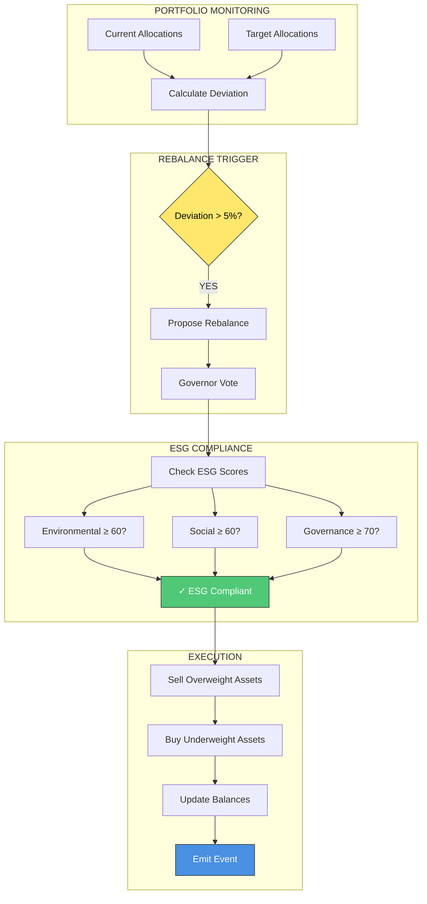
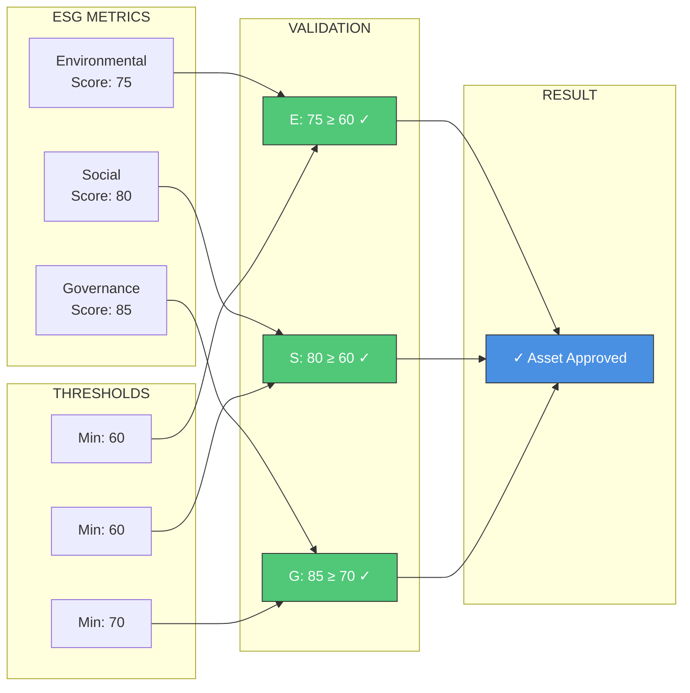

# GROUP 4: DAO Treasury Management - Architecture Diagrams

## 1. Treasury Rebalancing Engine

```mermaid
graph TB
    subgraph "PORTFOLIO MONITORING"
        M1["Current Allocations"]
        M2["Target Allocations"]
        M3["Calculate Deviation"]
    end

    subgraph "REBALANCE TRIGGER"
        T1{"Deviation > 5%?"}
        T2["Propose Rebalance"]
        T3["Governor Vote"]
    end

    subgraph "ESG COMPLIANCE"
        E1["Check ESG Scores"]
        E2["Environmental ≥ 60?"]
        E3["Social ≥ 60?"]
        E4["Governance ≥ 70?"]
        E5["✓ ESG Compliant"]
    end

    subgraph "EXECUTION"
        X1["Sell Overweight Assets"]
        X2["Buy Underweight Assets"]
        X3["Update Balances"]
        X4["Emit Event"]
    end

    M1 --> M3
    M2 --> M3
    M3 --> T1
    T1 -->|YES| T2
    T2 --> T3
    T3 --> E1
    E1 --> E2 & E3 & E4
    E2 & E3 & E4 --> E5
    E5 --> X1 --> X2 --> X3 --> X4

    style T1 fill:#FFE66D,stroke:#333,color:#000
    style E5 fill:#50C878,stroke:#333,color:#fff
    style X4 fill:#4A90E2,stroke:#333,color:#fff
```

## 2. ESG Compliance Check

```mermaid
graph LR
    subgraph "ESG METRICS"
        E1["Environmental<br/>Score: 75"]
        S1["Social<br/>Score: 80"]
        G1["Governance<br/>Score: 85"]
    end

    subgraph "THRESHOLDS"
        E2["Min: 60"]
        S2["Min: 60"]
        G2["Min: 70"]
    end

    subgraph "VALIDATION"
        V1["E: 75 ≥ 60 ✓"]
        V2["S: 80 ≥ 60 ✓"]
        V3["G: 85 ≥ 70 ✓"]
    end

    subgraph "RESULT"
        R1["✓ Asset Approved"]
    end

    E1 & E2 --> V1
    S1 & S2 --> V2
    G1 & G2 --> V3
    V1 & V2 & V3 --> R1

    style V1 fill:#50C878,stroke:#333,color:#fff
    style V2 fill:#50C878,stroke:#333,color:#fff
    style V3 fill:#50C878,stroke:#333,color:#fff
    style R1 fill:#4A90E2,stroke:#333,color:#fff
```
