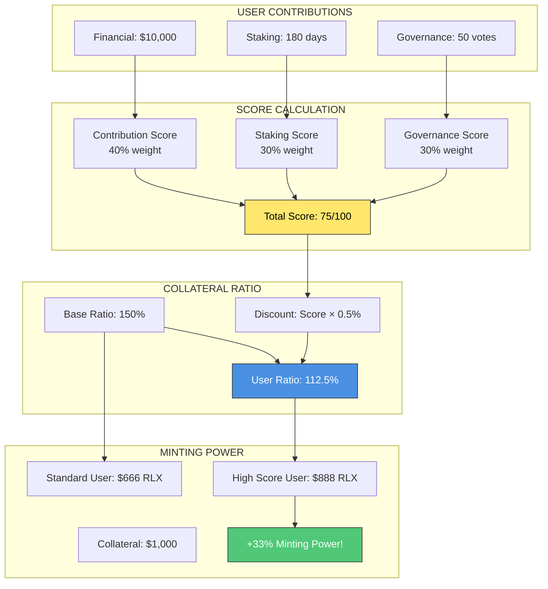
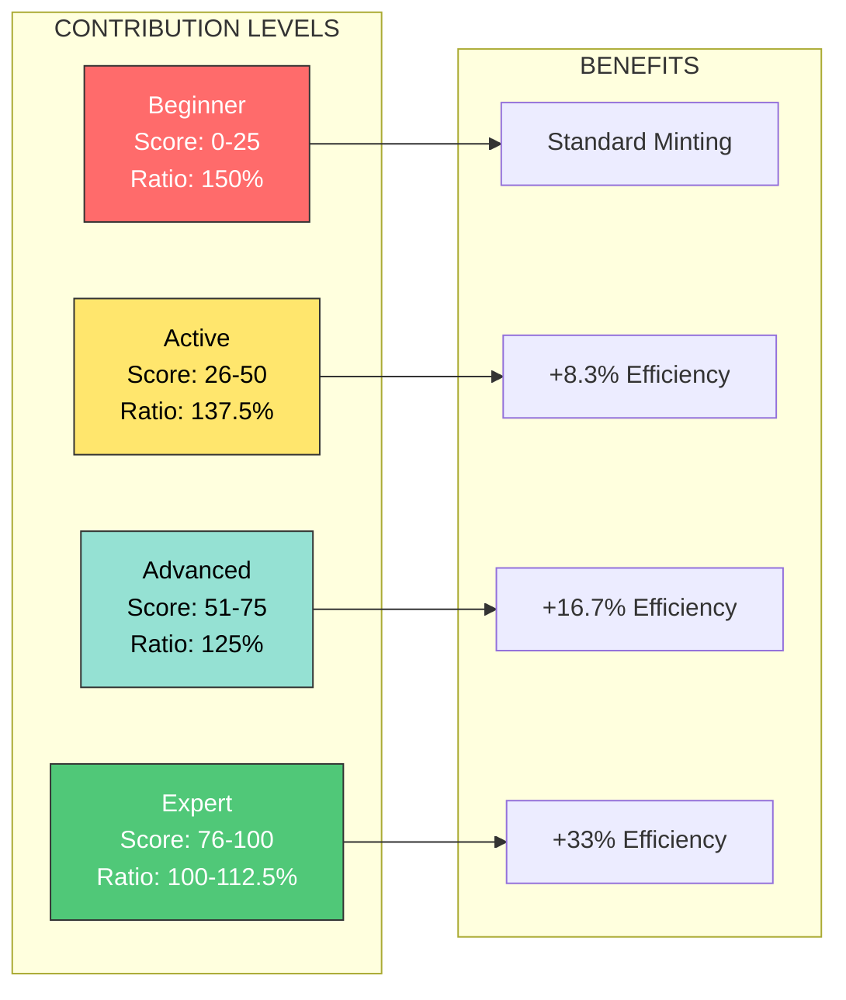
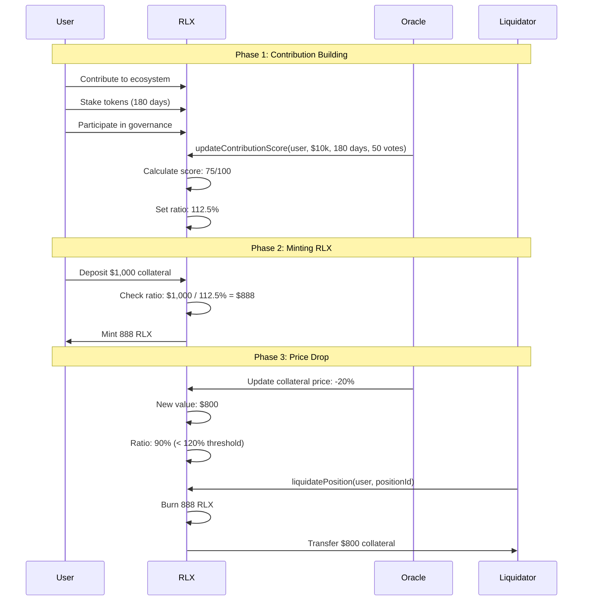
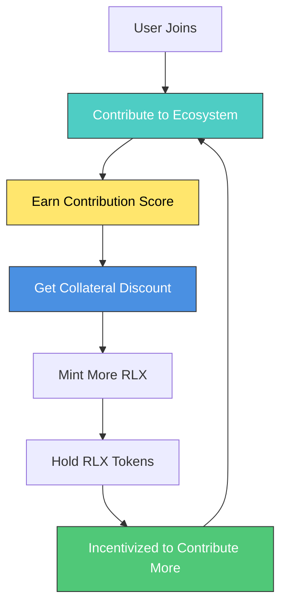

# GROUP 5: Self-Reinforcing Stablecoin (RLX) - Architecture Diagrams

## 1. Contribution Score & Dynamic Collateral System

## 2. Dynamic Collateral Adjustment

## 3. Minting & Liquidation Flow

## 4. Self-Reinforcing Mechanism

