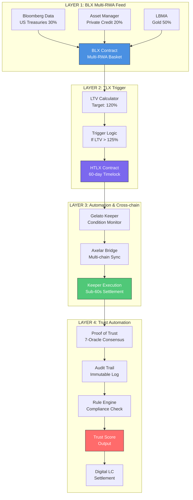
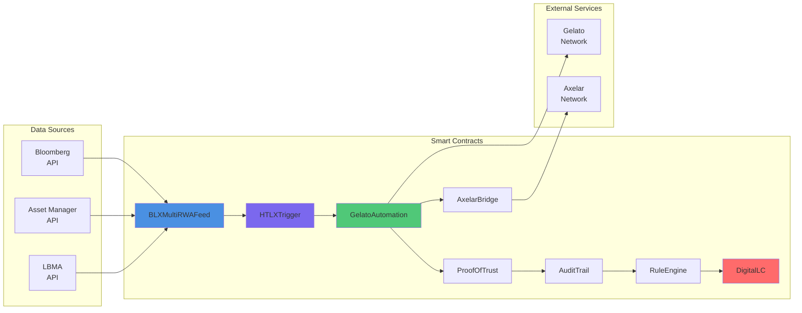
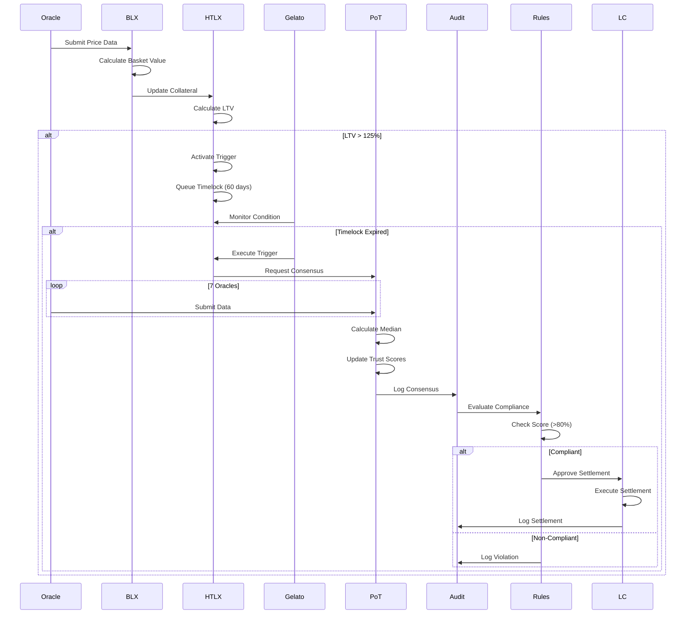
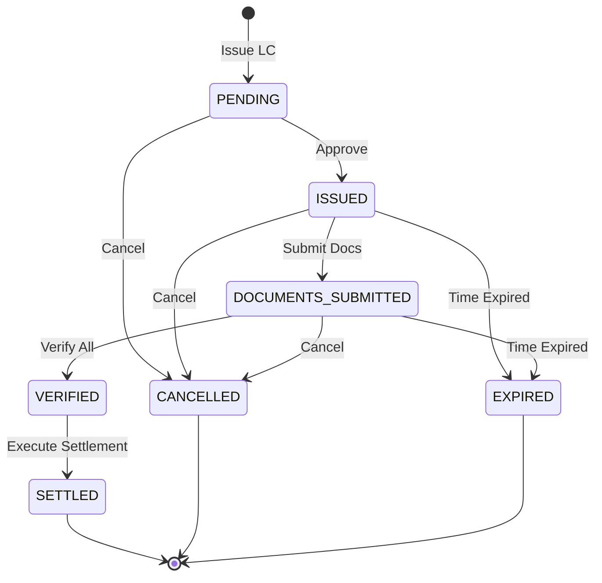
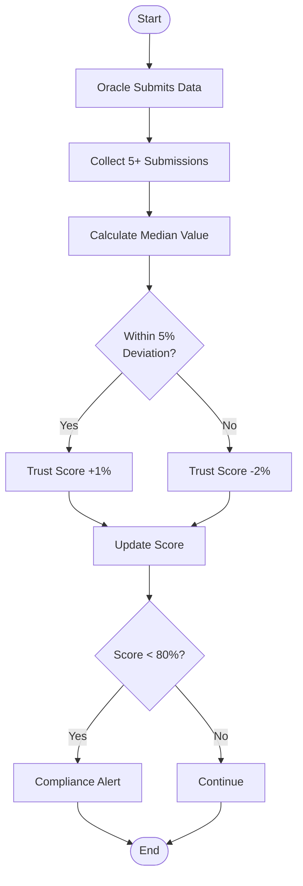
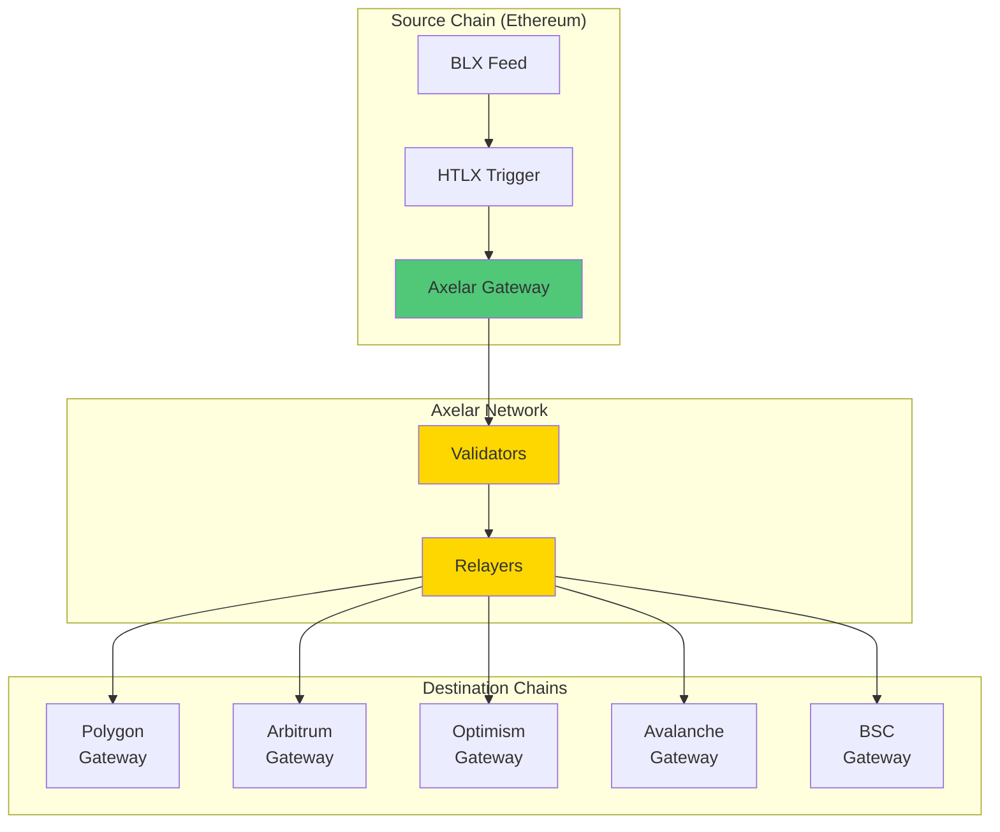
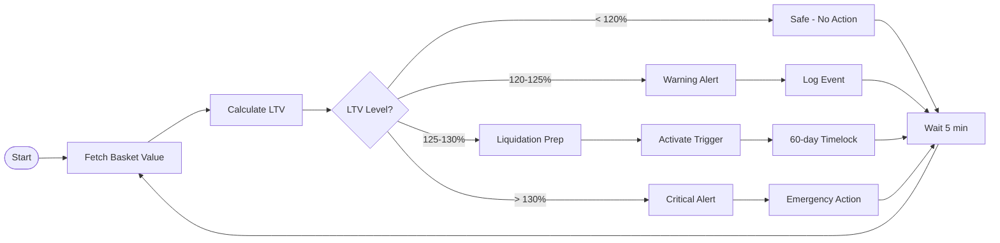

# RWA Automation System - Visual Architecture

## System Flow Diagram



## Detailed Component Diagram



## Sequence Diagram - Complete Flow



## State Transition Diagram - Digital LC



## Trust Score Flow



## Cross-Chain Synchronization



## LTV Monitoring Flow



## System Architecture Overview

```
┌─────────────────────────────────────────────────────────────────────┐
│                         CLIENT APPLICATIONS                          │
│                    (Web Dashboard, Mobile App, API)                  │
└──────────────────────────────┬──────────────────────────────────────┘
                               │
┌──────────────────────────────┴──────────────────────────────────────┐
│                        LAYER 4: SETTLEMENT                           │
│  ┌──────────────┐  ┌──────────────┐  ┌──────────────┐              │
│  │ Proof of     │  │  Audit       │  │  Rule        │  ┌─────────┐ │
│  │ Trust        ├──┤  Trail       ├──┤  Engine      ├──┤Digital  │ │
│  │ (7 Oracles)  │  │  (Immutable) │  │  (Rules)     │  │LC       │ │
│  └──────────────┘  └──────────────┘  └──────────────┘  └─────────┘ │
└──────────────────────────────┬──────────────────────────────────────┘
                               │
┌──────────────────────────────┴──────────────────────────────────────┐
│                  LAYER 3: AUTOMATION & CROSS-CHAIN                   │
│  ┌──────────────────────────┐  ┌─────────────────────────────────┐ │
│  │ Gelato Automation        │  │ Axelar Bridge                   │ │
│  │ - Condition Monitor      │  │ - Multi-chain Sync              │ │
│  │ - Keeper Execution       │  │ - Message Verification          │ │
│  │ - <60s Settlement        │  │ - 6 Chains Supported            │ │
│  └──────────────────────────┘  └─────────────────────────────────┘ │
└──────────────────────────────┬──────────────────────────────────────┘
                               │
┌──────────────────────────────┴──────────────────────────────────────┐
│                     LAYER 2: TRIGGER LOGIC                           │
│  ┌──────────────────────────────────────────────────────────────┐  │
│  │ HTLX Trigger System                                           │  │
│  │ - LTV Calculator (Target: 120%, Trigger: 125%)               │  │
│  │ - Timelock (60 days)                                         │  │
│  │ - Trigger Queue Management                                   │  │
│  └──────────────────────────────────────────────────────────────┘  │
└──────────────────────────────┬──────────────────────────────────────┘
                               │
┌──────────────────────────────┴──────────────────────────────────────┐
│                   LAYER 1: DATA AGGREGATION                          │
│  ┌────────────┐  ┌────────────┐  ┌────────────┐                    │
│  │ Bloomberg  │  │   Asset    │  │   LBMA     │                    │
│  │ US Treas.  │  │  Manager   │  │   Gold     │                    │
│  │   (30%)    │  │ Priv. Cred.│  │   (50%)    │                    │
│  │            │  │   (20%)    │  │            │                    │
│  └─────┬──────┘  └─────┬──────┘  └─────┬──────┘                    │
│        └─────────────┬──┴──────────────┘                            │
│                      │                                               │
│         ┌────────────┴────────────┐                                 │
│         │  BLX Multi-RWA Basket   │                                 │
│         │  Weighted Valuation     │                                 │
│         └─────────────────────────┘                                 │
└─────────────────────────────────────────────────────────────────────┘
```

---

**Note**: This diagram shows the complete RWA Automation System architecture as originally requested. All components are interconnected to provide a seamless, automated, and trustless settlement system for real-world assets.

**Version**: 1.0.0
**Created**: 2025-11-18
**Maintainer**: HTS DAO Technical Team
