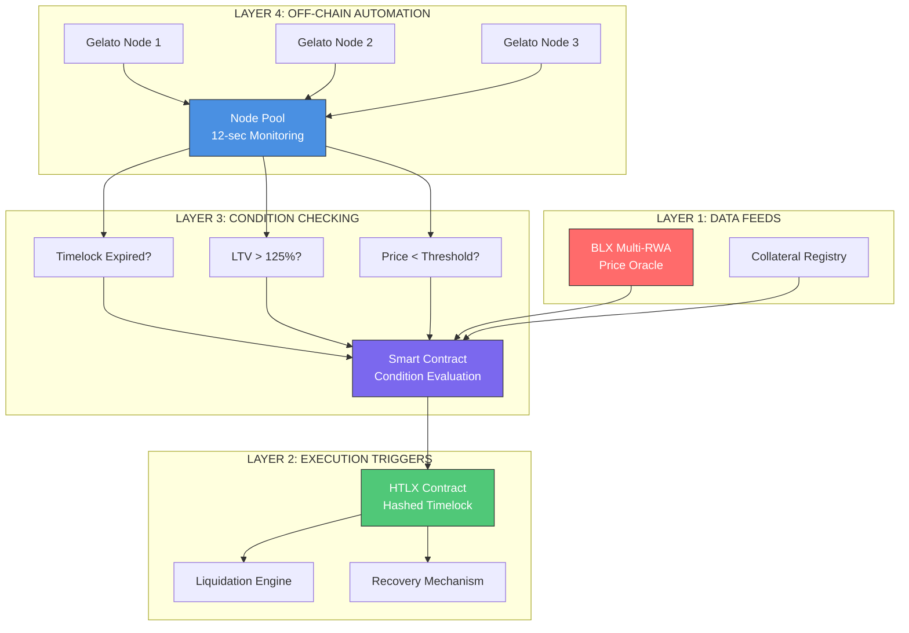
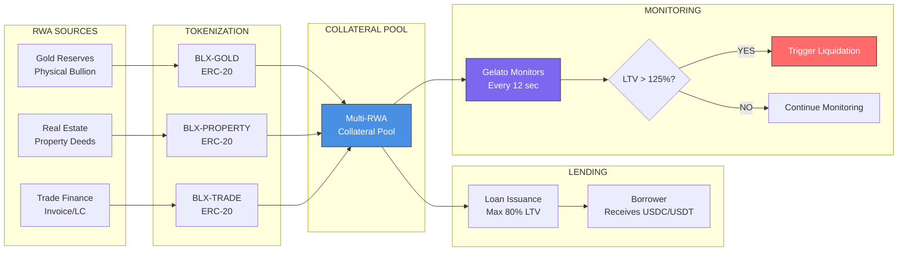
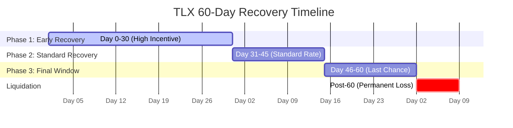
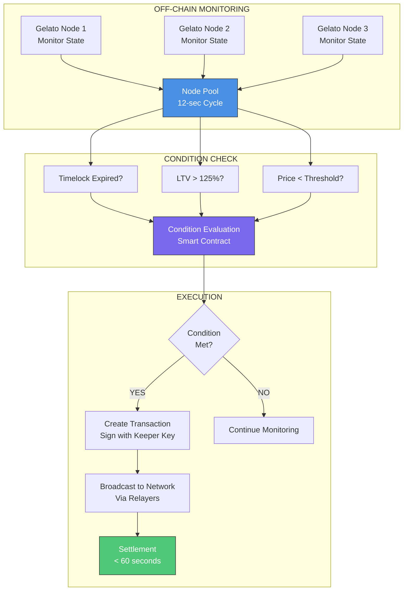
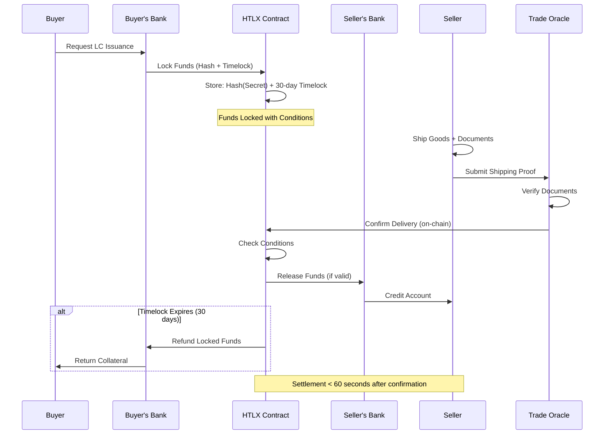
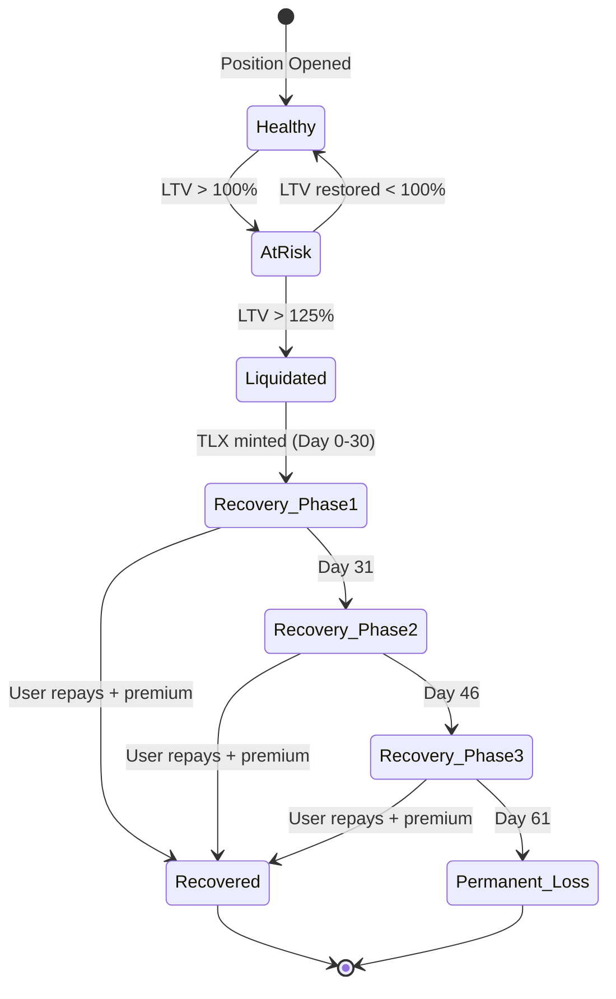
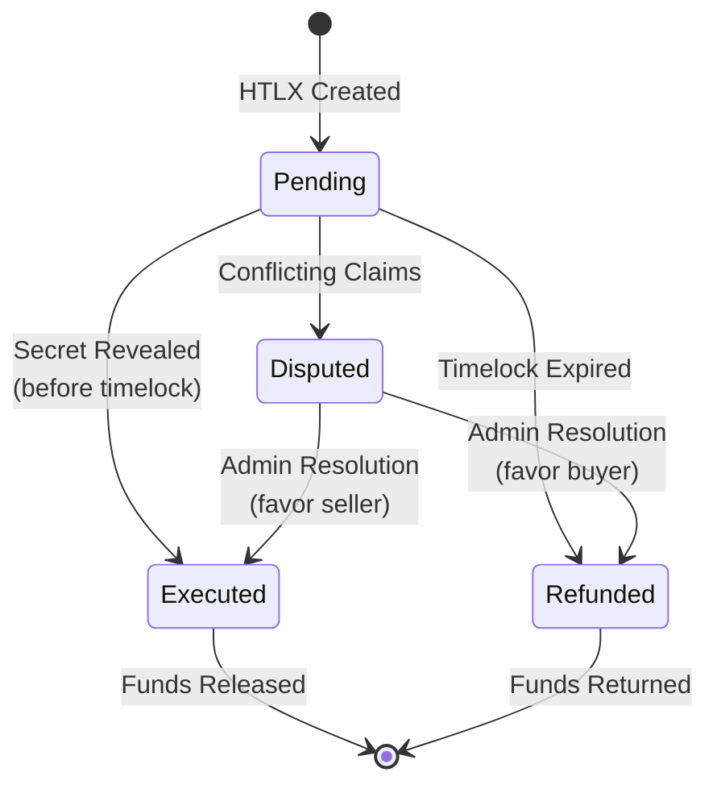
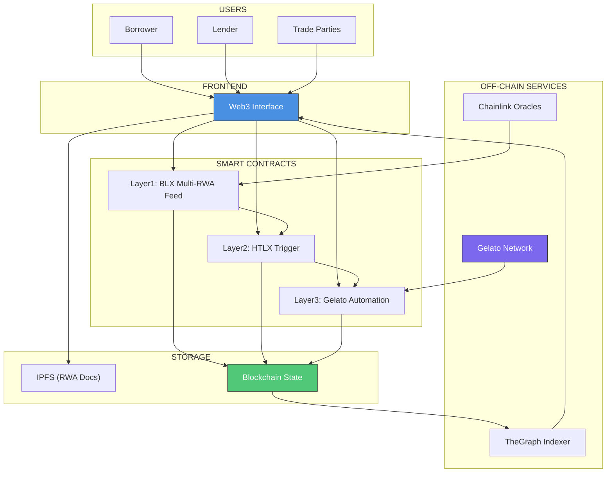

# RWA Automation System - Complete Diagram Collection

**Purpose**: Visual reference for all system flows
**Format**: Mermaid diagrams
**Last Updated**: 2025-11-18

---

## Table of Contents

1. [4-Layer System Architecture](#1-4-layer-system-architecture)
2. [BLX Multi-RWA Collateral Flow](#2-blx-multi-rwa-collateral-flow)
3. [TLX 60-Day Recovery Timeline](#3-tlx-60-day-recovery-timeline)
4. [Gelato Keeper Automation](#4-gelato-keeper-automation)
5. [Digital LC Settlement Flow](#5-digital-lc-settlement-flow)
6. [State Machine Diagrams](#6-state-machine-diagrams)

---

## 1. 4-Layer System Architecture

### High-Level Overview

This diagram shows the complete 4-layer architecture from off-chain monitoring (Gelato) to on-chain data feeds (BLX RWA).



**Key Components**:
- **Layer 4**: Gelato Network (off-chain keepers)
- **Layer 3**: Condition evaluation (on-chain smart contract)
- **Layer 2**: HTLX triggers (settlement execution)
- **Layer 1**: BLX Multi-RWA Feed (price oracles)

**Data Flow**: Off-chain monitoring → On-chain condition check → Trigger execution → Data feed validation

---

## 2. BLX Multi-RWA Collateral Flow

### Asset Tokenization to Liquidation

This diagram illustrates how multiple RWA types (Gold, Real Estate, Trade Finance) are tokenized as BLX tokens, pooled as collateral, and monitored for liquidation.



**Asset Types**:
1. **BLX-GOLD**: Backed by physical gold bullion (stored in vaults)
2. **BLX-PROPERTY**: Backed by real estate deeds (verified ownership)
3. **BLX-TRADE**: Backed by trade finance instruments (invoices/LCs)

**Collateral Ratios**:
- Initial LTV: 80% (borrower can borrow up to 80% of collateral value)
- Warning LTV: 100% (monitoring alert triggered)
- Liquidation LTV: 125% (automatic liquidation executed)

**Monitoring Frequency**: Every 12 seconds via Gelato keeper network

---

## 3. TLX 60-Day Recovery Timeline

### Recovery Phases with Incentive Structure

This Gantt chart shows the 60-day recovery period during which liquidated borrowers can recover their collateral using TLX tokens.



**Recovery Rate Schedule**:

| Phase | Days | TLX Release | Incentive | Recovery % |
|-------|------|-------------|-----------|------------|
| **Phase 1** | 0-30 | 50% | 1.5x | Up to 90% |
| **Phase 2** | 31-45 | 30% | 1.0x | Up to 70% |
| **Phase 3** | 46-60 | 20% | 0.7x | Up to 50% |
| **Post-60** | 61+ | 0% | N/A | 0% (Loss) |

**Incentive Structure**:
- **Early recovery** (Days 0-30): Higher incentive multiplier (1.5x) encourages quick action
- **Standard recovery** (Days 31-45): Normal rate (1.0x)
- **Final window** (Days 46-60): Reduced incentive (0.7x) - last chance
- **Permanent loss** (Post-60): Collateral sold, borrower loses position

**TLX Token Mechanics**:
- Minted at liquidation event (proportional to debt)
- Unlocks linearly over 60-day period
- Can be used to repay debt + penalty fee
- Burned upon successful recovery

---

## 4. Gelato Keeper Automation

### Off-Chain Monitoring & Execution Flow

This diagram shows the detailed Gelato keeper automation process from monitoring to settlement.



**Monitoring Cycle** (12 seconds):
1. **State Monitoring**: Gelato nodes query contract state
2. **Condition Evaluation**: On-chain checker function evaluates all conditions
3. **Decision**: If conditions met → Execute, else → Continue monitoring

**Condition Checks**:
- **Timelock Expired**: HTLX contracts with expired deadlines
- **LTV > 125%**: Loans exceeding liquidation threshold
- **Price < Threshold**: Asset prices below safety margins

**Execution Flow**:
1. **Transaction Creation**: Gelato node creates liquidation transaction
2. **Signing**: Transaction signed with keeper private key
3. **Broadcasting**: Sent to network via multiple relayers (redundancy)
4. **Settlement**: On-chain execution within 60 seconds

**Keeper Key Security**:
- 30-day rotation cycle
- Hardware security modules (HSM) for storage
- Multi-signature backup for emergencies

---

## 5. Digital LC Settlement Flow

### Letter of Credit Automation with HTLX

This sequence diagram shows the automated settlement process for Digital Letters of Credit using Hashed Timelock Contracts.



**HTLX Contract Parameters**:
```solidity
struct HTLXAgreement {
    bytes32 hashLock;      // Hash(Secret) - known only to seller
    uint256 timeLock;      // 30-day expiry timestamp
    address sender;        // Buyer's bank address
    address receiver;      // Seller's bank address
    uint256 amount;        // Locked funds (USDC/USDT)
    bool executed;         // Settlement status
    bool refunded;         // Refund status
}
```

**Settlement Paths**:

1. **Happy Path** (Goods Delivered):
   - Seller ships goods → Oracle verifies → Funds released to seller
   - Timeframe: < 60 seconds after oracle confirmation

2. **Timeout Path** (No Delivery):
   - 30 days elapse → No delivery confirmation → Funds refunded to buyer
   - Automatic execution via Gelato keeper

3. **Dispute Path** (Manual Intervention):
   - Conflicting evidence → Contract paused → Admin review
   - Resolution via multisig governance

**Oracle Verification**:
- **Shipping Documents**: Bill of Lading, Packing List, Certificate of Origin
- **Delivery Proof**: GPS coordinates, timestamp, signatures
- **Quality Assurance**: Inspection reports (if required)

---

## 6. State Machine Diagrams

### Position Lifecycle State Machine

This state diagram shows all possible states for a borrower's position from opening to final resolution.



**State Definitions**:

| State | LTV Range | Description | Actions Available |
|-------|-----------|-------------|-------------------|
| **Healthy** | 0-100% | Normal operation | Borrow more, withdraw collateral |
| **AtRisk** | 100-125% | Warning zone | Add collateral, repay debt |
| **Liquidated** | >125% | Position closed | Use TLX for recovery |
| **Recovery_Phase1** | N/A | Days 0-30 | Repay with 1.5x incentive |
| **Recovery_Phase2** | N/A | Days 31-45 | Repay with 1.0x incentive |
| **Recovery_Phase3** | N/A | Days 46-60 | Repay with 0.7x incentive |
| **Recovered** | 0% | Position restored | Resume normal operations |
| **Permanent_Loss** | N/A | Collateral sold | No recovery possible |

**Transition Triggers**:
- **Healthy → AtRisk**: Collateral value drops OR debt increases
- **AtRisk → Liquidated**: LTV exceeds 125% (Gelato executes)
- **AtRisk → Healthy**: User adds collateral OR repays debt
- **Liquidated → Recovery_Phase1**: Automatic (TLX minted)
- **Recovery_PhaseX → Recovered**: User repays debt + premium with TLX
- **Recovery_Phase3 → Permanent_Loss**: 60 days elapse with no action

---

### HTLX Contract State Machine



**HTLX State Definitions**:

| State | Description | Duration | Next States |
|-------|-------------|----------|-------------|
| **Pending** | Funds locked, awaiting delivery | Up to 30 days | Executed, Refunded, Disputed |
| **Executed** | Secret revealed, funds released | Immediate | Terminal |
| **Refunded** | Timelock expired, funds returned | Immediate | Terminal |
| **Disputed** | Manual review required | Variable | Executed, Refunded |

**State Transition Logic**:
```solidity
function executeHTLX(bytes32 agreementId, bytes32 secret) external {
    HTLXAgreement storage agreement = agreements[agreementId];

    require(block.timestamp < agreement.timeLock, "Timelock expired");
    require(keccak256(abi.encodePacked(secret)) == agreement.hashLock, "Invalid secret");
    require(!agreement.executed && !agreement.refunded, "Already settled");

    agreement.executed = true;
    // Transfer funds to receiver
}

function refundHTLX(bytes32 agreementId) external {
    HTLXAgreement storage agreement = agreements[agreementId];

    require(block.timestamp >= agreement.timeLock, "Timelock not expired");
    require(!agreement.executed && !agreement.refunded, "Already settled");

    agreement.refunded = true;
    // Transfer funds to sender
}
```

---

## Integration Diagram: Complete System View

### End-to-End Flow



**Component Interactions**:

1. **User → Frontend**: Web3 wallet connection (MetaMask, WalletConnect)
2. **Frontend → Smart Contracts**: Transaction submission (read/write)
3. **Gelato → Smart Contracts**: Automated execution (keeper calls)
4. **Oracles → Smart Contracts**: Price feed updates (push/pull)
5. **Smart Contracts → Blockchain**: State changes (transactions)
6. **Blockchain → TheGraph**: Event indexing (subgraph)
7. **TheGraph → Frontend**: Query interface (GraphQL)
8. **Frontend → IPFS**: RWA document storage/retrieval

---

## Diagram Usage Guide

### For Developers

1. **Architecture Design**: Start with "4-Layer System Architecture"
2. **Implementation**: Reference "BLX Multi-RWA Collateral Flow" and "Gelato Keeper Automation"
3. **Testing**: Use "State Machine Diagrams" to define test cases
4. **Integration**: Study "Digital LC Settlement Flow" for HTLX implementation

### For Product Managers

1. **User Flows**: Review "BLX Multi-RWA Collateral Flow" for borrower journey
2. **Timelines**: Reference "TLX 60-Day Recovery Timeline" for recovery UX
3. **Performance**: Check "Gelato Keeper Automation" for SLA targets

### For Auditors

1. **Security Model**: Analyze state transitions in "State Machine Diagrams"
2. **Attack Vectors**: Review "HTLX Contract State Machine" for edge cases
3. **Integration Points**: Study "Integration Diagram" for trust boundaries

---

## Updating These Diagrams

All diagrams use **Mermaid syntax** and can be rendered in:
- GitHub Markdown
- GitLab Markdown
- VS Code (with Mermaid extension)
- Documentation sites (MkDocs, Docusaurus)

To update a diagram:
1. Edit the Mermaid code block
2. Verify rendering locally
3. Commit changes to repository
4. Update version history in this document

---

## Version History

| Version | Date | Changes | Author |
|---------|------|---------|--------|
| 1.0.0 | 2025-11-18 | Initial diagram collection | HTS DAO |

---

## References

- **Mermaid Documentation**: https://mermaid.js.org/
- **Smart Contract Code**: `../contracts/`
- **Architecture Document**: `../docs/architecture.md`
- **Gelato Integration**: `../docs/gelato-integration.md`

---

**Document Maintainer**: HTS DAO Technical Team
**Review Frequency**: After each major system update
**Export Formats**: Markdown (source), PNG (via mermaid-cli), SVG (via mermaid-cli)
