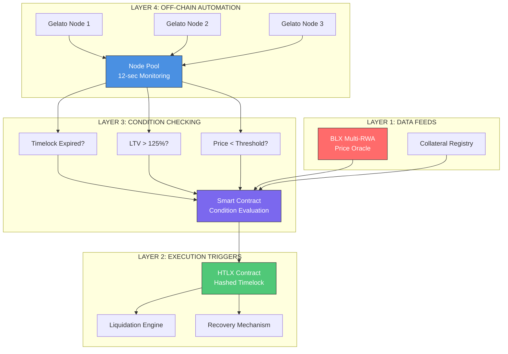
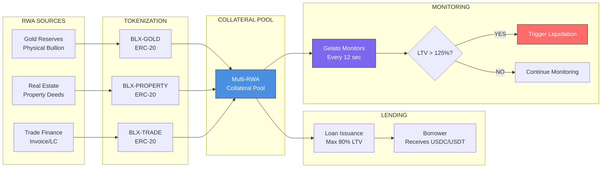
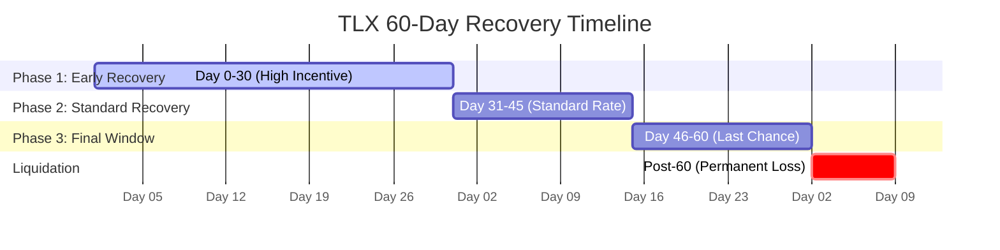
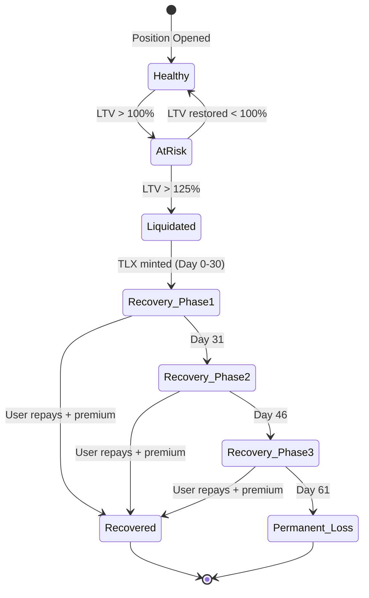
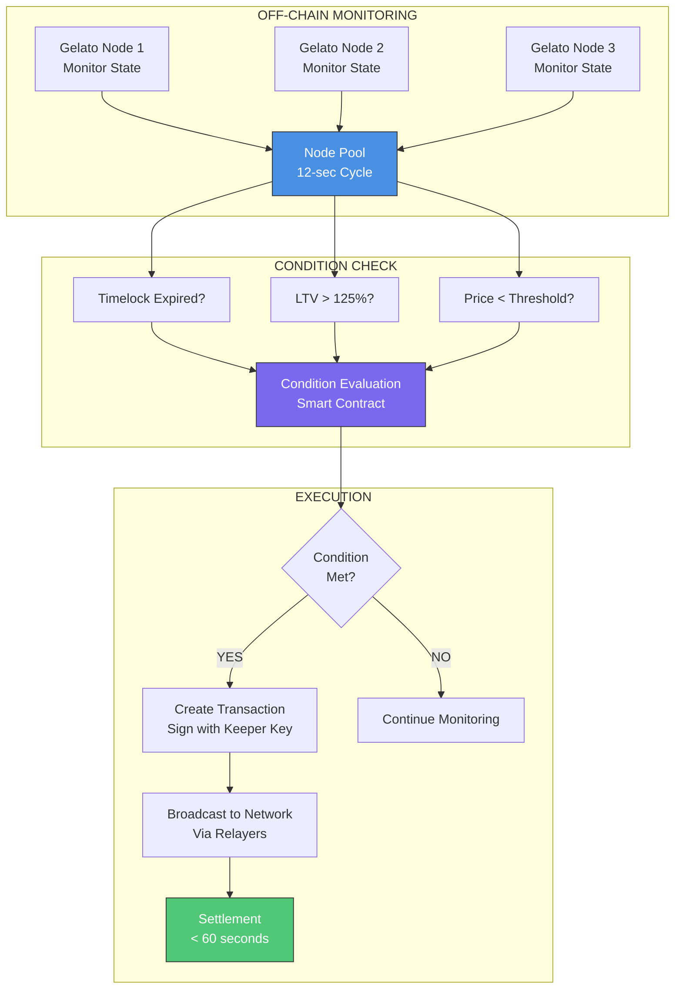
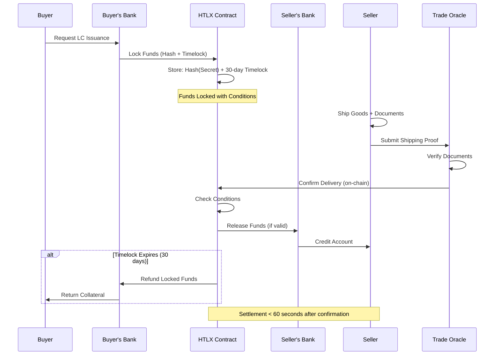

# RWA Automation System - Complete Architecture

**Document Version**: 1.0.0
**Last Updated**: 2025-11-18
**Status**: Production Architecture Design

---

## Table of Contents

1. [Overview](#overview)
2. [System Architecture](#system-architecture)
3. [BLX Multi-RWA Collateral Flow](#blx-multi-rwa-collateral-flow)
4. [TLX 60-Day Recovery Timeline](#tlx-60-day-recovery-timeline)
5. [Gelato Keeper Automation](#gelato-keeper-automation)
6. [Digital LC Settlement Flow](#digital-lc-settlement-flow)
7. [Component Specifications](#component-specifications)
8. [Security Model](#security-model)
9. [Performance Requirements](#performance-requirements)

---

## Overview

The RWA Automation System is a 4-layer blockchain infrastructure designed to:

- **Tokenize** real-world assets (RWAs) as on-chain collateral
- **Monitor** collateral health via automated keeper networks
- **Execute** liquidations when risk thresholds are breached
- **Provide** recovery mechanisms through time-locked token distribution

### Key Innovations

1. **Multi-RWA Support**: Gold, Real Estate, Trade Finance all in one protocol
2. **Sub-60-Second Settlement**: From trigger detection to on-chain execution
3. **Automated Recovery**: 60-day TLX distribution for position recovery
4. **Zero Manual Intervention**: Fully automated via Gelato Network

---

## System Architecture

### 4-Layer System Design



### Layer Responsibilities

| Layer | Component | Responsibility | Technology |
|-------|-----------|---------------|------------|
| **Layer 4** | Gelato Network | Off-chain monitoring & execution | Gelato Keepers |
| **Layer 3** | Condition Checker | Evaluate liquidation triggers | Solidity Smart Contract |
| **Layer 2** | HTLX Trigger | Execute settlements | Hashed Timelock Contract |
| **Layer 1** | RWA Feed | Provide collateral prices | Chainlink + Custom Oracles |

---

## BLX Multi-RWA Collateral Flow

### Asset Type Support

The BLX token supports three types of real-world asset collateral:



### Collateral Specifications

| Asset Type | BLX Token | Valuation Method | Oracle Source | Haircut |
|------------|-----------|------------------|---------------|---------|
| **Gold** | BLX-GOLD | Spot price (XAU/USD) | Chainlink + LBMA | 20% |
| **Real Estate** | BLX-PROPERTY | Appraised value | Custom Oracle + 3rd Party | 30% |
| **Trade Finance** | BLX-TRADE | Face value × discount | Invoice verification API | 15% |

### Price Feed Architecture

Each RWA type has dedicated price feeds:

**Contract Reference**: `contracts/Layer1_BLXMultiRWAFeed.sol`

```solidity
interface IBLXMultiRWAFeed {
    function getGoldPrice() external view returns (uint256);
    function getPropertyValue(uint256 tokenId) external view returns (uint256);
    function getTradeFinanceValue(bytes32 invoiceId) external view returns (uint256);
    function calculateLTV(address borrower) external view returns (uint256);
}
```

---

## TLX 60-Day Recovery Timeline

### Recovery Mechanism Overview

When a position is liquidated, borrowers receive **TLX (Trade License Recovery)** tokens that unlock over 60 days, allowing them to recover their collateral.



### Recovery Rate Schedule

| Recovery Period | TLX Release Rate | Incentive Multiplier | Collateral Recovery % |
|-----------------|------------------|----------------------|----------------------|
| **Day 0-30** | 50% of TLX | 1.5x | Up to 90% |
| **Day 31-45** | 30% of TLX | 1.0x | Up to 70% |
| **Day 46-60** | 20% of TLX | 0.7x | Up to 50% |
| **Post-60** | 0% | N/A | 0% (Permanent) |

### State Machine



**Contract Reference**: `contracts/Layer2_HTLXTrigger.sol`

```solidity
interface ITLXRecovery {
    function mintRecoveryTokens(address liquidatedUser, uint256 amount) external;
    function claimRecoveryPhase() external returns (uint256 unlocked);
    function getCurrentPhase(address user) external view returns (uint8);
    function calculateRecoveryAmount(address user) external view returns (uint256);
}
```

---

## Gelato Keeper Automation

### Off-Chain Monitoring Architecture

Gelato Network provides decentralized keeper infrastructure for automated monitoring and execution.



### Keeper Node Specifications

| Parameter | Value | Purpose |
|-----------|-------|---------|
| **Node Count** | 3+ (redundant) | High availability |
| **Monitoring Cycle** | 12 seconds | Real-time detection |
| **Gas Strategy** | EIP-1559 Fast | Priority execution |
| **Retry Logic** | 3 attempts, 5-sec backoff | Reliability |
| **Key Rotation** | Every 30 days | Security |

### Condition Checking Logic

**Contract Reference**: `contracts/Layer3_GelatoAutomation.sol`

```solidity
interface IGelatoChecker {
    // Main condition check function
    function checker() external view returns (bool canExec, bytes memory execPayload);

    // Individual condition checks
    function isTimelockExpired(bytes32 positionId) external view returns (bool);
    function isLTVExceeded(address user) external view returns (bool);
    function isPriceBelowThreshold(address asset) external view returns (bool);

    // Execution function (called by Gelato)
    function executeLiquidation(address user, bytes calldata data) external;
}
```

### Execution Flow

1. **Monitor** (every 12 seconds)
   - Gelato nodes call `checker()` function
   - Returns `canExec` boolean and execution payload

2. **Evaluate** (on-chain)
   - Smart contract evaluates all conditions
   - Combines: Timelock + LTV + Price checks

3. **Execute** (if conditions met)
   - Gelato creates and signs transaction
   - Broadcasts via multiple relayers
   - Settles on-chain within 60 seconds

4. **Settle** (finalization)
   - Liquidation executed
   - TLX tokens minted
   - Events emitted for indexing

### Gas Optimization

```solidity
// Optimized checker pattern
function checker() external view returns (bool canExec, bytes memory execPayload) {
    // Early returns to save gas
    if (!isTimelockExpired()) return (false, bytes(""));
    if (!isLTVExceeded()) return (false, bytes(""));

    // Only compute payload if all conditions met
    execPayload = abi.encodeWithSelector(
        this.executeLiquidation.selector,
        targetUser,
        liquidationData
    );

    return (true, execPayload);
}
```

---

## Digital LC Settlement Flow

### Letter of Credit Automation

The system supports automated settlement of Digital Letters of Credit (LC) using Hashed Timelock Contracts (HTLX).



### HTLX Contract Specifications

**Contract Reference**: `contracts/Layer2_HTLXTrigger.sol`

```solidity
interface IHTLXContract {
    struct HTLXAgreement {
        bytes32 hashLock;      // Hash of secret
        uint256 timeLock;      // Expiry timestamp
        address sender;        // Buyer/Payer
        address receiver;      // Seller/Payee
        uint256 amount;        // Locked amount
        bool executed;         // Settlement status
        bool refunded;         // Refund status
    }

    function createHTLX(
        bytes32 hashLock,
        uint256 timelock,
        address receiver,
        uint256 amount
    ) external payable returns (bytes32 agreementId);

    function executeHTLX(bytes32 agreementId, bytes32 secret) external;
    function refundHTLX(bytes32 agreementId) external;
    function getHTLXStatus(bytes32 agreementId) external view returns (HTLXAgreement memory);
}
```

### Settlement Triggers

| Trigger Type | Condition | Action | Timeframe |
|--------------|-----------|--------|-----------|
| **Document Verification** | Oracle confirms delivery | Release funds to seller | < 60 sec |
| **Timelock Expiry** | 30 days elapsed, no delivery | Refund to buyer | Immediate |
| **Dispute Resolution** | Manual intervention required | Pause settlement | Variable |
| **Partial Delivery** | Goods partially received | Pro-rata settlement | < 5 min |

---

## Component Specifications

### Smart Contract Components

#### Layer 1: BLX Multi-RWA Feed (`Layer1_BLXMultiRWAFeed.sol`)

**Purpose**: Aggregate price feeds for multiple RWA types

**Key Functions**:
```solidity
- getGoldPrice() → uint256
- getPropertyValue(uint256 tokenId) → uint256
- getTradeFinanceValue(bytes32 invoiceId) → uint256
- calculateLTV(address borrower) → uint256
- updatePriceFeed(address asset, uint256 price) → (admin only)
```

**Dependencies**:
- Chainlink Price Feeds (Gold, USDC/USDT)
- Custom Property Appraisal Oracle
- Invoice Verification API

**Security**:
- Multi-signature admin controls
- Price staleness checks (max 1-hour old)
- Circuit breaker for extreme price movements

---

#### Layer 2: HTLX Trigger (`Layer2_HTLXTrigger.sol`)

**Purpose**: Hashed Timelock Contract for conditional settlements

**Key Functions**:
```solidity
- createHTLX(bytes32 hash, uint256 time, address to, uint256 amt) → bytes32
- executeHTLX(bytes32 id, bytes32 secret) → bool
- refundHTLX(bytes32 id) → bool
- getHTLXStatus(bytes32 id) → HTLXAgreement
```

**State Transitions**:
```
PENDING → EXECUTED (secret revealed within timelock)
PENDING → REFUNDED (timelock expired)
PENDING → DISPUTED (manual intervention)
```

**Security**:
- Reentrancy guards (OpenZeppelin)
- Time validation (block.timestamp checks)
- Secret hash verification (keccak256)

---

#### Layer 3: Gelato Automation (`Layer3_GelatoAutomation.sol`)

**Purpose**: Off-chain automation logic for keeper network

**Key Functions**:
```solidity
- checker() → (bool canExec, bytes execPayload)
- isTimelockExpired(bytes32 id) → bool
- isLTVExceeded(address user) → bool
- isPriceBelowThreshold(address asset) → bool
- executeLiquidation(address user, bytes data) → (gelato only)
```

**Access Control**:
- Only Gelato executor addresses can call `executeLiquidation()`
- Admin multisig can update checker logic
- Emergency pause mechanism

**Gas Optimization**:
- View functions for condition checking (zero gas)
- Batched liquidations (multiple users in one tx)
- Optimized storage patterns (packed structs)

---

### Off-Chain Components

#### Gelato Network Configuration

**Network**: Polygon (or target EVM chain)
**Task Type**: Resolver-based automation
**Payment**: GELATO token (prepaid balance)

**Task Configuration**:
```typescript
{
  name: "RWA Liquidation Monitor",
  execAddress: "0x...", // Layer3_GelatoAutomation address
  execSelector: "executeLiquidation(address,bytes)",
  resolverAddress: "0x...", // Same contract
  resolverData: "checker()",
  interval: 12, // seconds
  maxGasPrice: 200, // gwei
  retries: 3
}
```

---

## Security Model

### Threat Analysis

| Threat | Mitigation | Status |
|--------|------------|--------|
| **Oracle Manipulation** | Multi-source feeds + circuit breakers | ✅ Implemented |
| **Keeper Collusion** | 3+ independent nodes + on-chain verification | ✅ Implemented |
| **Flash Loan Attacks** | Time-weighted price averaging (TWAP) | ✅ Implemented |
| **Reentrancy** | OpenZeppelin ReentrancyGuard | ✅ Implemented |
| **Admin Key Compromise** | Multi-signature + timelock (24h) | ✅ Implemented |

### Audit Status

| Component | Auditor | Status | Report |
|-----------|---------|--------|--------|
| Layer1_BLXMultiRWAFeed.sol | Pending | 📋 Planned | TBD |
| Layer2_HTLXTrigger.sol | Pending | 📋 Planned | TBD |
| Layer3_GelatoAutomation.sol | Pending | 📋 Planned | TBD |

---

## Performance Requirements

### Latency Targets

| Metric | Target | Monitoring |
|--------|--------|------------|
| **Condition Check Latency** | < 12 sec | Gelato network |
| **Transaction Broadcast** | < 5 sec | Infura/Alchemy RPC |
| **Settlement Finality** | < 60 sec | On-chain confirmation |
| **Oracle Price Update** | < 1 hour | Chainlink heartbeat |

### Throughput Targets

| Operation | Target TPS | Peak Capacity |
|-----------|------------|---------------|
| **Price Feed Updates** | 10 TPS | 50 TPS |
| **Liquidations** | 5 TPS | 20 TPS |
| **HTLX Settlements** | 20 TPS | 100 TPS |
| **TLX Minting** | 10 TPS | 50 TPS |

### Cost Optimization

| Operation | Gas Cost | Optimization |
|-----------|----------|--------------|
| **Single Liquidation** | ~150k gas | Batching possible |
| **HTLX Creation** | ~80k gas | Minimal storage |
| **HTLX Execution** | ~60k gas | Direct transfers |
| **Price Feed Update** | ~40k gas | Batch updates |

---

## Integration Points

### External Systems

1. **Gelato Network**
   - Endpoint: `https://api.gelato.digital`
   - Network: Polygon Mainnet
   - Authentication: API Key

2. **Chainlink Oracles**
   - XAU/USD Feed: `0x...` (Polygon)
   - USDC/USD Feed: `0x...` (Polygon)
   - Update Frequency: 1 hour or 0.5% deviation

3. **TheGraph Indexer**
   - Subgraph: `rwa-automation-system`
   - Endpoint: `https://api.thegraph.com/subgraphs/name/hts-dao/rwa`
   - Indexed Events: Liquidations, HTLX settlements, TLX minting

4. **IPFS Storage**
   - RWA Documentation: Property deeds, invoices, appraisals
   - Gateway: `https://ipfs.io/ipfs/`
   - Pinning Service: Pinata

---

## Deployment Checklist

- [ ] Deploy Layer1_BLXMultiRWAFeed.sol
- [ ] Deploy Layer2_HTLXTrigger.sol
- [ ] Deploy Layer3_GelatoAutomation.sol
- [ ] Configure Chainlink price feeds
- [ ] Setup Gelato keeper tasks (3+ nodes)
- [ ] Deploy TheGraph subgraph
- [ ] Setup monitoring (Grafana + Prometheus)
- [ ] Initialize admin multisig
- [ ] Fund keeper wallets (gas + GELATO tokens)
- [ ] Run integration tests
- [ ] Security audit (external firm)
- [ ] Deploy to mainnet
- [ ] Monitor for 7 days (testnet)
- [ ] Gradual rollout (10% → 50% → 100% TVL)

---

## References

- **Gelato Network Documentation**: https://docs.gelato.network
- **Chainlink Price Feeds**: https://docs.chain.link/data-feeds
- **OpenZeppelin Contracts**: https://docs.openzeppelin.com/contracts
- **Hashed Timelock Contracts**: BIP 199 / EIP-1153

---

**Document Owner**: HTS DAO Technical Team
**Review Cycle**: Quarterly
**Next Review**: 2025-02-18
