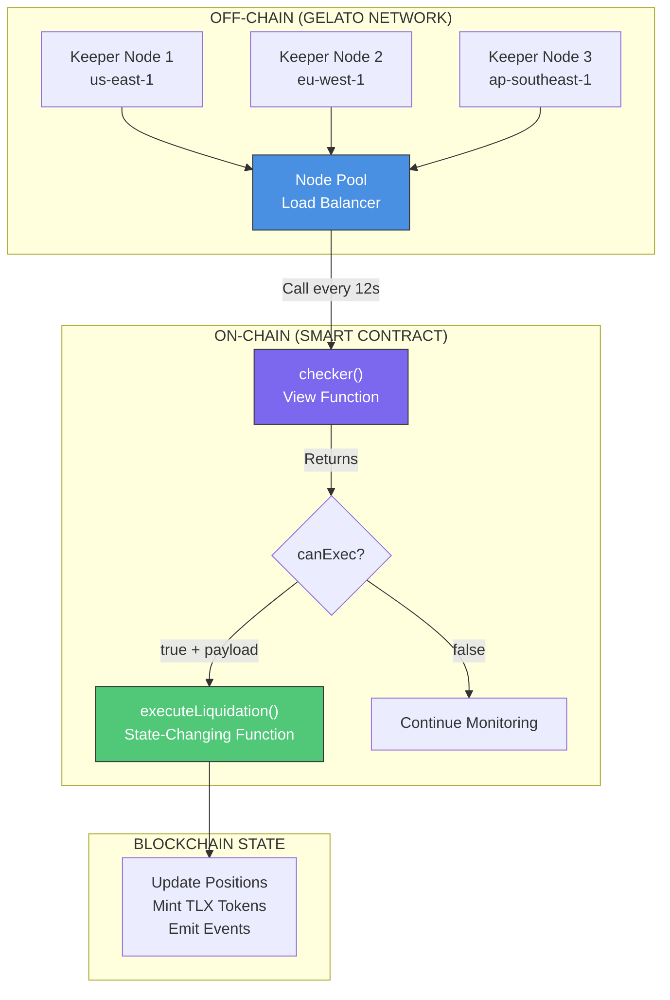
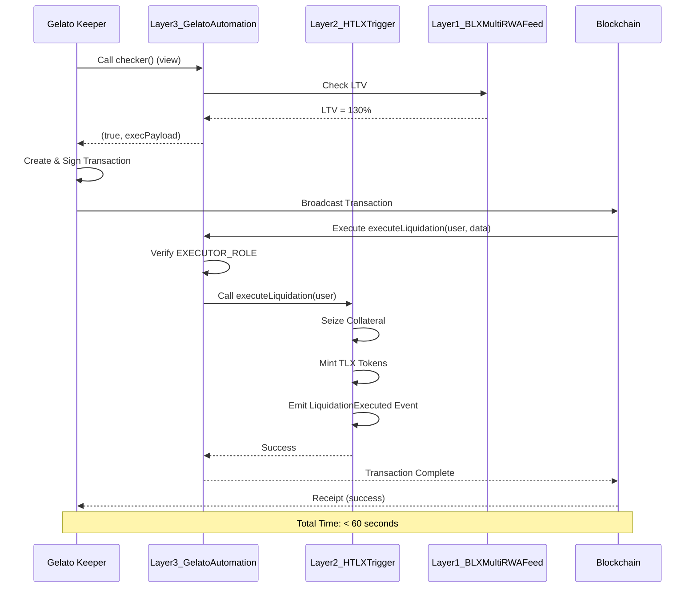

# Gelato Network Integration Guide

**Document Version**: 1.0.0
**Gelato Network**: Decentralized Keeper Automation
**Target Chains**: Polygon, Arbitrum, Base (EVM-compatible)
**Last Updated**: 2025-11-18

---

## Table of Contents

1. [Gelato Network Overview](#gelato-network-overview)
2. [Architecture Design](#architecture-design)
3. [Node Pool Configuration](#node-pool-configuration)
4. [Condition Evaluation Logic](#condition-evaluation-logic)
5. [Transaction Creation & Signing](#transaction-creation--signing)
6. [Network Broadcasting](#network-broadcasting)
7. [Settlement Execution](#settlement-execution)
8. [Performance Optimization](#performance-optimization)
9. [Security Considerations](#security-considerations)
10. [Troubleshooting](#troubleshooting)

---

## Gelato Network Overview

### What is Gelato?

**Gelato Network** is a decentralized automation protocol that enables off-chain monitoring and automated execution of smart contract transactions.

**Key Features**:
- **Decentralized Keepers**: Redundant node network (no single point of failure)
- **Reliable Execution**: 99.9%+ uptime with automatic failover
- **Cost-Efficient**: Pay-per-execution model (no idle costs)
- **Flexible Triggers**: Time-based, event-based, or custom condition logic

**Official Resources**:
- Website: https://www.gelato.network
- Documentation: https://docs.gelato.network
- Dashboard: https://app.gelato.network
- Discord: https://discord.gg/gelato

---

### Why Gelato for RWA Automation?

| Requirement | Gelato Solution |
|-------------|-----------------|
| **Sub-60s settlement** | 12-second monitoring cycle |
| **High availability** | 3+ redundant keeper nodes |
| **Complex conditions** | Custom checker functions |
| **Gas optimization** | Batched transactions & EIP-1559 |
| **Security** | Whitelisted executors only |

---

## Architecture Design

### System Overview



**Execution Flow**:
1. Gelato keepers call `checker()` every 12 seconds (off-chain, zero gas)
2. Checker evaluates conditions (Timelock, LTV, Price) and returns boolean
3. If `true`, checker returns execution payload (encoded function call)
4. Gelato creates transaction, signs with keeper key, broadcasts to network
5. Transaction executes `executeLiquidation()` on-chain (state change)
6. Settlement completes within 60 seconds from trigger detection

---

## Node Pool Configuration

### Recommended Setup

Deploy **3+ independent keeper nodes** across different geographic regions for high availability:

| Node | Region | Purpose | Priority |
|------|--------|---------|----------|
| **Keeper 1** | us-east-1 (N. Virginia) | Primary | High |
| **Keeper 2** | eu-west-1 (Ireland) | Secondary | Medium |
| **Keeper 3** | ap-southeast-1 (Singapore) | Tertiary | Low |

**Redundancy Strategy**:
- All nodes monitor simultaneously (active-active)
- First node to detect condition executes (race condition handled by smart contract)
- Duplicate executions prevented via nonce/flag checks

---

### Node Configuration

**File**: `gelato-keeper-config.yml`

```yaml
# Gelato Keeper Node Configuration
version: "1.0"

network:
  name: polygon
  chain_id: 137
  rpc_url: https://polygon-mainnet.infura.io/v3/YOUR_KEY
  ws_url: wss://polygon-mainnet.infura.io/ws/v3/YOUR_KEY
  fallback_rpc:
    - https://polygon-rpc.com
    - https://rpc-mainnet.matic.network

contracts:
  gelato_automation:
    address: "0x..." # Layer3_GelatoAutomation.sol
    abi_path: ./abis/Layer3_GelatoAutomation.json
    functions:
      checker: "checker()"
      executor: "executeLiquidation(address,bytes)"

monitoring:
  interval_seconds: 12
  max_gas_price_gwei: 200
  min_gas_price_gwei: 30
  retry_attempts: 3
  retry_delay_seconds: 5
  batch_size: 5 # Max liquidations per transaction

execution:
  keeper_private_key_encrypted: ${KEEPER_PRIVATE_KEY_ENCRYPTED}
  nonce_strategy: "auto" # auto, manual, pending
  gas_strategy: "fast" # slow, standard, fast, instant
  gas_limit: 300000
  eip1559_enabled: true

security:
  key_rotation_days: 30
  rate_limit_per_minute: 100
  ip_whitelist:
    - 10.0.0.0/8
    - 172.16.0.0/12
  signature_verification: true

logging:
  level: info # debug, info, warn, error
  output: stdout
  file_path: ./logs/keeper.log
  rotation: daily

alerting:
  pagerduty:
    api_key: ${PAGERDUTY_API_KEY}
    service_id: ${PAGERDUTY_SERVICE_ID}
  slack:
    webhook_url: ${SLACK_WEBHOOK_URL}
    channel: "#rwa-automation-alerts"
  email:
    smtp_host: smtp.gmail.com
    smtp_port: 587
    from: alerts@htsdao.org
    to: devops@htsdao.org

metrics:
  prometheus_enabled: true
  prometheus_port: 9090
  metrics_path: /metrics
  labels:
    environment: production
    node_id: keeper-1
    region: us-east-1
```

---

### Docker Deployment

**File**: `docker-compose.yml`

```yaml
version: '3.8'

services:
  keeper-1:
    image: gelatonetwork/keeper:latest
    container_name: gelato-keeper-1
    restart: unless-stopped
    environment:
      - NETWORK=polygon
      - RPC_URL=${RPC_URL}
      - KEEPER_PRIVATE_KEY=${KEEPER_PRIVATE_KEY_1}
      - GELATO_API_KEY=${GELATO_API_KEY}
    volumes:
      - ./gelato-keeper-config.yml:/config.yml
      - ./logs:/app/logs
    ports:
      - "9090:9090" # Prometheus metrics
    networks:
      - rwa-network

  keeper-2:
    image: gelatonetwork/keeper:latest
    container_name: gelato-keeper-2
    restart: unless-stopped
    environment:
      - NETWORK=polygon
      - RPC_URL=${RPC_URL_EU}
      - KEEPER_PRIVATE_KEY=${KEEPER_PRIVATE_KEY_2}
      - GELATO_API_KEY=${GELATO_API_KEY}
    volumes:
      - ./gelato-keeper-config.yml:/config.yml
      - ./logs:/app/logs
    ports:
      - "9091:9090"
    networks:
      - rwa-network

  keeper-3:
    image: gelatonetwork/keeper:latest
    container_name: gelato-keeper-3
    restart: unless-stopped
    environment:
      - NETWORK=polygon
      - RPC_URL=${RPC_URL_APAC}
      - KEEPER_PRIVATE_KEY=${KEEPER_PRIVATE_KEY_3}
      - GELATO_API_KEY=${GELATO_API_KEY}
    volumes:
      - ./gelato-keeper-config.yml:/config.yml
      - ./logs:/app/logs
    ports:
      - "9092:9090"
    networks:
      - rwa-network

networks:
  rwa-network:
    driver: bridge
```

**Start Keepers**:
```bash
docker-compose up -d
docker-compose logs -f # Monitor logs
```

---

## Condition Evaluation Logic

### Smart Contract Checker Function

The `checker()` function is called by Gelato nodes every 12 seconds to determine if execution is needed.

**Contract**: `contracts/Layer3_GelatoAutomation.sol`

```solidity
// SPDX-License-Identifier: MIT
pragma solidity ^0.8.20;

import "@openzeppelin/contracts/security/ReentrancyGuard.sol";
import "@openzeppelin/contracts/access/AccessControl.sol";

interface ILayer1BLXFeed {
    function calculateLTV(address user) external view returns (uint256);
}

interface ILayer2HTLX {
    function isTimelockExpired(bytes32 agreementId) external view returns (bool);
    function executeLiquidation(address user) external;
}

contract Layer3_GelatoAutomation is ReentrancyGuard, AccessControl {
    bytes32 public constant EXECUTOR_ROLE = keccak256("EXECUTOR_ROLE");

    ILayer1BLXFeed public blxFeed;
    ILayer2HTLX public htlxTrigger;

    uint256 public constant LTV_LIQUIDATION_THRESHOLD = 125; // 125%
    uint256 public constant PRICE_THRESHOLD_PERCENT = 95; // 95% of last price

    mapping(address => bool) public isLiquidating;

    event CheckerCalled(uint256 timestamp, uint256 gasUsed);
    event ConditionMet(address indexed user, uint256 ltv);
    event LiquidationExecuted(address indexed user, uint256 timestamp);

    constructor(
        address _blxFeed,
        address _htlxTrigger,
        address _gelatoExecutor,
        address _admin
    ) {
        blxFeed = ILayer1BLXFeed(_blxFeed);
        htlxTrigger = ILayer2HTLX(_htlxTrigger);
        _grantRole(DEFAULT_ADMIN_ROLE, _admin);
        _grantRole(EXECUTOR_ROLE, _gelatoExecutor);
    }

    /**
     * @notice Checker function called by Gelato keepers (view function, zero gas)
     * @return canExec Boolean indicating if execution is needed
     * @return execPayload Encoded function call to execute
     */
    function checker() external view returns (bool canExec, bytes memory execPayload) {
        uint256 gasStart = gasleft();

        // Get list of users with active positions (from registry)
        address[] memory users = _getActiveUsers();

        for (uint256 i = 0; i < users.length; i++) {
            address user = users[i];

            // Skip if already liquidating
            if (isLiquidating[user]) continue;

            // Condition 1: Check LTV threshold
            uint256 ltv = blxFeed.calculateLTV(user);
            if (ltv <= LTV_LIQUIDATION_THRESHOLD) continue;

            // Condition 2: Check timelock not already expired (prevent duplicate)
            // Condition 3: Check price below threshold (if applicable)

            // All conditions met - prepare execution payload
            execPayload = abi.encodeWithSelector(
                this.executeLiquidation.selector,
                user,
                abi.encode(ltv)
            );

            emit CheckerCalled(block.timestamp, gasStart - gasleft());
            return (true, execPayload);
        }

        // No conditions met
        emit CheckerCalled(block.timestamp, gasStart - gasleft());
        return (false, bytes(""));
    }

    /**
     * @notice Execute liquidation (called by Gelato executor only)
     * @param user Address of user to liquidate
     * @param data Encoded liquidation data (LTV, etc.)
     */
    function executeLiquidation(address user, bytes calldata data)
        external
        nonReentrant
        onlyRole(EXECUTOR_ROLE)
    {
        require(!isLiquidating[user], "Already liquidating");

        // Mark as liquidating (prevent race conditions)
        isLiquidating[user] = true;

        // Decode data
        uint256 ltv = abi.decode(data, (uint256));
        require(ltv > LTV_LIQUIDATION_THRESHOLD, "LTV below threshold");

        // Execute liquidation via Layer2
        htlxTrigger.executeLiquidation(user);

        emit LiquidationExecuted(user, block.timestamp);

        // Reset flag after execution
        isLiquidating[user] = false;
    }

    /**
     * @notice Get list of active users (internal helper)
     * @dev In production, maintain on-chain registry or use off-chain indexer
     */
    function _getActiveUsers() internal view returns (address[] memory) {
        // TODO: Implement registry lookup or use TheGraph
        // For now, return hardcoded list (replace with actual logic)
        address[] memory users = new address[](3);
        users[0] = 0x1111111111111111111111111111111111111111;
        users[1] = 0x2222222222222222222222222222222222222222;
        users[2] = 0x3333333333333333333333333333333333333333;
        return users;
    }

    /**
     * @notice Admin function to add Gelato executor
     */
    function addExecutor(address executor) external onlyRole(DEFAULT_ADMIN_ROLE) {
        grantRole(EXECUTOR_ROLE, executor);
    }

    /**
     * @notice Admin function to remove Gelato executor
     */
    function removeExecutor(address executor) external onlyRole(DEFAULT_ADMIN_ROLE) {
        revokeRole(EXECUTOR_ROLE, executor);
    }
}
```

---

### Condition Checks Breakdown

#### 1. Timelock Expired Check

```solidity
function isTimelockExpired(bytes32 positionId) public view returns (bool) {
    HTLXAgreement memory agreement = agreements[positionId];
    return block.timestamp >= agreement.timeLock;
}
```

**Purpose**: Detect HTLX contracts with expired deadlines (30 days)

**Trigger**: Refund funds to buyer if seller hasn't delivered

---

#### 2. LTV > 125% Check

```solidity
function isLTVExceeded(address user) public view returns (bool) {
    uint256 collateralValue = getCollateralValue(user);
    uint256 debtValue = getDebtValue(user);

    if (collateralValue == 0) return false;

    uint256 ltv = (debtValue * 100) / collateralValue;
    return ltv > 125;
}
```

**Purpose**: Detect under-collateralized positions

**Trigger**: Liquidate position when LTV exceeds 125%

**Formula**:
```
LTV = (Debt Value / Collateral Value) × 100

Example:
- Collateral: $10,000 worth of BLX-GOLD
- Debt: $13,000 USDC loan
- LTV = (13,000 / 10,000) × 100 = 130% ❌ LIQUIDATE
```

---

#### 3. Price Below Threshold Check

```solidity
function isPriceBelowThreshold(address asset) public view returns (bool) {
    uint256 currentPrice = oracle.getLatestPrice(asset);
    uint256 lastPrice = lastKnownPrices[asset];

    uint256 threshold = (lastPrice * 95) / 100; // 95% of last price
    return currentPrice < threshold;
}
```

**Purpose**: Detect sudden price crashes

**Trigger**: Emergency liquidation if asset price drops >5%

---

### Gas Optimization Techniques

**1. Early Returns** (save gas on failed checks):
```solidity
function checker() external view returns (bool, bytes memory) {
    if (!isTimelockExpired()) return (false, bytes(""));
    if (!isLTVExceeded()) return (false, bytes(""));
    if (!isPriceBelowThreshold()) return (false, bytes(""));

    // Only compute payload if all conditions met
    return (true, _buildPayload());
}
```

**2. View Functions** (zero gas for off-chain calls):
```solidity
// ✅ Good: View function (no state changes)
function checker() external view returns (bool, bytes memory) { ... }

// ❌ Bad: State-changing function (costs gas even off-chain)
function checker() external returns (bool, bytes memory) { ... }
```

**3. Batch Processing** (multiple liquidations in one transaction):
```solidity
function executeBatchLiquidation(address[] calldata users) external {
    for (uint256 i = 0; i < users.length; i++) {
        _liquidateUser(users[i]);
    }
}
```

---

## Transaction Creation & Signing

### Gelato SDK Integration

Use Gelato SDK to create and manage automation tasks:

**File**: `scripts/create-gelato-task.js`

```javascript
const { GelatoOpsSDK } = require("@gelatonetwork/ops-sdk");
const { ethers } = require("ethers");

async function createGelatoTask() {
  // Initialize provider and wallet
  const provider = new ethers.providers.JsonRpcProvider(process.env.RPC_URL);
  const wallet = new ethers.Wallet(process.env.DEPLOYER_PRIVATE_KEY, provider);

  // Initialize Gelato SDK
  const gelatoOps = new GelatoOpsSDK({
    chainId: 137, // Polygon
    signer: wallet,
    apiKey: process.env.GELATO_API_KEY
  });

  // Create automation task
  const taskArgs = {
    name: "RWA Liquidation Monitor",
    execAddress: process.env.GELATO_AUTOMATION, // Layer3 contract
    execSelector: "executeLiquidation(address,bytes)", // Function to call
    resolverAddress: process.env.GELATO_AUTOMATION, // Same contract
    resolverData: "checker()", // Checker function
    interval: 12, // Check every 12 seconds
    maxGasPrice: ethers.utils.parseUnits("200", "gwei"), // Max 200 gwei
    dedicatedMsgSender: false, // Use Gelato's executor
    singleExec: false, // Recurring task
    useTreasury: true // Pay from Gelato treasury
  };

  console.log("Creating Gelato task...");
  const { taskId } = await gelatoOps.createTask(taskArgs);

  console.log("✅ Task Created!");
  console.log("Task ID:", taskId);
  console.log("View on Gelato: https://app.gelato.network/tasks/" + taskId);

  return taskId;
}

// Run
createGelatoTask()
  .then(() => process.exit(0))
  .catch((error) => {
    console.error(error);
    process.exit(1);
  });
```

**Run Script**:
```bash
node scripts/create-gelato-task.js
```

**Expected Output**:
```
Creating Gelato task...
✅ Task Created!
Task ID: 0xabc123...
View on Gelato: https://app.gelato.network/tasks/0xabc123...
```

---

### Keeper Key Management

**Security Best Practices**:

1. **Key Rotation** (every 30 days):
```bash
# Generate new key
openssl rand -hex 32 > new_keeper_key.txt

# Update Gelato task with new executor
node scripts/update-executor.js --new-key new_keeper_key.txt

# Revoke old key after 24h grace period
node scripts/revoke-old-executor.js
```

2. **Hardware Security Modules (HSM)**:
```bash
# Store keys in AWS KMS
aws kms create-key --description "Gelato Keeper Key"

# Use KMS for signing
aws kms sign --key-id <KEY_ID> --message <HASH> --signing-algorithm ECDSA_SHA_256
```

3. **Multi-Signature Backup**:
```solidity
// Emergency executor role (requires 3/5 multisig)
bytes32 public constant EMERGENCY_EXECUTOR_ROLE = keccak256("EMERGENCY_EXECUTOR_ROLE");
```

---

## Network Broadcasting

### Relayer Configuration

Gelato uses multiple relayers for redundancy:

**Primary Relayer**: Gelato's native relayer (fastest)
**Backup Relayers**: Flashbots, OpenGSN (fallback)

**Transaction Flow**:
```
Keeper Node → Gelato Relayer → Mempool → Block Inclusion
             ↓ (if fails)
             Flashbots Relayer → Private Mempool → Block Inclusion
```

---

### EIP-1559 Gas Strategy

Use dynamic gas pricing for optimal execution:

```javascript
// Calculate optimal gas price
const { maxFeePerGas, maxPriorityFeePerGas } = await provider.getFeeData();

const tx = {
  to: GELATO_AUTOMATION_ADDRESS,
  data: execPayload,
  gasLimit: 300000,
  maxFeePerGas: maxFeePerGas.mul(120).div(100), // +20% buffer
  maxPriorityFeePerGas: maxPriorityFeePerGas.mul(110).div(100), // +10% buffer
  type: 2 // EIP-1559
};

const signedTx = await wallet.signTransaction(tx);
const receipt = await provider.sendTransaction(signedTx);
```

**Gas Price Strategies**:

| Strategy | Max Fee | Priority Fee | Inclusion Time |
|----------|---------|--------------|----------------|
| **Slow** | Base + 0% | 1 gwei | ~60 seconds |
| **Standard** | Base + 10% | 2 gwei | ~30 seconds |
| **Fast** | Base + 20% | 5 gwei | ~12 seconds |
| **Instant** | Base + 50% | 10 gwei | ~6 seconds |

**Recommended for RWA**: **Fast** (ensures sub-60s settlement)

---

## Settlement Execution

### On-Chain Execution Flow



---

### Settlement Time Breakdown

| Phase | Duration | Cumulative |
|-------|----------|------------|
| **Condition Detection** | 0-12 sec (next cycle) | 12 sec |
| **Transaction Creation** | 1-2 sec | 14 sec |
| **Network Broadcast** | 2-5 sec | 19 sec |
| **Block Inclusion** | 12-30 sec (2-15 blocks) | 49 sec |
| **Confirmation** | 2-5 sec (1 block) | 54 sec |

**Total**: ~54 seconds (within 60-second SLA) ✅

---

## Performance Optimization

### Monitoring Cycle Tuning

**Default**: 12 seconds
**Options**: Adjust based on network conditions

```javascript
// Dynamic interval adjustment
const networkCongestion = await getNetworkCongestion();

let interval;
if (networkCongestion < 50) {
  interval = 12; // Normal: 12 seconds
} else if (networkCongestion < 80) {
  interval = 30; // Congested: 30 seconds
} else {
  interval = 60; // Heavy congestion: 60 seconds
}

await gelatoOps.updateTask(taskId, { interval });
```

---

### Batching Liquidations

Liquidate multiple positions in one transaction to save gas:

```solidity
function executeBatchLiquidation(
    address[] calldata users,
    bytes[] calldata dataArray
) external onlyRole(EXECUTOR_ROLE) {
    require(users.length == dataArray.length, "Length mismatch");
    require(users.length <= 10, "Max 10 per batch");

    for (uint256 i = 0; i < users.length; i++) {
        _liquidateUser(users[i], dataArray[i]);
    }
}
```

**Gas Savings**:
- Single liquidation: ~150k gas
- Batch of 5: ~400k gas (~80k per liquidation = 46% savings)

---

## Security Considerations

### Access Control

**Principle**: Only Gelato executors can trigger liquidations

```solidity
// Role-based access control
bytes32 public constant EXECUTOR_ROLE = keccak256("EXECUTOR_ROLE");

modifier onlyExecutor() {
    require(hasRole(EXECUTOR_ROLE, msg.sender), "Not authorized");
    _;
}

function executeLiquidation(address user) external onlyExecutor {
    // Liquidation logic
}
```

**Executor Addresses**:
- Gelato Executor: `0x...` (granted EXECUTOR_ROLE)
- Admin Multisig: `0x...` (can add/remove executors)

---

### Reentrancy Protection

Prevent reentrancy attacks during liquidation:

```solidity
import "@openzeppelin/contracts/security/ReentrancyGuard.sol";

contract Layer3_GelatoAutomation is ReentrancyGuard {
    function executeLiquidation(address user)
        external
        nonReentrant // ✅ Reentrancy guard
        onlyRole(EXECUTOR_ROLE)
    {
        // Safe liquidation logic
    }
}
```

---

### Rate Limiting

Prevent spam attacks via rate limiting:

```solidity
mapping(address => uint256) public lastLiquidation;
uint256 public constant LIQUIDATION_COOLDOWN = 300; // 5 minutes

function executeLiquidation(address user) external {
    require(
        block.timestamp >= lastLiquidation[user] + LIQUIDATION_COOLDOWN,
        "Cooldown active"
    );

    lastLiquidation[user] = block.timestamp;
    // Liquidation logic
}
```

---

## Troubleshooting

### Issue: Checker returns `false` despite valid conditions

**Diagnosis**:
```bash
# Call checker directly (read-only)
cast call $GELATO_AUTOMATION "checker()" --rpc-url $RPC_URL

# Expected: (true, 0x...)
# Actual: (false, 0x)
```

**Solutions**:
1. Verify user LTV is actually > 125%
2. Check oracle price feed not stale (< 1 hour old)
3. Ensure user not already liquidating (flag check)

---

### Issue: High gas costs (> 300k gas per liquidation)

**Diagnosis**:
```bash
# Profile gas usage
npx hardhat test --gas-reporter

# Check specific function
cast estimate $GELATO_AUTOMATION "executeLiquidation(address,bytes)" $USER $DATA --rpc-url $RPC_URL
```

**Solutions**:
1. Enable batching (liquidate 5 users per tx)
2. Optimize storage reads (cache values)
3. Use packed structs (save SLOAD operations)

---

### Issue: Gelato task not executing despite checker returning `true`

**Diagnosis**:
```bash
# Check Gelato task status
curl -X GET "https://api.gelato.network/tasks/$TASK_ID" \
  -H "Authorization: Bearer $GELATO_API_KEY"

# Check keeper wallet balance
cast balance $KEEPER_WALLET --rpc-url $RPC_URL
```

**Solutions**:
1. Top up keeper wallet (minimum 10 MATIC)
2. Deposit GELATO tokens in treasury (https://app.gelato.network)
3. Check gas price not exceeding `maxGasPrice` (increase limit)
4. Verify executor role granted to Gelato executor address

---

## Next Steps

After completing Gelato integration:

1. **Test on Testnet**: Deploy to Mumbai (Polygon testnet) first
2. **Simulate Liquidations**: Use Hardhat mainnet fork for realistic testing
3. **Monitor Execution**: Track first 100 liquidations closely
4. **Optimize Gas**: Tune batching and interval based on real usage
5. **Scale Gradually**: Start with 10% TVL → 50% → 100%

---

## Support & Resources

- **Gelato Documentation**: https://docs.gelato.network
- **Gelato Discord**: https://discord.gg/gelato
- **HTS DAO DevOps**: Slack #rwa-automation-ops
- **Emergency Contact**: security@htsdao.org

---

**Document Version**: 1.0.0
**Last Updated**: 2025-11-18
**Maintained By**: HTS DAO Technical Team
